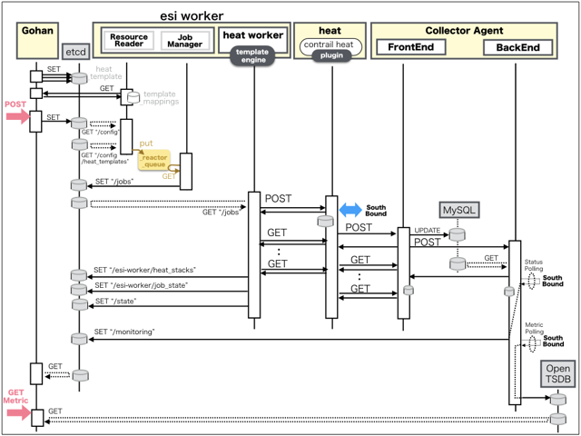

[Return to Top Page](../README.md)

# ESI interface for Logical Network
This section is for the purpose of documenting ESI interface.

* Initinalizing gohan ...
* Receiving HTTP Methods for Creating Resource ...

# Resource model for Loginal Network
First of all, you can see the overview of resources model of "Logical Network".

* [01: Ese Device](01_ese_device.md)
* [02: Physical Port](02_physical_port.md)
* [03: Ese Physical Port](03_ese_physical_port.md)
* [04: Network](04_network.md)
* [05: Subnet](05_subnet.md)
* [06: Port](06_port.md)

