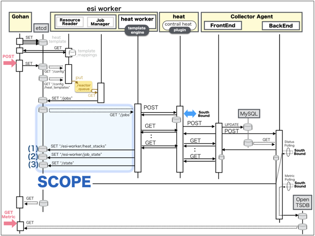

[Return to Previous Page](00_logical_network.md)

# 1. Clarification of interface in Sequence Diagram "Create Ese Device"
You can see the relations of "Ese Device" as following.


## 1.1. Stored data in etcd after initinalizing gohan


These are stored data for "heat_templates" in etcd.

* [Checking stored data for "ese_device_existing"](../heat_template/ese_device_existing.md)


## 1.2. HTTP Methods for RESTful between Gohan and Client


This is JSON data for "Create Ese Device" in HTTP Methods from client.

* Checking JSON data at post method
```
POST /v2.0/ese_devices
```
```
{
    "ese_device": {
        "username": "esi", 
        "public_ip_address": "10.161.0.33", 
        "existing": "existing", 
        "tenant_id": "ae69b52f46ba480bb9636f62736436f4", 
        "hostname": "QFX-NW01", 
        "name": "QFX-NW01", 
        "password": "***", 
        "type": "tor", 
        "management_ip_address": "10.161.0.33"
    }
}
```


## 1.3. Stored data in etcd after receiving HTTP Methods for RESTful


These are stored data for "Create Ese Device" in etcd.

* [Checking stored data for creating "ese_device"](stored_in_etcd/CreateEseDevice_01.md)


## 1.4. Stored heat-stack via heat-api



These are stored heat-stacks for "Create Ese Device" in heat-engine.

* [Checking heat-stack of "ese_device"](heat-stack/CreateEseDevice_01.md)


## 1.5. HTTP Methods for RESTful between heat-engine and CollectorAgent


This is JSON data for "Create Ese Device" between heat-engine and CollectorAgent

* [Checking monitoring of "ese_devices"](collector_agents/CreateEseDevice_01.md)


## 1.6. Stored resource in gohan
As a result, checking resources regarding of "Ese Device" in gohan.

* Checking the target of resources via gohan client
```
$ gohan client ese_device show --output-format json 718148aa-4483-47d5-bbd1-a0e0738dc018
{
    "ese_device": {
        "description": "",
        "existing": "existing",
        "flavor": null,
        "hostname": "QFX-NW01",
        "id": "718148aa-4483-47d5-bbd1-a0e0738dc018",
        "location": null,
        "management_ip_address": "10.161.0.33",
        "name": "QFX-NW01",
        "operational_state": "UP",
        "orchestration_state": "CREATE_COMPLETE",
        "password": "password",
        "public_ip_address": "10.161.0.33",
        "status": "ACTIVE",
        "tags": {},
        "tenant_id": "ae69b52f46ba480bb9636f62736436f4",
        "tor_agent_names": null,
        "tsn_names": null,
        "type": "tor",
        "username": "esi"
    }
}
```


[Return to Previous Page](00_logical_network.md)
