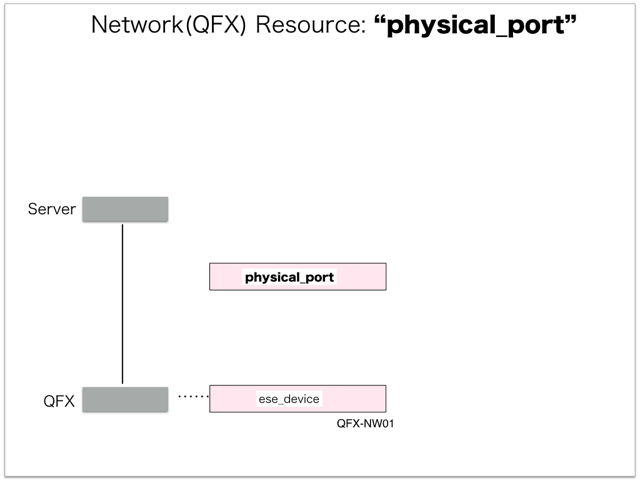

[Return to Previous Page](00_logical_network.md)

# 2. Clarification of interface in Sequence Diagram "Create Physical Port"
You can see the relations of "Physical Port" as following.




## 2.1. HTTP Methods for RESTful between Gohan and Client


This is JSON data for "Create Physical Port" in HTTP Methods from client.

* Checking JSON data at post method
```
POST /v2.0/physical_ports
```
```
{
    "physical_port": {
        "service_id": "server", 
        "plane": "data", 
        "service_owner": "server", 
        "name": "qfx-nw01-xe001", 
        "tenant_id": "ae69b52f46ba480bb9636f62736436f4"
    }
}
```


## 2.2. Stored data in etcd after receiving HTTP Methods for RESTful


These are stored data for "Create Physical Port" in etcd.

* [Checking stored data for creating "physical_port"](stored_in_etcd/CreatePhysicalPort_01.md)


## 2.3. Stored resource in gohan
As a result, checking resources regarding of "Physical Port" in gohan.

* Checking the target of resources via gohan client
```
$ gohan client physical_port show --output-format json 7ff183de-0188-46bf-b7d0-68d08ad2b54f
{
    "physical_port": {
        "description": "",
        "id": "7ff183de-0188-46bf-b7d0-68d08ad2b54f",
        "name": "qfx-nw01-xe001",
        "plane": "data",
        "segmentation_ranges": [
            {
                "end": 4093,
                "start": 3
            }
        ],
        "service_id": "server",
        "service_owner": "server",
        "status": "DOWN",
        "tags": {},
        "tenant_id": "ae69b52f46ba480bb9636f62736436f4"
    }
}
```


[Return to Previous Page](00_logical_network.md)
