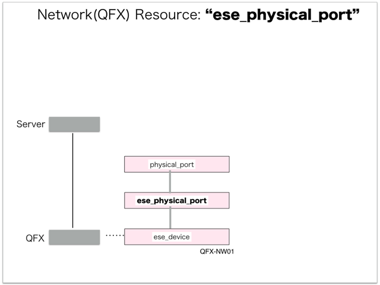

[Return to Previous Page](00_logical_network.md)

# 3. Clarification of interface in Sequence Diagram "Create Ese Physical Port"
You can see the relations of "Ese Physical Port" as following.




## 3.1. Stored data in etcd after initinalizing gohan


These are stored data for "heat_templates" in etcd.

* [Checking stored data for "ese_physical_port_existing"](../heat_template/ese_physical_port_existing.md)


## 3.2. HTTP Methods for RESTful between Gohan and Client


This is JSON data for "Create Ese Physical Port" in HTTP Methods from client.

* Checking JSON data at post method
```
POST /v2.0/ese_physical_ports
```
```
{
    "ese_physical_port": {
        "connected_port_owner": "physical_port", 
        "tenant_id": "ae69b52f46ba480bb9636f62736436f4", 
        "existing": "existing", 
        "connected_port_id": "7ff183de-0188-46bf-b7d0-68d08ad2b54f", 
        "ese_device_id": "718148aa-4483-47d5-bbd1-a0e0738dc018", 
        "name": "xe-0/0/1"
    }
}
```


## 3.3. Stored data in etcd after receiving HTTP Methods for RESTful


These are stored data for "Create Ese Physical Port" in etcd.

* [Checking stored data for creating "ese_physical_port"](stored_in_etcd/CreateEsePhysicalPort_01.md)


## 3.4. Stored heat-stack via heat-api


These are stored heat-stacks for "Create Ese Physical Port" in heat-engine.

* [Checking heat-stack of "ese_physical_port"](heat-stack/CreateEsePhysicalPort_01.md)


## 3.5. HTTP Methods for RESTful between heat-engine and CollectorAgent


This is JSON data for "Create Ese Physical Port" between heat-engine and CollectorAgent

* [Checking monitoring of "ese_physical_port"](collector_agents/CreateEsePhysicalPort_01.md)


## 3.6. Stored resource in gohan
As a result, checking resources regarding of "Ese Physical Port" in gohan.

* Checking the target of resources via gohan client
```
$ gohan client ese_physical_port show --output-format json 24dd42cf-b343-47a9-966a-8f7486378c46
{
    "ese_physical_port": {
        "connected_port_id": "7ff183de-0188-46bf-b7d0-68d08ad2b54f",
        "connected_port_owner": "physical_port",
        "description": "",
        "ese_device_id": "718148aa-4483-47d5-bbd1-a0e0738dc018",
        "existing": "existing",
        "id": "24dd42cf-b343-47a9-966a-8f7486378c46",
        "name": "xe-0/0/1",
        "operational_state": "UP",
        "orchestration_state": "CREATE_COMPLETE",
        "status": "ACTIVE",
        "tags": {},
        "tenant_id": "ae69b52f46ba480bb9636f62736436f4"
    }
}
```


[Return to Previous Page](00_logical_network.md)
