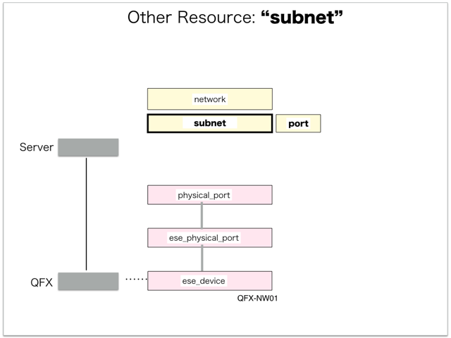

[Return to Previous Page](00_logical_network.md)

# 5. Clarification of interface in Sequence Diagram "Create Subnet"
You can see the relations of "Subnet" as following.




## 5.1. Gohan


### Outline
First of all, Gohan has received JSON data for "Create Subnet" in HTTP Methods from client.

* Checking JSON data at post method
```
POST /v2.0/subnets
```
```
{
    "subnet": {
        "description": "sample subnet",
        "tags": {},
        "network_id": "35bc496f-3c0e-46b4-a5c0-33810e8e7263",
        "tenant_id": "ae69b52f46ba480bb9636f62736436f4",
        "ip_version": 4,
        "cidr": "192.168.200.0/24",
        "name": "sample-subnet"
    }
}
```
After processing, Gohan has stored data for "Create Subnet" in etcd.

* [Checking stored data for creating "subnet"](stored_in_etcd/01_Gohan/CreateSubnet_01.md)
* [Checking stored data for creating "port(dhcp)"](stored_in_etcd/01_Gohan/CreateSubnet_02.md)


## 5.2. ResourceReader
When ResourceReader has started, it gets all of schemas from Gohan.
After that, these schemas are converted as a template_mappings.
And then, ResourceReader keeps storing template_mappings for following processing.

### Reference
* [Checking schemas in ResourceReader](../memo/schemas.txt)
* [Checking template_mappings in ResourceReader](../memo/template_mappings.md)


### Outline
After fetching resource_data for "Create Subnet" in etcd, ResourceReader has fetched heat_templates in etcd.

* [Checking stored data for "subnet"](../heat_template/subnet.md)

And then, ResourceReader has stored data as finishing resource

* [Checking stored data for creating "port(dhcp)"](stored_in_etcd/00_ResourceReader/CreateSubnet_02.md)


## 5.3. JobManager


### Outline
After converting resource_data to job_data, JobManager has stored it in etcd.

* [Checking stored data for creating "subnet"](stored_in_etcd/02_JobManager/CreateSubnet_01.md)


## 5.4. HeatWorker


### Outline
After fetching job_data, HeatWorker has handled job_data.
And then, HeatWorker has stored the result of handling job_data.

* [Checking stored data for creating "subnet"](stored_in_etcd/03_HeatWorker/CreateSubnet_01.md)


## 5.5. Heat


### Outline
Heat has conducted some tasks for "Create Subnet".
As a result, Heat has stored heat-stacks for "Create Subnet".

* [Checking heat-stack of "subnet"](heat-stack/CreateSubnet_01.md)


## 5.6. Stored resource in gohan
As a result, checking resources regarding of "Subnet" in gohan.

* Checking the target of resources via gohan client
```
$ gohan client subnet show --output-format json 3cfa93ac-251a-4a60-9434-ff4c88bf3655
{
    "subnet": {
        "allocation_pools": [
            {
                "end": "192.168.200.254",
                "start": "192.168.200.2"
            }
        ],
        "cidr": "192.168.200.0/24",
        "description": "sample subnet",
        "dhcp_server_address": "192.168.200.2",
        "dns_nameservers": [],
        "enable_dhcp": true,
        "gateway_ip": "192.168.200.1",
        "host_routes": [],
        "id": "3cfa93ac-251a-4a60-9434-ff4c88bf3655",
        "ip_version": 4,
        "ipv6_address_mode": null,
        "ipv6_ra_mode": null,
        "name": "sample-subnet",
        "network_id": "35bc496f-3c0e-46b4-a5c0-33810e8e7263",
        "ntp_servers": [],
        "orchestration_state": "CREATE_COMPLETE",
        "status": "ACTIVE",
        "tags": {},
        "tenant_id": "ae69b52f46ba480bb9636f62736436f4"
    }
}
```
* Checking another resources via gohan client
```
$ gohan client port show --output-format json 3836f376-21ad-4ec2-975b-b7f0c671c5c8
{
    "port": {
        "admin_state_up": true,
        "allowed_address_pairs": [],
        "attached": false,
        "binding:vif_type": "vrouter",
        "description": "DHCP Server Port",
        "device_id": "3cfa93ac-251a-4a60-9434-ff4c88bf3655",
        "device_owner": "network:dhcp",
        "ese_logical_port_id": null,
        "fake_delete": false,
        "fixed_ips": [
            {
                "ip_address": "192.168.200.2",
                "subnet_id": "3cfa93ac-251a-4a60-9434-ff4c88bf3655"
            }
        ],
        "id": "3836f376-21ad-4ec2-975b-b7f0c671c5c8",
        "mac_address": "00:00:5e:00:01:00",
        "managed_by_service": false,
        "name": "dhcp-server-port",
        "network_id": "35bc496f-3c0e-46b4-a5c0-33810e8e7263",
        "operational_state": "",
        "orchestration_state": "SYNC_COMPLETE",
        "security_groups": [],
        "segmentation_id": null,
        "segmentation_type": null,
        "status": "ACTIVE",
        "tags": {},
        "tenant_id": "ae69b52f46ba480bb9636f62736436f4"
    }
}
```


[Return to Previous Page](00_logical_network.md)
