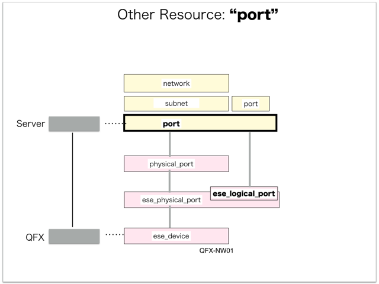

[Return to Previous Page](00_logical_network.md)

# 6. Clarification of interface in Sequence Diagram "Create Port"
You can see the relations of "Port" as following.




## 6.1. Gohan


### Outline
First of all, Gohan has received JSON data for "Create Port" in HTTP Methods from client.

* Checking JSON data at post method
```
POST /v2.0/ports
```
```
{
    "port": {
        "name": "sample-port",
        "network_id": "35bc496f-3c0e-46b4-a5c0-33810e8e7263",
        "segmentation_id": 1003,
        "fixed_ips": [
            {
                "subnet_id": "3cfa93ac-251a-4a60-9434-ff4c88bf3655",
                "ip_address": "192.168.200.101"
            }
        ],
        "device_owner": "physical_port",
        "tenant_id": "ae69b52f46ba480bb9636f62736436f4",
        "segmentation_type": "vlan",
        "device_id": "7ff183de-0188-46bf-b7d0-68d08ad2b54f"
    }
}
```
After processing, Gohan has stored data for "Create Port" in etcd.

* [Checking stored data for creating "port (192.168.200.101 / device_owner:"physical_port" / attached:false"](stored_in_etcd/01_Gohan/CreatePort_01.md)
* [Checking stored data for creating "ese_logical_port"](stored_in_etcd/01_Gohan/CreatePort_02.md)
* [Checking stored data for updating "port (192.168.200.101 / device_owner:"physical_port" / attached:true"](stored_in_etcd/01_Gohan/CreatePort_03.md)


## 6.2. ResourceReader
When ResourceReader has started, it gets all of schemas from Gohan.
After that, these schemas are converted as a template_mappings.
And then, ResourceReader keeps storing template_mappings for following processing.

### Reference
* [Checking schemas in ResourceReader](../memo/schemas.txt)
* [Checking template_mappings in ResourceReader](../memo/template_mappings.md)


### Outline
After fetching resource_data for "Create Ese Device" in etcd, ResourceReader has fetched heat_templates in etcd.

* [Checking stored data for "port"](../heat_template/port.md)
* [Checking stored data for "ese_logical_port"](../heat_template/ese_logical_port.md)


## 6.3. JobManager


### Outline
After converting resource_data to job_data, JobManager has stored it in etcd.

* [Checking stored data for creating "port (192.168.200.101 / device_owner:"physical_port" / attached:false"](stored_in_etcd/02_JobManager/CreatePort_01.md)
* [Checking stored data for creating "ese_logical_port"](stored_in_etcd/02_JobManager/CreatePort_02.md)
* [Checking stored data for updating "port (192.168.200.101 / device_owner:"physical_port" / attached:true"](stored_in_etcd/02_JobManager/CreatePort_03.md)


## 6.4. HeatWorker


### Outline
After fetching job_data, HeatWorker has handled job_data.
And then, HeatWorker has stored the result of handling job_data.

* [Checking stored data for creating "port (192.168.200.101 / device_owner:"physical_port" / attached:false"](stored_in_etcd/03_HeatWorker/CreatePort_01.md)
* [Checking stored data for creating "ese_logical_port"](stored_in_etcd/03_HeatWorker/CreatePort_02.md)
* [Checking stored data for updating "port (192.168.200.101 / device_owner:"physical_port" / attached:true"](stored_in_etcd/03_HeatWorker/CreatePort_03.md)


## 6.5. Heat


### Outline
Heat has conducted some tasks for "Create Port".
As a result, Heat has stored heat-stacks for "Create Port".

* [Checking heat-stack of "ese_logical_port"](heat-stack/CreatePort_01.md)
* [Checking heat-stack of "port (192.168.200.101)"](heat-stack/CreatePort_02.md)


## 6.6. CollectorAgent


### Outline
CollectorAgent has conducted some tasks for "Create Ese Device" based heat-stacks via Heat.
As a result, CollectorAgent has responded the result of status information as handling tasks.

* [Checking monitoring of "ese_logical_port"](collector_agents/CreatePort_01.md)
* [Checking monitoring of "port"](collector_agents/CreatePort_02.md)

And then, CollectorAgent has stored the result of status information.

* [Checking stored data for creating "port (192.168.200.101 / device_owner:"physical_port" / attached:false"](stored_in_etcd/04_CollectorAgent/CreatePort_01.md)
* [Checking stored data for creating "ese_logical_port"](stored_in_etcd/04_CollectorAgent/CreatePort_02.md)
* [Checking stored data for updating "port (192.168.200.101 / device_owner:"physical_port" / attached:true"](stored_in_etcd/04_CollectorAgent/CreatePort_03.md)


## 6.7. Stored resource in gohan
As a result, checking resources regarding of "Port" in gohan.

* Checking the target of resources via gohan client
```
$ gohan client port show --output-format json fde61b02-9615-4e75-aac0-30a333657c1b
{
    "port": {
        "admin_state_up": true,
        "allowed_address_pairs": [],
        "attached": true,
        "binding:vif_type": "vrouter",
        "description": "",
        "device_id": "7ff183de-0188-46bf-b7d0-68d08ad2b54f",
        "device_owner": "physical_port",
        "ese_logical_port_id": "ced1435d-6dfa-4dab-bb7c-19da4d8e48b7",
        "fake_delete": false,
        "fixed_ips": [
            {
                "ip_address": "192.168.200.101",
                "subnet_id": "3cfa93ac-251a-4a60-9434-ff4c88bf3655"
            }
        ],
        "id": "fde61b02-9615-4e75-aac0-30a333657c1b",
        "mac_address": "fa:16:3e:67:26:46",
        "managed_by_service": false,
        "name": "sample-port",
        "network_id": "35bc496f-3c0e-46b4-a5c0-33810e8e7263",
        "operational_state": "UP",
        "orchestration_state": "UPDATE_COMPLETE",
        "security_groups": [],
        "segmentation_id": 1003,
        "segmentation_type": "vlan",
        "status": "ACTIVE",
        "tags": {},
        "tenant_id": "ae69b52f46ba480bb9636f62736436f4"
    }
}
```
* Checking another resources via gohan client
```
$ gohan client ese_logical_port show --output-format json ced1435d-6dfa-4dab-bb7c-19da4d8e48b7
{
    "ese_logical_port": {
        "common_function_gateway_id": null,
        "connected_resource": "port",
        "description": "ESE Logical port for Port fde61b02-9615-4e75-aac0-30a333657c1b",
        "ese_physical_port_id": "24dd42cf-b343-47a9-966a-8f7486378c46",
        "gw_interface_id": null,
        "id": "ced1435d-6dfa-4dab-bb7c-19da4d8e48b7",
        "name": "xe-0/0/1.1003",
        "network_id": "35bc496f-3c0e-46b4-a5c0-33810e8e7263",
        "operational_state": "UP",
        "orchestration_state": "CREATE_COMPLETE",
        "port_ids": [
            "fde61b02-9615-4e75-aac0-30a333657c1b"
        ],
        "status": "ACTIVE",
        "tags": {},
        "tenant_id": "ae69b52f46ba480bb9636f62736436f4",
        "type": "L2",
        "vlan_id": 1003
    }
}
```


[Return to Previous Page](00_logical_network.md)
