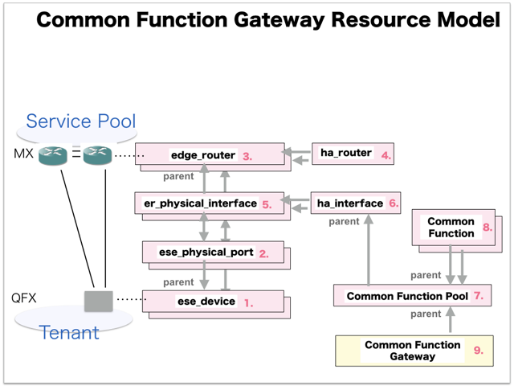

[Return to Top Page](../README.md)

# ESI interface for Common Function Gateway
This section is for the purpose of documenting ESI interface.

* Initinalizing gohan ...
* Receiving HTTP Methods for Creating Resource ...

# Resource model for Common Function Gateway
First of all, you can see the overview of resources model of "Common Function Gateway".

* [01: Ese Device](01_ese_device.md)
* [02: Ese Physical Port](02_ese_physical_port.md)
* [03: Edge Router](03_edge_router.md)
* [04: Ha Router](04_ha_router.md)
* [05: Er Physical Interface](05_er_physical_interface.md)
* [06: Ha Interface](06_ha_interface.md)
* [07: Common Function Pool](07_common_function_pool.md)
* [08: Common Function](08_common_function.md)
* [09: Nat Ip Pool](09_nat_ip_pool.md)
* [10: Common Function Gateway](10_common_function_gateway.md)

