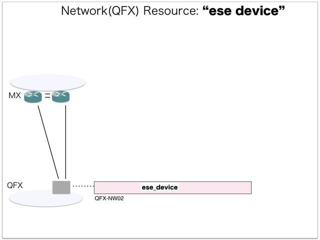
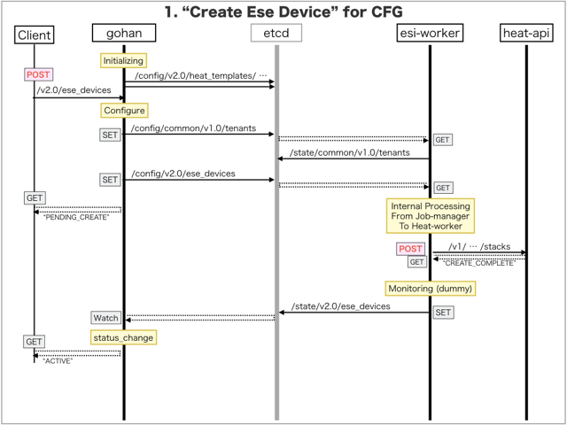

[Return to Previous Page](00_common_function_gateway.md)

# 1. Clarification of interface in Sequence Diagram "Create Ese Device"
You can see the relations of "Ese Device" as following.



## 1.1. Sequence Diagram between gohan and etcd
This is a diagram that has been described as interfaces for "Ese Device" between gohan and etcd.

* Initinalizing gohan ...
* Receiving HTTP Methods for Creating Resource ...



## 1.2. Stored data in etcd after initinalizing gohan
These are stored data for "heat_templates" in etcd.

* [Checking stored data for "ese_device_existing"](../heat_template/ese_device_existing.md)
* [Checking stored data for "ese_device_monitoring"](../heat_template/ese_device_monitoring.md)


## 1.3. HTTP Methods for RESTful between Gohan and Client
This is JSON data for "Create Ese Device" in HTTP Methods from client.

* Checking JSON data at post method
```
POST /v2.0/ese_devices
```
```
{
    "ese_device": {
        "username": "esi",
        "password": "password",
        "public_ip_address": "10.161.0.34",
        "hostname": "QFX-NW02",
        "name": "QFX-NW02",
        "management_ip_address": "10.161.0.34",
        "type": "tor",
        "existing": "existing",
        "tenant_id": "0b576f6f4cbf414f829cd12f008bf08f"
    }
}
```


## 1.4. Stored data in etcd after receiving HTTP Methods for RESTful
These are stored data for "Create Ese Device" in etcd.

* [Checking stored data for creating "ese_device"](stored_in_etcd/CreateEseDevice_01.md)


## 1.5. Stored heat-stack via heat-api
These are stored heat-stacks for "Create Ese Device" in heat-engine.

* [Checking heat-stack of "ese_device"](heat-stack/CreateEseDevice_01.md)


## 1.6. Stored resource for monitoring in Kafka
This is JSON data for "Create Ese Device" between monitoring-worker and kafka

* [Checking the topic "monitor_snmp_device" for monitoring "ese_devices"](stored_in_kafka/CreateEseDevice_01.md)


## 1.7. Stored resource in gohan
As a result, checking resources regarding of "Ese Device" in gohan.

* Checking the target of resources via gohan client
```
$ gohan client ese_device show --output-format json 9f05b260-26ca-46f7-98c3-ad88e411a989
{
    "ese_device": {
        "description": "",
        "existing": "existing",
        "flavor": null,
        "hostname": "QFX-NW02",
        "id": "9f05b260-26ca-46f7-98c3-ad88e411a989",
        "location": null,
        "management_ip_address": "10.161.0.34",
        "name": "QFX-NW02",
        "password": "password",
        "public_ip_address": "10.161.0.34",
        "status": "ACTIVE",
        "tags": {},
        "tenant_id": "0b576f6f4cbf414f829cd12f008bf08f",
        "tor_agent_names": null,
        "tsn_names": null,
        "type": "tor",
        "username": "esi"
    }
}
```


[Return to Previous Page](00_common_function_gateway.md)
