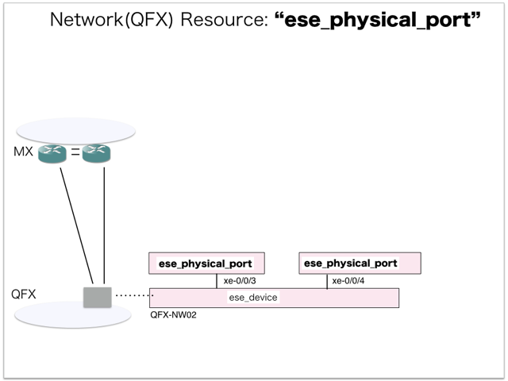

[Return to Previous Page](00_common_function_gateway.md)

# 2. Clarification of interface in Sequence Diagram "Create Ese Physical Port"
You can see the relations of "Ese Physical Port" as following.



## 2.1. Sequence Diagram between gohan and etcd
This is a diagram that has been described as interfaces for "Ese Physical Port" between gohan and etcd.

* Initinalizing gohan ...
* Receiving HTTP Methods for Creating Resource ...


## 2.2. Stored data in etcd after initinalizing gohan
These are stored data for "heat_templates" in etcd.

* [Checking stored data for "ese_physical_port_existing"](../heat_template/ese_physical_port_existing.md)
* [Checking stored data for "ese_physical_port_monitoring"](../heat_template/ese_physical_port_monitoring.md)


## 2.3. HTTP Methods for RESTful between Gohan and Client
This is JSON data for "Create Ese Physical Port" in HTTP Methods from client.

* Checking JSON data at post method
```
POST /v2.0/ese_physical_ports
```
```
{
    "ese_physical_port": {
        "name": "xe-0/0/3",
        "ese_device_id": "9f05b260-26ca-46f7-98c3-ad88e411a989",
        "connected_port_id": "",
        "connected_port_owner": "mx_downlink",
        "tenant_id": "0b576f6f4cbf414f829cd12f008bf08f"
    }
}
```
* Checking JSON data at post method
```
POST /v2.0/ese_physical_ports
```
```
{
    "ese_physical_port": {
        "name": "xe-0/0/4",
        "ese_device_id": "9f05b260-26ca-46f7-98c3-ad88e411a989",
        "connected_port_id": "",
        "connected_port_owner": "mx_downlink",
        "tenant_id": "0b576f6f4cbf414f829cd12f008bf08f"
    }
}
```


## 2.4. Stored data in etcd after receiving HTTP Methods for RESTful
These are stored data for "Create Ese Physical Port" in etcd.

* [Checking stored data for creating "xe-0/0/3"](stored_in_etcd/CreateEsePhysicalPort_01.md)
* [Checking stored data for creating "xe-0/0/4"](stored_in_etcd/CreateEsePhysicalPort_02.md)


## 2.5. Stored heat-stack via heat-api
These are stored heat-stacks for "Create Ese Physical Port" in heat-engine.

* [Checking heat-stack of "xe-0/0/3"](heat-stack/CreateEsePhysicalPort_01.md)
* [Checking heat-stack of "xe-0/0/4"](heat-stack/CreateEsePhysicalPort_02.md)


## 2.6. Stored resource for monitoring in Kafka
This is JSON data for "Create Ese Physical Port" between monitoring-worker and kafka

* [Checking the topic "monitor_physical_port" for monitoring "ese_physical_port"](stored_in_kafka/CreateEsePhysicalPort_01.md)


## 2.7. Stored resource in gohan
As a result, checking resources regarding of "Ese Physical Port" in gohan.

* Checking the target of resources via gohan client
```
$ gohan client ese_physical_port show --output-format json 976156ef-05b4-47f4-9497-a36531563a08
{
    "ese_physical_port": {
        "connected_port_id": "",
        "connected_port_owner": "mx_downlink",
        "description": "",
        "ese_device_id": "9f05b260-26ca-46f7-98c3-ad88e411a989",
        "existing": "new",
        "id": "976156ef-05b4-47f4-9497-a36531563a08",
        "name": "xe-0/0/3",
        "status": "ACTIVE",
        "tags": {},
        "tenant_id": "0b576f6f4cbf414f829cd12f008bf08f"
    }
}
```
```
$ gohan client ese_physical_port show --output-format json 5b2dee2e-7420-4cd4-b270-5081eb9eb371
{
    "ese_physical_port": {
        "connected_port_id": "",
        "connected_port_owner": "mx_downlink",
        "description": "",
        "ese_device_id": "9f05b260-26ca-46f7-98c3-ad88e411a989",
        "existing": "new",
        "id": "5b2dee2e-7420-4cd4-b270-5081eb9eb371",
        "name": "xe-0/0/4",
        "status": "ACTIVE",
        "tags": {},
        "tenant_id": "0b576f6f4cbf414f829cd12f008bf08f"
    }
}
```


[Return to Previous Page](00_common_function_gateway.md)
