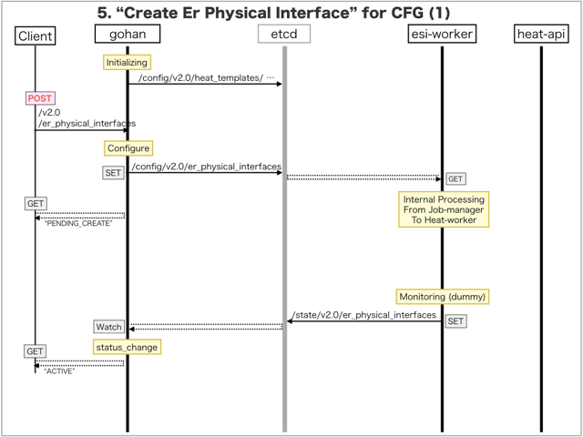
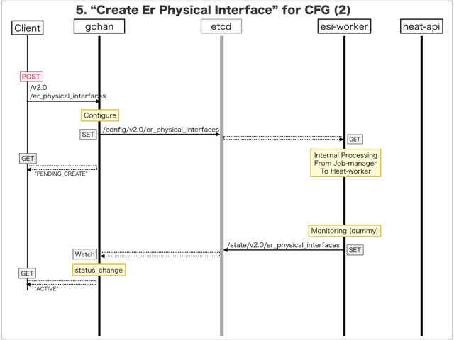

[Return to Previous Page](00_common_function_gateway.md)

# 5. Clarification of interface in Sequence Diagram "Create Er Physical Interface"
You can see the relations of "Create Er Physical Interface" as following.


## 5.1. Sequence Diagram between gohan and etcd
This is a diagram that has been described as interfaces for "Er Physical Interface" between gohan and etcd.

* Initinalizing gohan ...
* Receiving HTTP Methods for Creating Resource ...




## 5.2. Stored data in etcd after initinalizing gohan
These are stored data for "heat_templates" in etcd.

* [Checking stored data for "er_physical_interface_monitoring"](../heat_template/er_physical_interface_monitoring.md)


## 5.3. HTTP Methods for RESTful between Gohan and Client
This is JSON data for "Create Er Physical Interface" in HTTP Methods from client.

* Checking JSON data at post method
```
POST /v2.0/er_physical_interfaces
```
```
{
    "er_physical_interface": {
        "connected_ese_port_id": "976156ef-05b4-47f4-9497-a36531563a08",
        "device_id": "8aba84f9-4675-4d22-a231-e9eabde80818",
        "name": "ae0",
        "tenant_id": "0b576f6f4cbf414f829cd12f008bf08f"
    }
}
```
* Checking JSON data at post method
```
POST /v2.0/er_physical_interfaces
```
```
{
    "er_physical_interface": {
        "connected_ese_port_id": "5b2dee2e-7420-4cd4-b270-5081eb9eb371",
        "device_id": "769b5e3b-3320-41ec-9be0-4567b50f1aab",
        "name": "ae0",
        "tenant_id": "0b576f6f4cbf414f829cd12f008bf08f"
    }
}
```


## 5.4. Stored data in etcd after receiving HTTP Methods for RESTful
These are stored data for "Create Er Physical Interface" in etcd.

* [Checking stored data for creating "ae0"](stored_in_etcd/CreateErPhysicalInterface_01.md)
* [Checking stored data for creating "ae0"](stored_in_etcd/CreateErPhysicalInterface_02.md)


## 5.5. Stored resource for monitoring in Kafka
This is JSON data for "Create Er Physical Interface" between monitoring-worker and kafka

* [Checking the topic "monitor_physical_port" for monitoring "er_physical_interface"](stored_in_kafka/CreateErPhysicalInterface_01.md)


## 5.6. Stored resource in gohan
As a result, checking resources regarding of "Er Physical Interface" in gohan.

* Checking the target of resources via gohan client
```
$ gohan client er_physical_interface show --output-format json a752c6c0-2075-4e7f-9040-5fcefcad0252
{
    "er_physical_interface": {
        "connected_ese_port_id": "976156ef-05b4-47f4-9497-a36531563a08",
        "description": "",
        "device_id": "8aba84f9-4675-4d22-a231-e9eabde80818",
        "id": "a752c6c0-2075-4e7f-9040-5fcefcad0252",
        "name": "ae0",
        "status": "ACTIVE",
        "tenant_id": "0b576f6f4cbf414f829cd12f008bf08f"
    }
}
```
```
$ gohan client er_physical_interface show --output-format json 96c3629b-9bfb-4d54-adc1-750d024c2858
{
    "er_physical_interface": {
        "connected_ese_port_id": "5b2dee2e-7420-4cd4-b270-5081eb9eb371",
        "description": "",
        "device_id": "769b5e3b-3320-41ec-9be0-4567b50f1aab",
        "id": "96c3629b-9bfb-4d54-adc1-750d024c2858",
        "name": "ae0",
        "status": "ACTIVE",
        "tenant_id": "0b576f6f4cbf414f829cd12f008bf08f"
    }
}
```


[Return to Previous Page](00_common_function_gateway.md)
