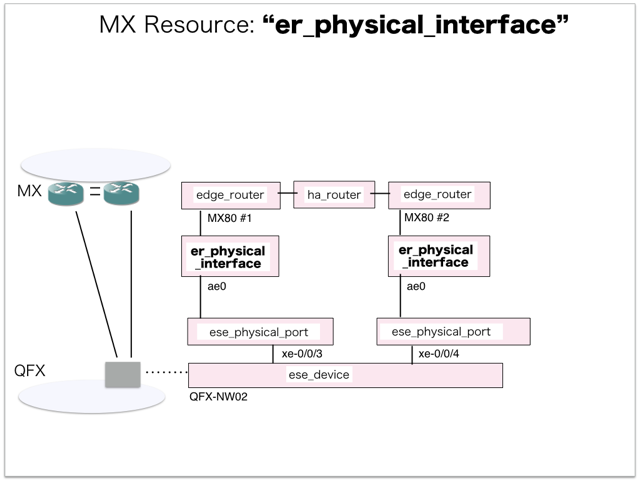

[Return to Previous Page](00_common_function_gateway.md)

# 5. Clarification of interface in Sequence Diagram "Create Er Physical Interface"
You can see the relations of "Create Er Physical Interface" as following.




## 5.1. Gohan


### Outline
First of all, Gohan has received JSON data for "Create Er Physical Interface" in HTTP Methods from client.

* Checking JSON data at post method
```
POST /v2.0/er_physical_interfaces
```
```
{
    "er_physical_interface": {
        "connected_ese_port_id": "9451c9ca-289d-42ba-846d-359c448e910c",
        "device_id": "f4f54175-93fe-406b-ae66-dbca4df99e03",
        "name": "ae0",
        "tenant_id": "c583ce78843344adbe5fd20f13620274"
    }
}
```
* Checking JSON data at post method
```
POST /v2.0/er_physical_interfaces
```
```
{
    "er_physical_interface": {
        "connected_ese_port_id": "f4c3a1bf-3b61-48ba-a548-422036849465",
        "device_id": "2d056865-47a9-45cf-a890-ed10e3b5912a",
        "name": "ae0",
        "tenant_id": "c583ce78843344adbe5fd20f13620274"
    }
}
```
After processing, Gohan has stored data for "Create Er Physical Interface" in etcd.

* [Checking stored data for creating "ae0"](stored_in_etcd/01_Gohan/CreateErPhysicalInterface_01.md)
* [Checking stored data for creating "ae0"](stored_in_etcd/01_Gohan/CreateErPhysicalInterface_02.md)


## 5.2. ResourceReader
When ResourceReader has started, it gets all of schemas from Gohan.
After that, these schemas are converted as a template_mappings.
And then, ResourceReader keeps storing template_mappings for following processing.

### Reference
* [Checking schemas in ResourceReader](../memo/schemas.txt)
* [Checking template_mappings in ResourceReader](../memo/template_mappings.md)


### Outline
After fetching resource_data for "Create Er Physical Interface" in etcd, ResourceReader has fetched heat_templates in etcd.

* [Checking stored data for "er_physical_interface"](../heat_template/er_physical_interface.md)


## 5.3. JobManager


### Outline
After converting resource_data to job_data, JobManager has stored it in etcd.

* [Checking stored data for creating "ae0"](stored_in_etcd/02_JobManager/CreateErPhysicalInterface_01.md)
* [Checking stored data for creating "ae0"](stored_in_etcd/02_JobManager/CreateErPhysicalInterface_02.md)


## 5.4. HeatWorker


### Outline
After fetching job_data, HeatWorker has handled job_data.
And then, HeatWorker has stored the result of handling job_data.

* [Checking stored data for creating "ae0"](stored_in_etcd/03_HeatWorker/CreateErPhysicalInterface_01.md)
* [Checking stored data for creating "ae0"](stored_in_etcd/03_HeatWorker/CreateErPhysicalInterface_02.md)


## 5.5. Heat


### Outline
Heat has conducted some tasks for "Create Er Physical Interface".
As a result, Heat has stored heat-stacks for "Create Er Physical Interface".

* [Checking heat-stack of "ae0"](heat-stack/CreateErPhysicalInterface_01.md)
* [Checking heat-stack of "ae0"](heat-stack/CreateErPhysicalInterface_02.md)


## 5.6. CollectorAgent


### Outline
CollectorAgent has conducted some tasks for "Create Er Physical Interface" based heat-stacks via Heat.
As a result, CollectorAgent has responded the result of status information as handling tasks.

* [Checking monitoring of "ae0"](collector_agents/CreateErPhysicalInterface_01.md)
* [Checking monitoring of "ae0"](collector_agents/CreateErPhysicalInterface_02.md)

And then, CollectorAgent has stored the result of status information.

* [Checking stored data for creating "ae0"](stored_in_etcd/04_CollectorAgent/CreateErPhysicalInterface_01.md)
* [Checking stored data for creating "ae0"](stored_in_etcd/04_CollectorAgent/CreateErPhysicalInterface_02.md)


## 5.7. Stored resource in gohan
As a result, checking resources regarding of "Er Physical Interface" in gohan.

* Checking the target of resources via gohan client
```
$ gohan client er_physical_interface show --output-format json c2576120-00b0-461e-a2ae-f7bbff9465d0
{
    "er_physical_interface": {
        "connected_ese_port_id": "9451c9ca-289d-42ba-846d-359c448e910c",
        "description": "",
        "device_id": "f4f54175-93fe-406b-ae66-dbca4df99e03",
        "id": "c2576120-00b0-461e-a2ae-f7bbff9465d0",
        "name": "ae0",
        "operational_state": "UP",
        "orchestration_state": "CREATE_COMPLETE",
        "status": "ACTIVE",
        "tenant_id": "c583ce78843344adbe5fd20f13620274"
    }
}
```
```
$ gohan client er_physical_interface show --output-format json b9c7c1f4-1b90-4a7a-8161-34276bb2ed10
{
    "er_physical_interface": {
        "connected_ese_port_id": "f4c3a1bf-3b61-48ba-a548-422036849465",
        "description": "",
        "device_id": "2d056865-47a9-45cf-a890-ed10e3b5912a",
        "id": "b9c7c1f4-1b90-4a7a-8161-34276bb2ed10",
        "name": "ae0",
        "operational_state": "UP",
        "orchestration_state": "CREATE_COMPLETE",
        "status": "ACTIVE",
        "tenant_id": "c583ce78843344adbe5fd20f13620274"
    }
}
```


[Return to Previous Page](00_common_function_gateway.md)
