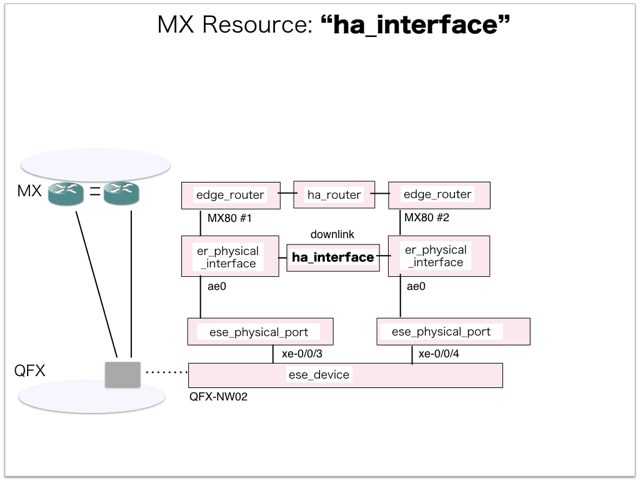
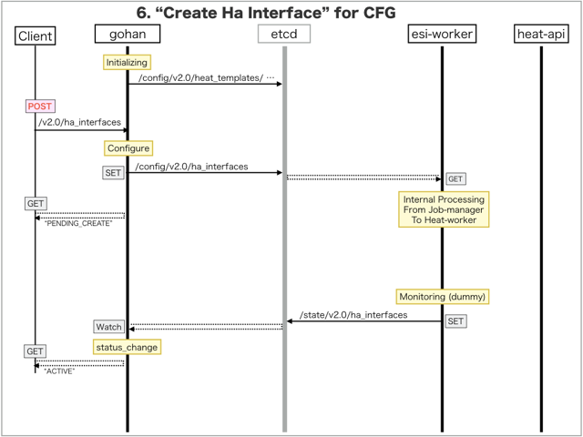

[Return to Previous Page](00_common_function_gateway.md)

# 6. Clarification of interface in Sequence Diagram "Create Ha Interface"
You can see the relations of "Ha Interface" as following.



## 6.1. Sequence Diagram between gohan and etcd
This is a diagram that has been described as interfaces for "Ha Interface" between gohan and etcd.

* Initinalizing gohan ...
* Receiving HTTP Methods for Creating Resource ...



## 6.2. Stored data in etcd after initinalizing gohan
These are stored data for "heat_templates" in etcd.

* [Checking stored data for "ha_interface_monitoring"](../heat_template/ha_interface_monitoring.md)


## 6.3. HTTP Methods for RESTful between Gohan and Client
This is JSON data for "Create Ha Interface" in HTTP Methods from client.

* Checking JSON data at post method
```
POST /v2.0/ha_interfaces
```
```
{
    "ha_interface": {
        "ha_router_id": "3a3d7a43-d749-44e8-90bc-de7b37d1d258",
        "link_type": "downlink",
        "name": "sample-ha-router-downlink",
        "primary_interface_id": "a752c6c0-2075-4e7f-9040-5fcefcad0252",
        "secondary_interface_id": "96c3629b-9bfb-4d54-adc1-750d024c2858",
        "restricted_vlans": "0-1024,4094",
        "tenant_id": "0b576f6f4cbf414f829cd12f008bf08f"
    }
}
```


## 6.4. Stored data in etcd after receiving HTTP Methods for RESTful
These are stored data for "Create Ha Interface" in etcd.

* [Checking stored data for creating "ha_interface"](stored_in_etcd/CreateHaInterface_01.md)


## 6.5. Stored resource in gohan
As a result, checking resources regarding of "Ha Interface" in gohan.

* Checking the target of resources via gohan client
```
$ gohan client ha_interface show --output-format json 372ed357-e622-41fb-a613-076d332838e2
{
    "ha_interface": {
        "admin_state_up": true,
        "available_be_bandwidth": 0,
        "available_ga_bandwidth": 0,
        "description": "",
        "gateway_instances_count": 0,
        "ha_router_id": "3a3d7a43-d749-44e8-90bc-de7b37d1d258",
        "id": "372ed357-e622-41fb-a613-076d332838e2",
        "link_type": "downlink",
        "maximum_be_bandwidth": 0,
        "maximum_ga_bandwidth": 0,
        "name": "sample-ha-router-downlink",
        "primary_interface_id": "a752c6c0-2075-4e7f-9040-5fcefcad0252",
        "restricted_vlans": "0-1024,4094",
        "secondary_interface_id": "96c3629b-9bfb-4d54-adc1-750d024c2858",
        "status": "ACTIVE",
        "tenant_id": "0b576f6f4cbf414f829cd12f008bf08f",
        "vlan_ids_available": 3069,
        "vlan_pool_state": "//////////////////////////////////////////////////////////////////////////////////////////////////////////////////////////////////////////////////////////////////////////+AAAAAAAAAAAAAAAAAAAAAAAAAAAAAAAAAAAAAAAAAAAAAAAAAAAAAAAAAAAAAAAAAAAAAAAAAAAAAAAAAAAAAAAAAAAAAAAAAAAAAAAAAAAAAAAAAAAAAAAAAAAAAAAAAAAAAAAAAAAAAAAAAAAAAAAAAAAAAAAAAAAAAAAAAAAAAAAAAAAAAAAAAAAAAAAAAAAAAAAAAAAAAAAAAAAAAAAAAAAAAAAAAAAAAAAAAAAAAAAAAAAAAAAAAAAAAAAAAAAAAAAAAAAAAAAAAAAAAAAAAAAAAAAAAAAAAAAAAAAAAAAAAAAAAAAAAAAAAAAAAAAAAAAAAAAAAAAAAAAAAAAAAAAAAAAAAAAAAAAAAAAAAAAAAAAAAAAAAAAAAAAAAAAAAAAAAAAAAAAAAAAAAAAAAAAAAAAAAAAAAAAAAAAAAAAAAAAAAAAAAAAAAAAAAAAAAAAAAAAAAAAAAAAAAAAAAAAAAAAAAAAAAAAAAAAAAAAAAAAAAAAAAAAAAAAM="
    }
}
```

[Return to Previous Page](00_common_function_gateway.md)
