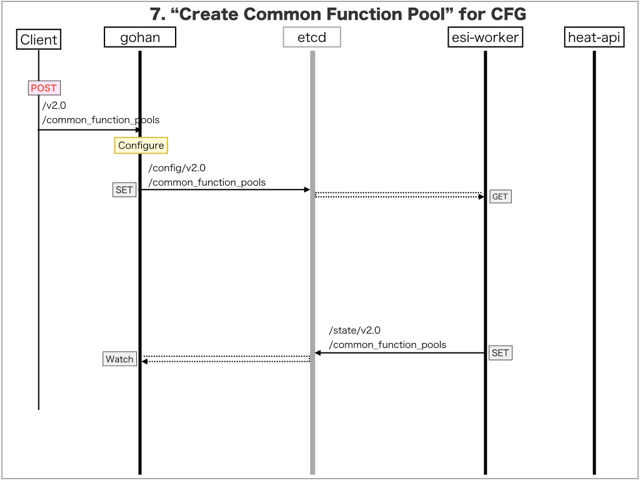

[Return to Previous Page](00_common_function_gateway.md)

# 7. Clarification of interface in Sequence Diagram "Create Common Function Pool"
You can see the relations of "Common Function Pool" as following.


## 7.1. Sequence Diagram between gohan and etcd
This is a diagram that has been described as interfaces for "Common Function Pool" between gohan and etcd.

* Receiving HTTP Methods for Creating Resource ...




## 7.2. HTTP Methods for RESTful between Gohan and Client
This is JSON data for "Create Common Function Pool" in HTTP Methods from client.

* Checking JSON data at post method
```
POST /v2.0/common_function_pools
```
```
{
    "common_function_pool": {
        "description": "sample common function pool",
        "dnat_group_name": "DNAT-RULE",
        "dnat_pool_group_name": "DNAT-POOL",
        "downlink_interfaces": [
            "372ed357-e622-41fb-a613-076d332838e2"
        ],
        "link_local_cidr": "169.254.0.0/17",
        "logical_tunnel_interface_name": "lt-0/0/0",
        "name": "common_function_pool",
        "service_interface_name": "ms-0/2/0",
        "service_vrf_name": "SHARED-RESOURCE",
        "snapt_group_name": "SNAPT-RULE",
        "snapt_pool_group_name": "SNAPT-POOL",
        "tenant_id": "0b576f6f4cbf414f829cd12f008bf08f",
        "vrrp_config": [
            {
                "primary_ip": "169.254.1.251",
                "secondary_ip": "169.254.1.252",
                "vrid": 41
            },
            {
                "primary_ip": "169.254.1.253",
                "secondary_ip": "169.254.1.254",
                "vrid": 42
            }
        ],
        "vrrp_group_name": "IF-USER-VRRP-ACT"
    }
}
```


## 7.3. Stored data in etcd after receiving HTTP Methods for RESTful
These are stored data for "Create Common Function Pool" in etcd.

* [Checking stored data for creating "common_function_pool"](stored_in_etcd/CreateCommonFunctionPool_01.md)


## 7.4. Stored resource in gohan
As a result, checking resources regarding of "Common Function Pool" in gohan.

* Checking the target of resources via gohan client
```
$ gohan client common_function_pool show --output-format json cca32fd7-2430-4acc-87e9-a7b527e9918d
{
    "common_function_pool": {
        "common_function_pool_state": "AAD//w==",
        "description": "sample common function pool",
        "dnat_group_name": "DNAT-RULE",
        "dnat_pool_group_name": "DNAT-POOL",
        "downlink_interfaces": [
            "372ed357-e622-41fb-a613-076d332838e2"
        ],
        "id": "cca32fd7-2430-4acc-87e9-a7b527e9918d",
        "link_local_cidr": "169.254.0.0/17",
        "link_local_netmask": 17,
        "logical_tunnel_interface_name": "lt-0/0/0",
        "name": "common_function_pool",
        "service_interface_name": "ms-0/2/0",
        "service_vrf_name": "SHARED-RESOURCE",
        "snapt_group_name": "SNAPT-RULE",
        "snapt_pool_group_name": "SNAPT-POOL",
        "tenant_id": "0b576f6f4cbf414f829cd12f008bf08f",
        "vrrp_config": [
            {
                "primary_ip": "169.254.1.251",
                "secondary_ip": "169.254.1.252",
                "vrid": 41
            },
            {
                "primary_ip": "169.254.1.253",
                "secondary_ip": "169.254.1.254",
                "vrid": 42
            }
        ],
        "vrrp_group_name": "IF-USER-VRRP-ACT"
    }
}
```

[Return to Previous Page](00_common_function_gateway.md)
