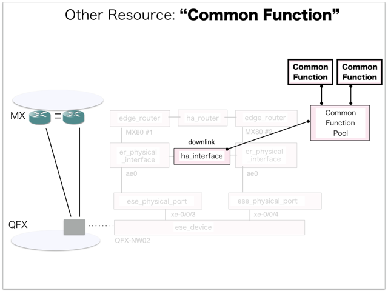

[Return to Previous Page](00_common_function_gateway.md)

# 8. Clarification of interface in Sequence Diagram "Create Common Function"
You can see the relations of "Common Function" as following.




## 8.1. Gohan


### Outline
First of all, Gohan has received JSON data for "Create Common Function" in HTTP Methods from client.

* Checking JSON data at post method
```
POST /v2.0/common_functions
```
```
{
    "common_function": {
        "common_function_pool_id": "2d4a700d-bf94-4217-9a3c-4217a16c951f",
        "link_local_ip_address": "169.254.1.227",
        "name": "common_function1",
        "shared_ip_address": "100.64.0.127",
        "tenant_id": "c583ce78843344adbe5fd20f13620274"
    }
}
```
* Checking JSON data at post method
```
POST /v2.0/common_functions
```
```
{
    "common_function": {
        "common_function_pool_id": "2d4a700d-bf94-4217-9a3c-4217a16c951f",
        "link_local_ip_address": "169.254.1.228",
        "name": "common_function2",
        "shared_ip_address": "100.64.0.128",
        "tenant_id": "c583ce78843344adbe5fd20f13620274"
    }
}
```
After processing, Gohan has stored data for "Create Common Function" in etcd.

* [Checking stored data for creating "common_function_number1"](stored_in_etcd/01_Gohan/CreateCommonFunction_01.md)
* [Checking stored data for creating "common_function_number1"](stored_in_etcd/01_Gohan/CreateCommonFunction_02.md)
* [Checking stored data for creating "common_function_number2"](stored_in_etcd/01_Gohan/CreateCommonFunction_03.md)
* [Checking stored data for creating "common_function_number2"](stored_in_etcd/01_Gohan/CreateCommonFunction_04.md)


## 8.2. ResourceReader
When ResourceReader has started, it gets all of schemas from Gohan.
After that, these schemas are converted as a template_mappings.
And then, ResourceReader keeps storing template_mappings for following processing.

### Reference
* [Checking schemas in ResourceReader](../memo/schemas.txt)
* [Checking template_mappings in ResourceReader](../memo/template_mappings.md)


### Outline
After fetching resource_data for "Create Common Function" in etcd, ResourceReader has not fetched heat_templates in etcd because of non_workable_resource.
And then, ResourceReader has stored data as finishing resource

* [Checking stored data for creating "common_function_number1"](stored_in_etcd/00_ResourceReader/CreateCommonFunction_01.md)
* [Checking stored data for creating "common_function_number1"](stored_in_etcd/00_ResourceReader/CreateCommonFunction_02.md)
* [Checking stored data for creating "common_function_number2"](stored_in_etcd/00_ResourceReader/CreateCommonFunction_03.md)
* [Checking stored data for creating "common_function_number2"](stored_in_etcd/00_ResourceReader/CreateCommonFunction_04.md)


## 8.3. Stored resource in gohan
As a result, checking resources regarding of "Common Function" in gohan.

* Checking the target of resources via gohan client
```
$ gohan client common_function show --output-format json 637aa51a-f54f-4723-bc5f-9fb8942dfc8b
{
    "common_function": {
        "common_function_number": 1,
        "common_function_pool_id": "2d4a700d-bf94-4217-9a3c-4217a16c951f",
        "description": "",
        "ha_router_id": "e16529c4-ffb8-4346-b850-af3c93564604",
        "id": "637aa51a-f54f-4723-bc5f-9fb8942dfc8b",
        "link_local_ip_address": "169.254.1.227",
        "name": "common_function1",
        "orchestration_state": "SYNC_COMPLETE",
        "primary_vrrp_ip": "169.254.1.251",
        "secondary_vrrp_ip": "169.254.1.252",
        "shared_ip_address": "100.64.0.127",
        "status": "ACTIVE",
        "tenant_id": "c583ce78843344adbe5fd20f13620274",
        "vrid": 41
    }
}
```
```
$ gohan client common_function show --output-format json b7ff279d-a7ee-4714-b77c-bcd2f0e51996
{
    "common_function": {
        "common_function_number": 2,
        "common_function_pool_id": "2d4a700d-bf94-4217-9a3c-4217a16c951f",
        "description": "",
        "ha_router_id": "e16529c4-ffb8-4346-b850-af3c93564604",
        "id": "b7ff279d-a7ee-4714-b77c-bcd2f0e51996",
        "link_local_ip_address": "169.254.1.228",
        "name": "common_function2",
        "orchestration_state": "SYNC_COMPLETE",
        "primary_vrrp_ip": "169.254.1.253",
        "secondary_vrrp_ip": "169.254.1.254",
        "shared_ip_address": "100.64.0.128",
        "status": "ACTIVE",
        "tenant_id": "c583ce78843344adbe5fd20f13620274",
        "vrid": 42
    }
}
```

[Return to Previous Page](00_common_function_gateway.md)
