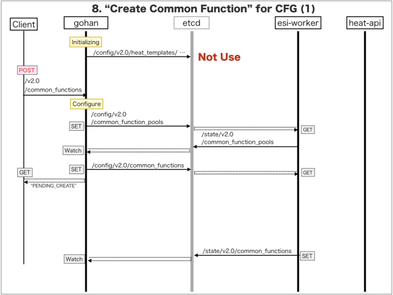
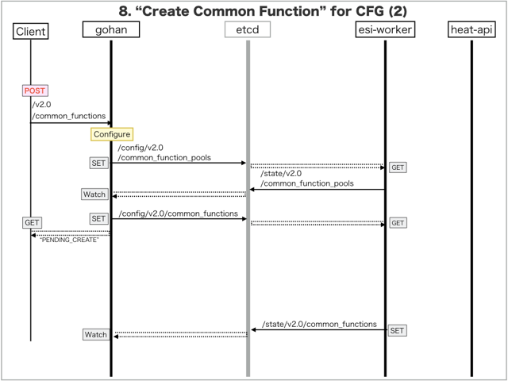

[Return to Previous Page](00_common_function_gateway.md)

# 8. Clarification of interface in Sequence Diagram "Create Common Function"
You can see the relations of "Common Function" as following.


## 8.1. Sequence Diagram between gohan and etcd
This is a diagram that has been described as interfaces for "Common Function" between gohan and etcd.

* Initinalizing gohan (but no use) ...
* Receiving HTTP Methods for Creating Resource ...





## 8.2. HTTP Methods for RESTful between Gohan and Client
This is JSON data for "Create Common Function" in HTTP Methods from client.

* Checking JSON data at post method
```
POST /v2.0/common_functions
```
```
{
    "common_function": {
        "common_function_pool_id": "cca32fd7-2430-4acc-87e9-a7b527e9918d",
        "link_local_ip_address": "169.254.1.227",
        "name": "common_function1",
        "shared_ip_address": "100.64.0.127",
        "tenant_id": "0b576f6f4cbf414f829cd12f008bf08f"
    }
}
```
* Checking JSON data at post method
```
POST /v2.0/common_functions
```
```
{
    "common_function": {
        "common_function_pool_id": "cca32fd7-2430-4acc-87e9-a7b527e9918d",
        "link_local_ip_address": "169.254.1.228",
        "name": "common_function2",
        "shared_ip_address": "100.64.0.128",
        "tenant_id": "0b576f6f4cbf414f829cd12f008bf08f"
    }
}
```


## 8.3. Stored data in etcd after receiving HTTP Methods for RESTful
These are stored data for "Create Common Function" in etcd.

* [Checking stored data for creating "common_function_number1"](stored_in_etcd/CreateCommonFunction_01.md)
* [Checking stored data for creating "common_function_number1"](stored_in_etcd/CreateCommonFunction_02.md)
* [Checking stored data for creating "common_function_number2"](stored_in_etcd/CreateCommonFunction_03.md)
* [Checking stored data for creating "common_function_number2"](stored_in_etcd/CreateCommonFunction_04.md)


## 8.4. Stored resource in gohan
As a result, checking resources regarding of "Common Function" in gohan.

* Checking the target of resources via gohan client
```
$ gohan client common_function show --output-format json 18c64ec9-78c2-43ac-ae0d-48fa9b6c0858
{
    "common_function": {
        "common_function_number": 1,
        "common_function_pool_id": "cca32fd7-2430-4acc-87e9-a7b527e9918d",
        "description": "",
        "ha_router_id": "3a3d7a43-d749-44e8-90bc-de7b37d1d258",
        "id": "18c64ec9-78c2-43ac-ae0d-48fa9b6c0858",
        "link_local_ip_address": "169.254.1.227",
        "name": "common_function1",
        "primary_vrrp_ip": "169.254.1.251",
        "secondary_vrrp_ip": "169.254.1.252",
        "shared_ip_address": "100.64.0.127",
        "status": "ACTIVE",
        "tenant_id": "0b576f6f4cbf414f829cd12f008bf08f",
        "vrid": 41
    }
}
```
```
$ gohan client common_function show --output-format json c1be08ee-7cf2-4c84-8fe7-7e891d17bc71
{
    "common_function": {
        "common_function_number": 2,
        "common_function_pool_id": "cca32fd7-2430-4acc-87e9-a7b527e9918d",
        "description": "",
        "ha_router_id": "3a3d7a43-d749-44e8-90bc-de7b37d1d258",
        "id": "c1be08ee-7cf2-4c84-8fe7-7e891d17bc71",
        "link_local_ip_address": "169.254.1.228",
        "name": "common_function2",
        "primary_vrrp_ip": "169.254.1.253",
        "secondary_vrrp_ip": "169.254.1.254",
        "shared_ip_address": "100.64.0.128",
        "status": "ACTIVE",
        "tenant_id": "0b576f6f4cbf414f829cd12f008bf08f",
        "vrid": 42
    }
}
```

[Return to Previous Page](00_common_function_gateway.md)
