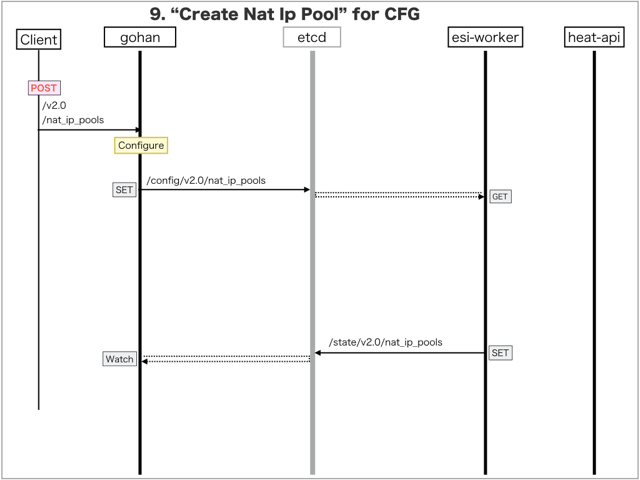

[Return to Previous Page](00_common_function_gateway.md)

# 9. Clarification of interface in Sequence Diagram "Create Nat Ip Pool"
You can see the relations of "Nat Ip Pool" as following.


## 9.1. Sequence Diagram between gohan and etcd
This is a diagram that has been described as interfaces for "Nat Ip Pool" between gohan and etcd.

* Receiving HTTP Methods for Creating Resource ...




## 9.2. HTTP Methods for RESTful between Gohan and Client
This is JSON data for "Create Nat Ip Pool" in HTTP Methods from client.

* Checking JSON data at post method
```
POST /v2.0/nat_ip_pools
```
```
{
    "nat_ip_pool": {
        "common_function_pool_id": "cca32fd7-2430-4acc-87e9-a7b527e9918d",
        "description": "",
        "ha_router_id": "3a3d7a43-d749-44e8-90bc-de7b37d1d258",
        "ip_ranges": [
          {
            "end": "100.64.0.254",
            "start": "100.64.0.10"
          }
        ],
        "name": "sample-nat-ip-pool",
        "tenant_id": "0b576f6f4cbf414f829cd12f008bf08f"
    }
}
```


## 9.3. Stored data in etcd after receiving HTTP Methods for RESTful
These are stored data for "Create Nat Ip Pool" in etcd.

* [Checking stored data for creating "nat_ip_pool1"](stored_in_etcd/CreateNatIpPool_01.md)
* [Checking stored data for creating "nat_ip_pool2"](stored_in_etcd/CreateNatIpPool_02.md)


## 9.4. Stored resource in gohan
As a result, checking resources regarding of "Nat Ip Pool" in gohan.

* Checking the target of resources via gohan client
```
$ gohan client nat_ip_pool show --output-format json 75733e12-47f7-49ea-9939-2819df6c8253
{
    "nat_ip_pool": {
        "common_function_pool_id": "cca32fd7-2430-4acc-87e9-a7b527e9918d",
        "description": "",
        "ha_router_id": "3a3d7a43-d749-44e8-90bc-de7b37d1d258",
        "id": "75733e12-47f7-49ea-9939-2819df6c8253",
        "ip_allocation_state": "AAAAAAAAAAAAAAAAAAAAAAAAAAAAAAAAAAAAAAAAB/8=",
        "ip_ranges": [
            {
                "end": "100.64.0.254",
                "start": "100.64.0.10"
            }
        ],
        "name": "sample-nat-ip-pool",
        "tenant_id": "0b576f6f4cbf414f829cd12f008bf08f"
    }
}
```

[Return to Previous Page](00_common_function_gateway.md)
