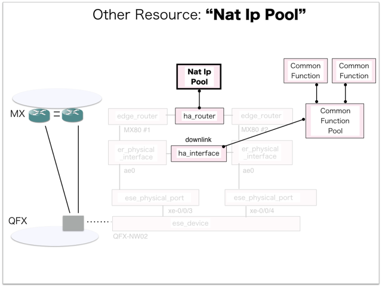

[Return to Previous Page](00_common_function_gateway.md)

# 9. Clarification of interface in Sequence Diagram "Create Nat Ip Pool"
You can see the relations of "Nat Ip Pool" as following.




## 9.1. Gohan


### Outline
First of all, Gohan has received JSON data for "Create Nat Ip Pool" in HTTP Methods from client.

* Checking JSON data at post method
```
POST /v2.0/nat_ip_pools
```
```
{
    "nat_ip_pool": {
        "common_function_pool_id": "2d4a700d-bf94-4217-9a3c-4217a16c951f",
        "description": "",
        "ha_router_id": "e16529c4-ffb8-4346-b850-af3c93564604",
        "ip_ranges": [
            {
                "end": "100.64.0.254",
                "start": "100.64.0.10"
            }
        ],
        "name": "sample-nat-ip-pool",
        "tenant_id": "c583ce78843344adbe5fd20f13620274"
    }
}
```
After processing, Gohan has stored data for "Create Nat Ip Pool" in etcd

* [Checking stored data for creating "nat_ip_pool1"](stored_in_etcd/01_Gohan/CreateNatIpPool_01.md)
* [Checking stored data for creating "nat_ip_pool2"](stored_in_etcd/01_Gohan/CreateNatIpPool_02.md)


## 9.2. ResourceReader
When ResourceReader has started, it gets all of schemas from Gohan.
After that, these schemas are converted as a template_mappings.
And then, ResourceReader keeps storing template_mappings for following processing.

### Reference
* [Checking schemas in ResourceReader](../memo/schemas.txt)
* [Checking template_mappings in ResourceReader](../memo/template_mappings.md)


### Outline
After fetching resource_data for "Create Nat Ip Pool" in etcd, ResourceReader has not fetched heat_templates in etcd because of non_workable_resource.
And then, ResourceReader has stored data as finishing resource

* [Checking stored data for creating "nat_ip_pool1"](stored_in_etcd/00_ResourceReader/CreateNatIpPool_01.md)
* [Checking stored data for creating "nat_ip_pool2"](stored_in_etcd/00_ResourceReader/CreateNatIpPool_02.md)


## 9.3. Stored resource in gohan
As a result, checking resources regarding of "Nat Ip Pool" in gohan.

* Checking the target of resources via gohan client
```
$ gohan client nat_ip_pool show --output-format json 8403ebb4-d81a-486e-8ba0-75613b936e8e
{
    "nat_ip_pool": {
        "common_function_pool_id": "2d4a700d-bf94-4217-9a3c-4217a16c951f",
        "description": "",
        "ha_router_id": "e16529c4-ffb8-4346-b850-af3c93564604",
        "id": "8403ebb4-d81a-486e-8ba0-75613b936e8e",
        "ip_allocation_state": "AAAAAAAAAAAAAAAAAAAAAAAAAAAAAAAAAAAAAAAAB/8=",
        "ip_ranges": [
            {
                "end": "100.64.0.254",
                "start": "100.64.0.10"
            }
        ],
        "name": "sample-nat-ip-pool",
        "tenant_id": "c583ce78843344adbe5fd20f13620274"
    }
}
```

[Return to Previous Page](00_common_function_gateway.md)
