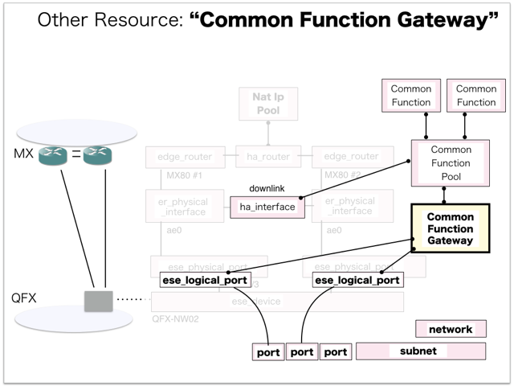

[Return to Previous Page](00_common_function_gateway.md)

# 10. Clarification of interface in Sequence Diagram "Create Common Function Gateway"
You can see the relations of "Common Function Gateway" as following.




## 10.1. Gohan


### Outline
First of all, Gohan has received JSON data for "Create Common Function Gateway" in HTTP Methods from client.

* Checking JSON data at post method
```
POST /v2.0/common_function_gateways
```
```
{
    "common_function_gateway": {
        "common_function_pool_id": "2d4a700d-bf94-4217-9a3c-4217a16c951f",
        "name": "T0011CF000",
        "tenant_id": "c583ce78843344adbe5fd20f13620274"
    }
}
```
After processing, Gohan has stored data for "Create Common Function Gateway" in etcd.

* [Checking stored data for creating "network"](stored_in_etcd/01_Gohan/CreateCommonFunctionGateway_01.md)
* [Checking stored data for creating "subnet"](stored_in_etcd/01_Gohan/CreateCommonFunctionGateway_02.md)
* [Checking stored data for creating "port (dhcp)"](stored_in_etcd/01_Gohan/CreateCommonFunctionGateway_03.md)
* [Checking stored data for creating "port (169.254.0.3 / device_owner:"network:common_function_gateway" / attached:false)"](stored_in_etcd/01_Gohan/CreateCommonFunctionGateway_04.md)
* [Checking stored data for creating "ese_logical_port (xe-0/0/3.1025)"](stored_in_etcd/01_Gohan/CreateCommonFunctionGateway_05.md)
* [Checking stored data for creating "port (169.254.0.4 / device_owner:"network:common_function_gateway" / attached:false)"](stored_in_etcd/01_Gohan/CreateCommonFunctionGateway_06.md)
* [Checking stored data for creating "ese_logical_port (xe-0/0/4.1025)"](stored_in_etcd/01_Gohan/CreateCommonFunctionGateway_07.md)
* [Checking stored data for creating "common_function_gateway"](stored_in_etcd/01_Gohan/CreateCommonFunctionGateway_08.md)
* [Checking stored data for creating "port (169.254.0.3 / device_owner:"network:common_function_gateway" / attached:true)"](stored_in_etcd/01_Gohan/CreateCommonFunctionGateway_09.md)
* [Checking stored data for creating "port (169.254.0.4 / device_owner:"network:common_function_gateway" / attached:true)"](stored_in_etcd/01_Gohan/CreateCommonFunctionGateway_10.md)


## 10.2. ResourceReader
When ResourceReader has started, it gets all of schemas from Gohan.
After that, these schemas are converted as a template_mappings.
And then, ResourceReader keeps storing template_mappings for following processing.

### Reference
* [Checking schemas in ResourceReader](../memo/schemas.txt)
* [Checking template_mappings in ResourceReader](../memo/template_mappings.md)


### Outline
After fetching resource_data for "Create Common Function Gateway" in etcd, ResourceReader has fetched heat_templates in etcd.

* [Checking stored data for "common_function_gateway"](../heat_template/common_function_gateway.md)
* [Checking stored data for "network"](../heat_template/network.md)
* [Checking stored data for "subnet"](../heat_template/subnet.md)
* [Checking stored data for "port"](../heat_template/port.md)
* [Checking stored data for "ese_logical_port"](../heat_template/ese_logical_port.md)

And then, ResourceReader has stored data as finishing resource

* [Checking stored data for creating "port (dhcp)"](stored_in_etcd/00_ResourceReader/CreateCommonFunctionGateway_03.md)


## 10.3. JobManager


### Outline
After converting resource_data to job_data, JobManager has stored it in etcd.

* [Checking stored data for creating "network"](stored_in_etcd/02_JobManager/CreateCommonFunctionGateway_01.md)
* [Checking stored data for creating "subnet"](stored_in_etcd/02_JobManager/CreateCommonFunctionGateway_02.md)
* [Checking stored data for creating "port (169.254.0.3 / device_owner:"network:common_function_gateway" / attached:false)"](stored_in_etcd/02_JobManager/CreateCommonFunctionGateway_04.md)
* [Checking stored data for creating "ese_logical_port (xe-0/0/3.1025)"](stored_in_etcd/02_JobManager/CreateCommonFunctionGateway_05.md)
* [Checking stored data for creating "port (169.254.0.4 / device_owner:"network:common_function_gateway" / attached:false)"](stored_in_etcd/02_JobManager/CreateCommonFunctionGateway_06.md)
* [Checking stored data for creating "ese_logical_port (xe-0/0/4.1025)"](stored_in_etcd/02_JobManager/CreateCommonFunctionGateway_07.md)
* [Checking stored data for creating "common_function_gateway"](stored_in_etcd/02_JobManager/CreateCommonFunctionGateway_08.md)
* [Checking stored data for creating "port (169.254.0.3 / device_owner:"network:common_function_gateway" / attached:true)"](stored_in_etcd/02_JobManager/CreateCommonFunctionGateway_09.md)
* [Checking stored data for creating "port (169.254.0.4 / device_owner:"network:common_function_gateway" / attached:true)"](stored_in_etcd/02_JobManager/CreateCommonFunctionGateway_10.md)


## 10.4. HeatWorker


### Outline
After fetching job_data, HeatWorker has handled job_data.

And then, HeatWorker has stored the result of handling job_data.

* [Checking stored data for creating "network"](stored_in_etcd/03_HeatWorker/CreateCommonFunctionGateway_01.md)
* [Checking stored data for creating "subnet"](stored_in_etcd/03_HeatWorker/CreateCommonFunctionGateway_02.md)
* [Checking stored data for creating "port (169.254.0.3 / device_owner:"network:common_function_gateway" / attached:false)"](stored_in_etcd/03_HeatWorker/CreateCommonFunctionGateway_04.md)
* [Checking stored data for creating "ese_logical_port (xe-0/0/3.1025)"](stored_in_etcd/03_HeatWorker/CreateCommonFunctionGateway_05.md)
* [Checking stored data for creating "port (169.254.0.4 / device_owner:"network:common_function_gateway" / attached:false)"](stored_in_etcd/03_HeatWorker/CreateCommonFunctionGateway_06.md)
* [Checking stored data for creating "ese_logical_port (xe-0/0/4.1025)"](stored_in_etcd/03_HeatWorker/CreateCommonFunctionGateway_07.md)
* [Checking stored data for creating "common_function_gateway"](stored_in_etcd/03_HeatWorker/CreateCommonFunctionGateway_08.md)
* [Checking stored data for creating "port (169.254.0.3 / device_owner:"network:common_function_gateway" / attached:true)"](stored_in_etcd/03_HeatWorker/CreateCommonFunctionGateway_09.md)
* [Checking stored data for creating "port (169.254.0.4 / device_owner:"network:common_function_gateway" / attached:true)"](stored_in_etcd/03_HeatWorker/CreateCommonFunctionGateway_10.md)


## 10.5. Heat


### Outline
Heat has conducted some tasks for "Create Common Function Gateway".
As a result, Heat has stored heat-stacks for "Create Common Function Gateway".

* [Checking heat-stack of "network"](heat-stack/CreateCommonFunctionGateway_01.md)
* [Checking heat-stack of "subnet"](heat-stack/CreateCommonFunctionGateway_02.md)
* [Checking heat-stack of "common_function_gateway"](heat-stack/CreateCommonFunctionGateway_03.md)
* [Checking heat-stack of "ese_logical_port"](heat-stack/CreateCommonFunctionGateway_04.md)
* [Checking heat-stack of "ese_logical_port"](heat-stack/CreateCommonFunctionGateway_05.md)
* [Checking heat-stack of "port"](heat-stack/CreateCommonFunctionGateway_06.md)
* [Checking heat-stack of "port"](heat-stack/CreateCommonFunctionGateway_07.md)


## 10.6. CollectorAgent


### Outline
CollectorAgent has conducted some tasks for "Create Common Function Gateway" based heat-stacks via Heat.
As a result, CollectorAgent has responded the result of status information as handling tasks.

* [Checking monitoring of "ese_logical_port"](collector_agents/CreateCommonFunctionGateway_02.md)
* [Checking monitoring of "ese_logical_port"](collector_agents/CreateCommonFunctionGateway_03.md)
* [Checking monitoring of "common_function_gateway"](collector_agents/CreateCommonFunctionGateway_01.md)
* [Checking monitoring of "port"](collector_agents/CreateCommonFunctionGateway_04.md)
* [Checking monitoring of "port"](collector_agents/CreateCommonFunctionGateway_05.md)

And then, CollectorAgent has stored the result of status information.

* [Checking stored data for creating "ese_logical_port (xe-0/0/3.1025)"](stored_in_etcd/04_CollectorAgent/CreateCommonFunctionGateway_05.md)
* [Checking stored data for creating "ese_logical_port (xe-0/0/4.1025)"](stored_in_etcd/04_CollectorAgent/CreateCommonFunctionGateway_07.md)
* [Checking stored data for creating "common_function_gateway"](stored_in_etcd/04_CollectorAgent/CreateCommonFunctionGateway_08.md)
* [Checking stored data for creating "port (169.254.0.3 / device_owner:"network:common_function_gateway" / attached:true)"](stored_in_etcd/04_CollectorAgent/CreateCommonFunctionGateway_09.md)
* [Checking stored data for creating "port (169.254.0.4 / device_owner:"network:common_function_gateway" / attached:true)"](stored_in_etcd/04_CollectorAgent/CreateCommonFunctionGateway_10.md)


## 10.7. Applying JUNOS Configurations via netconf
Checking configuration in Edge Router

* MX-1
```
[edit]
+  services {
+      service-set vrf_gw_sample-ha-router-downlink_1025 {
+          nat-rules vrf_gw_sample-ha-router-downlink_1025-SNAPT;
+          nat-rules vrf_gw_sample-ha-router-downlink_1025-DNAT;
+          interface-service {
+              service-interface ms-0/2/0.1025;
+          }
+      }
+      nat {
+          pool vrf_gw_sample-ha-router-downlink_1025-SNAPT-POOL {
+              apply-groups SNAPT-POOL;
+              address 100.64.0.10/32;
+          }
+          pool vrf_gw_sample-ha-router-downlink_1025-DNAT-POOL-1 {
+              apply-groups DNAT-POOL-1;
+          }
+          pool vrf_gw_sample-ha-router-downlink_1025-DNAT-POOL-2 {
+              apply-groups DNAT-POOL-2;
+          }
+          rule vrf_gw_sample-ha-router-downlink_1025-SNAPT {
+              apply-groups SNAPT-RULE;
+              term source {
+                  then {
+                      translated {
+                          source-pool vrf_gw_sample-ha-router-downlink_1025-SNAPT-POOL;
+                      }
+                  }
+              }
+          }
+          rule vrf_gw_sample-ha-router-downlink_1025-DNAT {
+              apply-groups DNAT-RULE;
+              term 1 {
+                  then {
+                      translated {
+                          destination-pool vrf_gw_sample-ha-router-downlink_1025-DNAT-POOL-1;
+                      }
+                  }
+              }
+              term 2 {                 
+                  then {
+                      translated {
+                          destination-pool vrf_gw_sample-ha-router-downlink_1025-DNAT-POOL-2;
+                      }
+                  }
+              }
+          }
+      }
+  }
```
```
[edit interfaces]
+   lt-0/0/0 {
+       unit 1025 {
+           peer-unit 11025;
+           family inet {
+               service {
+                   input {
+                       service-set vrf_gw_sample-ha-router-downlink_1025;
+                   }
+                   output {
+                       service-set vrf_gw_sample-ha-router-downlink_1025;
+                   }
+               }
+           }
+       }
+       unit 11025 {
+           peer-unit 1025;
+       }
+   }
+   ms-0/2/0 {
+       unit 1025 {
+           family inet;
+       }
+   }
```
```
[edit interfaces ae0 unit 1025]
+    apply-groups [ InetGW2-VRRP IF-USER-VRRP-ACT ];
+    description vrf_gw_sample-ha-router-downlink_1025;
```
```
[edit interfaces ae0 unit 1025 family inet]
+       service {
+           input {
+               service-set vrf_gw_sample-ha-router-downlink_1025;
+           }
+           output {
+               service-set vrf_gw_sample-ha-router-downlink_1025;
+           }
+       }
```
```
[edit routing-instances]
+   SHARED-RESOURCE {
+       interface lt-0/0/0.11025;
+       routing-options {
+           static {
+               route 100.64.0.10/32 next-hop lt-0/0/0.11025;
+           }
+       }
+   }
```
```
[edit routing-instances vrf_gw_sample-ha-router-downlink_1025]
+    interface lt-0/0/0.1025;
+    interface ms-0/2/0.1025;
```
```
[edit routing-instances vrf_gw_sample-ha-router-downlink_1025 routing-options]
+     static {
+         route 0.0.0.0/0 next-hop lt-0/0/0.1025;
+     }

[edit]
```

* MX-2
```
[edit]
+  services {
+      service-set vrf_gw_sample-ha-router-downlink_1025 {
+          nat-rules vrf_gw_sample-ha-router-downlink_1025-SNAPT;
+          nat-rules vrf_gw_sample-ha-router-downlink_1025-DNAT;
+          interface-service {
+              service-interface ms-0/2/0.1025;
+          }
+      }
+      nat {
+          pool vrf_gw_sample-ha-router-downlink_1025-SNAPT-POOL {
+              apply-groups SNAPT-POOL;
+              address 100.64.0.10/32;
+          }
+          pool vrf_gw_sample-ha-router-downlink_1025-DNAT-POOL-1 {
+              apply-groups DNAT-POOL-1;
+          }
+          pool vrf_gw_sample-ha-router-downlink_1025-DNAT-POOL-2 {
+              apply-groups DNAT-POOL-2;
+          }
+          rule vrf_gw_sample-ha-router-downlink_1025-SNAPT {
+              apply-groups SNAPT-RULE;
+              term source {
+                  then {
+                      translated {
+                          source-pool vrf_gw_sample-ha-router-downlink_1025-SNAPT-POOL;
+                      }
+                  }
+              }
+          }
+          rule vrf_gw_sample-ha-router-downlink_1025-DNAT {
+              apply-groups DNAT-RULE;
+              term 1 {
+                  then {
+                      translated {
+                          destination-pool vrf_gw_sample-ha-router-downlink_1025-DNAT-POOL-1;
+                      }
+                  }
+              }
+              term 2 {                 
+                  then {
+                      translated {
+                          destination-pool vrf_gw_sample-ha-router-downlink_1025-DNAT-POOL-2;
+                      }
+                  }
+              }
+          }
+      }
+  }
```
```
[edit interfaces]
+   lt-0/0/0 {
+       unit 1025 {
+           peer-unit 11025;
+           family inet {
+               service {
+                   input {
+                       service-set vrf_gw_sample-ha-router-downlink_1025;
+                   }
+                   output {
+                       service-set vrf_gw_sample-ha-router-downlink_1025;
+                   }
+               }
+           }
+       }
+       unit 11025 {
+           peer-unit 1025;
+       }
+   }
+   ms-0/2/0 {
+       unit 1025 {
+           family inet;
+       }
+   }
```
```
[edit interfaces ae0 unit 1025]
+    apply-groups [ InetGW1-VRRP IF-USER-VRRP-ACT ];
+    description vrf_gw_sample-ha-router-downlink_1025;
```
```
[edit interfaces ae0 unit 1025 family inet]
+       service {
+           input {
+               service-set vrf_gw_sample-ha-router-downlink_1025;
+           }
+           output {
+               service-set vrf_gw_sample-ha-router-downlink_1025;
+           }
+       }
```
```
[edit routing-instances]
+   SHARED-RESOURCE {
+       interface lt-0/0/0.11025;
+       routing-options {
+           static {
+               route 100.64.0.10/32 next-hop lt-0/0/0.11025;
+           }
+       }
+   }
```
```
[edit routing-instances vrf_gw_sample-ha-router-downlink_1025]
+    interface lt-0/0/0.1025;
+    interface ms-0/2/0.1025;
```
```
[edit routing-instances vrf_gw_sample-ha-router-downlink_1025 routing-options]
+     static {
+         route 0.0.0.0/0 next-hop lt-0/0/0.1025;
+     }

[edit]
```

## 10.8. Stored resource in gohan
As a result, checking resources regarding of "Common Function Gateway" in gohan.

* Checking the target of resources via gohan client
```
$ gohan client common_function_gateway show --output-format json f649736d-1920-41eb-96af-d4e4fe192d0e
{
    "common_function_gateway": {
        "common_function_pool_id": "2d4a700d-bf94-4217-9a3c-4217a16c951f",
        "common_functions": [
            {
                "common_function_id": "637aa51a-f54f-4723-bc5f-9fb8942dfc8b"
            },
            {
                "common_function_id": "b7ff279d-a7ee-4714-b77c-bcd2f0e51996"
            }
        ],
        "description": "",
        "downlink_interface_id": "16f6433d-0864-4d24-809d-c1b8e878280c",
        "id": "f649736d-1920-41eb-96af-d4e4fe192d0e",
        "logical_tunnel_unit_service": "11025",
        "logical_tunnel_unit_user": "1025",
        "name": "T0011CF000",
        "nat_ip": "100.64.0.10",
        "network_id": "fc8814a7-eb1e-4f59-8422-7de500e72782",
        "operational_state": "UP",
        "orchestration_state": "CREATE_COMPLETE",
        "primary_logical_interface_name": "ae0.1025",
        "secondary_logical_interface_name": "ae0.1025",
        "status": "ACTIVE",
        "subnet_id": "cf9356ae-b4e1-4a91-8193-089fdc12173d",
        "tenant_id": "c583ce78843344adbe5fd20f13620274",
        "vlan_id": "1025",
        "vrf_name": "vrf_gw_sample-ha-router-downlink_1025"
    }
}
```
* Checking billing_resource via gohan client
```
$ gohan client billing_resource list --output-format json
{   
    "billing_resources": [
        {   
            "config_version": 1,
            "ended": null,
            "id": "14a6bdca-a06f-49da-afbf-1439602f6496",
            "info": {},
            "parent_billing_id": null,
            "resource_id": "fc8814a7-eb1e-4f59-8422-7de500e72782",
            "resource_type": "network",
            "started": 1.523249394e+09,
            "tenant_id": "c583ce78843344adbe5fd20f13620274",
            "unique_resource_id": "fc8814a7-eb1e-4f59-8422-7de500e72782"
        }
    ]
}
```
* Checking another resources via gohan client
```
$ gohan client network show --output-format json fc8814a7-eb1e-4f59-8422-7de500e72782
{
    "network": {
        "admin_state_up": true,
        "description": "",
        "id": "fc8814a7-eb1e-4f59-8422-7de500e72782",
        "name": "common_function_gw_access_f649736d-1920-41eb-96af-d4e4fe192d0e",
        "orchestration_state": "CREATE_COMPLETE",
        "plane": "data",
        "shared": false,
        "status": "ACTIVE",
        "subnets": [
            "cf9356ae-b4e1-4a91-8193-089fdc12173d"
        ],
        "tags": {},
        "tenant_id": "c583ce78843344adbe5fd20f13620274"
    }
}
```
```
$ gohan client subnet show --output-format json cf9356ae-b4e1-4a91-8193-089fdc12173d
{
    "subnet": {
        "allocation_pools": [
            {
                "end": "169.254.127.254",
                "start": "169.254.0.2"
            }
        ],
        "cidr": "169.254.0.0/17",
        "description": "",
        "dhcp_server_address": "169.254.0.2",
        "dns_nameservers": [],
        "enable_dhcp": true,
        "gateway_ip": null,
        "host_routes": [],
        "id": "cf9356ae-b4e1-4a91-8193-089fdc12173d",
        "ip_version": 4,
        "ipv6_address_mode": null,
        "ipv6_ra_mode": null,
        "name": "common_function_gw_access_subnet_f649736d-1920-41eb-96af-d4e4fe192d0e",
        "network_id": "fc8814a7-eb1e-4f59-8422-7de500e72782",
        "ntp_servers": [],
        "orchestration_state": "CREATE_COMPLETE",
        "status": "ACTIVE",
        "tags": {},
        "tenant_id": "c583ce78843344adbe5fd20f13620274"
    }
}
```
```
$ gohan client port show --output-format json 33876f91-b5c9-43aa-a0e0-166e3def9133
{
    "port": {
        "admin_state_up": true,
        "allowed_address_pairs": [],
        "attached": false,
        "binding:vif_type": "vrouter",
        "description": "DHCP Server Port",
        "device_id": "cf9356ae-b4e1-4a91-8193-089fdc12173d",
        "device_owner": "network:dhcp",
        "ese_logical_port_id": null,
        "fake_delete": false,
        "fixed_ips": [
            {
                "ip_address": "169.254.0.2",
                "subnet_id": "cf9356ae-b4e1-4a91-8193-089fdc12173d"
            }
        ],
        "id": "33876f91-b5c9-43aa-a0e0-166e3def9133",
        "mac_address": "00:00:5e:00:01:00",
        "managed_by_service": false,
        "name": "dhcp-server-port",
        "network_id": "fc8814a7-eb1e-4f59-8422-7de500e72782",
        "operational_state": "",
        "orchestration_state": "SYNC_COMPLETE",
        "security_groups": [],
        "segmentation_id": null,
        "segmentation_type": null,
        "status": "ACTIVE",
        "tags": {},
        "tenant_id": "c583ce78843344adbe5fd20f13620274"
    }
}
```
```
$ gohan client ese_logical_port show --output-format json be66c7e0-b222-4e76-bf81-af75e8cf1824
{
    "ese_logical_port": {
        "common_function_gateway_id": "f649736d-1920-41eb-96af-d4e4fe192d0e",
        "connected_resource": "common_function_gateway",
        "description": "ESE Logical port for Port f84496b5-dc56-4727-87b1-aa06e2471737",
        "ese_physical_port_id": "9451c9ca-289d-42ba-846d-359c448e910c",
        "gw_interface_id": null,
        "id": "be66c7e0-b222-4e76-bf81-af75e8cf1824",
        "name": "xe-0/0/3.1025",
        "network_id": "fc8814a7-eb1e-4f59-8422-7de500e72782",
        "operational_state": "UP",
        "orchestration_state": "CREATE_COMPLETE",
        "port_ids": [
            "f84496b5-dc56-4727-87b1-aa06e2471737"
        ],
        "status": "ACTIVE",
        "tags": {},
        "tenant_id": "c583ce78843344adbe5fd20f13620274",
        "type": "L2",
        "vlan_id": 1025
    }
}
```
```
$ gohan client port show --output-format json f84496b5-dc56-4727-87b1-aa06e2471737
{   
    "port": {
        "admin_state_up": true,
        "allowed_address_pairs": [],
        "attached": true,
        "binding:vif_type": "vrouter",
        "description": "",
        "device_id": "f649736d-1920-41eb-96af-d4e4fe192d0e",
        "device_owner": "network:common_function_gateway",
        "ese_logical_port_id": "be66c7e0-b222-4e76-bf81-af75e8cf1824",
        "fake_delete": false,
        "fixed_ips": [
            {   
                "ip_address": "169.254.0.3",
                "subnet_id": "cf9356ae-b4e1-4a91-8193-089fdc12173d"
            }
        ],
        "id": "f84496b5-dc56-4727-87b1-aa06e2471737",
        "mac_address": "fa:16:3e:82:e7:8b",
        "managed_by_service": true,
        "name": "common_function_gw_f649736d-1920-41eb-96af-d4e4fe192d0e_primary_port:9451c9ca-289d-42ba-846d-359c448e910c",
        "network_id": "fc8814a7-eb1e-4f59-8422-7de500e72782",
        "operational_state": "FAIL",
        "orchestration_state": "UPDATE_COMPLETE",
        "security_groups": [],
        "segmentation_id": 1025,
        "segmentation_type": "vlan",
        "status": "MONITORING_UNAVAILABLE",
        "tags": {},
        "tenant_id": "c583ce78843344adbe5fd20f13620274"
    }
}
```
```
$ gohan client ese_logical_port show --output-format json e8555ee6-529c-42d9-8bb1-bfbe217133b1
{   
    "ese_logical_port": {
        "common_function_gateway_id": "f649736d-1920-41eb-96af-d4e4fe192d0e",
        "connected_resource": "common_function_gateway",
        "description": "ESE Logical port for Port 343b0257-512e-40e3-b063-8cc13a4b61f4",
        "ese_physical_port_id": "f4c3a1bf-3b61-48ba-a548-422036849465",
        "gw_interface_id": null,
        "id": "e8555ee6-529c-42d9-8bb1-bfbe217133b1",
        "name": "xe-0/0/4.1025",
        "network_id": "fc8814a7-eb1e-4f59-8422-7de500e72782",
        "operational_state": "UP",
        "orchestration_state": "CREATE_COMPLETE",
        "port_ids": [
            "343b0257-512e-40e3-b063-8cc13a4b61f4"
        ],
        "status": "ACTIVE",
        "tags": {},
        "tenant_id": "c583ce78843344adbe5fd20f13620274",
        "type": "L2",
        "vlan_id": 1025
    }
}
```
```
$ gohan client port show --output-format json 343b0257-512e-40e3-b063-8cc13a4b61f4
{
    "port": {
        "admin_state_up": true,
        "allowed_address_pairs": [],
        "attached": true,
        "binding:vif_type": "vrouter",
        "description": "",
        "device_id": "f649736d-1920-41eb-96af-d4e4fe192d0e",
        "device_owner": "network:common_function_gateway",
        "ese_logical_port_id": "e8555ee6-529c-42d9-8bb1-bfbe217133b1",
        "fake_delete": false,
        "fixed_ips": [
            {
                "ip_address": "169.254.0.4",
                "subnet_id": "cf9356ae-b4e1-4a91-8193-089fdc12173d"
            }
        ],
        "id": "343b0257-512e-40e3-b063-8cc13a4b61f4",
        "mac_address": "fa:16:3e:38:35:6a",
        "managed_by_service": true,
        "name": "common_function_gw_f649736d-1920-41eb-96af-d4e4fe192d0e_secondary_port:f4c3a1bf-3b61-48ba-a548-422036849465",
        "network_id": "fc8814a7-eb1e-4f59-8422-7de500e72782",
        "operational_state": "UP",
        "orchestration_state": "UPDATE_COMPLETE",
        "security_groups": [],
        "segmentation_id": 1025,
        "segmentation_type": "vlan",
        "status": "ACTIVE",
        "tags": {},
        "tenant_id": "c583ce78843344adbe5fd20f13620274"
    }
}
```
* Checking another resources via neutron client
```
$ neutron port-list
+--------------------------------------+-------------------------------------------------------------------------------------------------------------+-------------------+------------------------------------------------------------------------------------+
| id                                   | name                                                                                                        | mac_address       | fixed_ips                                                                          |
+--------------------------------------+-------------------------------------------------------------------------------------------------------------+-------------------+------------------------------------------------------------------------------------+
  ...
| 343b0257-512e-40e3-b063-8cc13a4b61f4 | common_function_gw_f649736d-1920-41eb-96af-d4e4fe192d0e_secondary_port:f4c3a1bf-3b61-48ba-a548-422036849465 | fa:16:3e:38:35:6a | {"subnet_id": "cf9356ae-b4e1-4a91-8193-089fdc12173d", "ip_address": "169.254.0.4"} |
| f84496b5-dc56-4727-87b1-aa06e2471737 | common_function_gw_f649736d-1920-41eb-96af-d4e4fe192d0e_primary_port:9451c9ca-289d-42ba-846d-359c448e910c   | fa:16:3e:82:e7:8b | {"subnet_id": "cf9356ae-b4e1-4a91-8193-089fdc12173d", "ip_address": "169.254.0.3"} |
+--------------------------------------+-------------------------------------------------------------------------------------------------------------+-------------------+------------------------------------------------------------------------------------+
```
```
$ neutron port-show 343b0257-512e-40e3-b063-8cc13a4b61f4
+-----------------------+-------------------------------------------------------------------------------------------------------------+
| Field                 | Value                                                                                                       |
+-----------------------+-------------------------------------------------------------------------------------------------------------+
| admin_state_up        | True                                                                                                        |
| allowed_address_pairs |                                                                                                             |
| attached              | True                                                                                                        |
| binding:vif_type      | vrouter                                                                                                     |
| description           |                                                                                                             |
| device_id             | f649736d-1920-41eb-96af-d4e4fe192d0e                                                                        |
| device_owner          | network:common_function_gateway                                                                             |
| ese_logical_port_id   | e8555ee6-529c-42d9-8bb1-bfbe217133b1                                                                        |
| fake_delete           | False                                                                                                       |
| fixed_ips             | {"subnet_id": "cf9356ae-b4e1-4a91-8193-089fdc12173d", "ip_address": "169.254.0.4"}                          |
| id                    | 343b0257-512e-40e3-b063-8cc13a4b61f4                                                                        |
| mac_address           | fa:16:3e:38:35:6a                                                                                           |
| managed_by_service    | True                                                                                                        |
| name                  | common_function_gw_f649736d-1920-41eb-96af-d4e4fe192d0e_secondary_port:f4c3a1bf-3b61-48ba-a548-422036849465 |
| network_id            | fc8814a7-eb1e-4f59-8422-7de500e72782                                                                        |
| operational_state     | FAIL                                                                                                        |
| orchestration_state   | UPDATE_COMPLETE                                                                                             |
| security_groups       |                                                                                                             |
| segmentation_id       | 1025                                                                                                        |
| segmentation_type     | vlan                                                                                                        |
| status                | MONITORING_UNAVAILABLE                                                                                      |
| tags                  | {}                                                                                                          |
| tenant_id             | c583ce78843344adbe5fd20f13620274                                                                            |
+-----------------------+-------------------------------------------------------------------------------------------------------------+
```
```
$ neutron port-show f84496b5-dc56-4727-87b1-aa06e2471737
+-----------------------+-----------------------------------------------------------------------------------------------------------+
| Field                 | Value                                                                                                     |
+-----------------------+-----------------------------------------------------------------------------------------------------------+
| admin_state_up        | True                                                                                                      |
| allowed_address_pairs |                                                                                                           |
| attached              | True                                                                                                      |
| binding:vif_type      | vrouter                                                                                                   |
| description           |                                                                                                           |
| device_id             | f649736d-1920-41eb-96af-d4e4fe192d0e                                                                      |
| device_owner          | network:common_function_gateway                                                                           |
| ese_logical_port_id   | be66c7e0-b222-4e76-bf81-af75e8cf1824                                                                      |
| fake_delete           | False                                                                                                     |
| fixed_ips             | {"subnet_id": "cf9356ae-b4e1-4a91-8193-089fdc12173d", "ip_address": "169.254.0.3"}                        |
| id                    | f84496b5-dc56-4727-87b1-aa06e2471737                                                                      |
| mac_address           | fa:16:3e:82:e7:8b                                                                                         |
| managed_by_service    | True                                                                                                      |
| name                  | common_function_gw_f649736d-1920-41eb-96af-d4e4fe192d0e_primary_port:9451c9ca-289d-42ba-846d-359c448e910c |
| network_id            | fc8814a7-eb1e-4f59-8422-7de500e72782                                                                      |
| operational_state     | UP                                                                                                        |
| orchestration_state   | UPDATE_COMPLETE                                                                                           |
| security_groups       |                                                                                                           |
| segmentation_id       | 1025                                                                                                      |
| segmentation_type     | vlan                                                                                                      |
| status                | ACTIVE                                                                                                    |
| tags                  | {}                                                                                                        |
| tenant_id             | c583ce78843344adbe5fd20f13620274                                                                          |
+-----------------------+-----------------------------------------------------------------------------------------------------------+
```


[Return to Previous Page](00_common_function_gateway.md)
