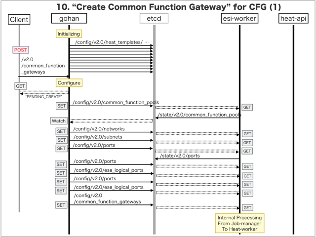
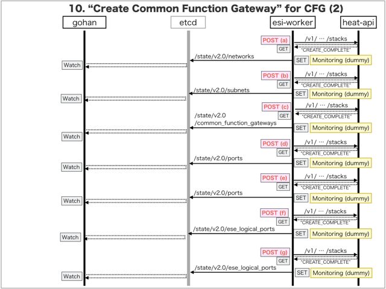
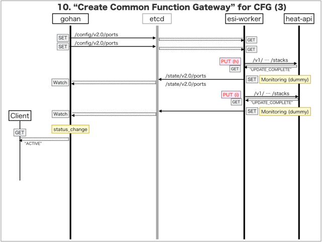

[Return to Previous Page](00_common_function_gateway.md)

# 10. Clarification of interface in Sequence Diagram "Create Common Function Gateway"
You can see the relations of "Common Function Gateway" as following.


## 10.1. Sequence Diagram between gohan and etcd
This is a diagram that has been described as interfaces for "Common Function Gateway" between gohan and etcd.

* Initinalizing gohan ...
* Receiving HTTP Methods for Creating Resource ...





## 10.2. Stored data in etcd after initinalizing gohan
These are stored data for "heat_templates" in etcd.

* [Checking stored data for "common_function_gateway"](../heat_template/common_function_gateway.md)
* [Checking stored data for "network"](../heat_template/network.md)
* [Checking stored data for "subnet"](../heat_template/subnet.md)
* [Checking stored data for "port"](../heat_template/port.md)
* [Checking stored data for "ese_logical_port"](../heat_template/ese_logical_port.md)
* [Checking stored data for "common_function_gateway_monitoring"](../heat_template/common_function_gateway_monitoring.md)
* [Checking stored data for "network_monitoring"](../heat_template/network_monitoring.md)
* [Checking stored data for "port_monitoring"](../heat_template/port_monitoring.md)
* [Checking stored data for "ese_logical_port_monitoring"](../heat_template/ese_logical_port_monitoring.md)


## 10.3. HTTP Methods for RESTful between Gohan and Client
This is JSON data for "Create Common Function Gateway" in HTTP Methods from client.

* Checking JSON data at post method
```
POST /v2.0/common_function_gateways
```
```
{
    "common_function_gateway": {
       "common_function_pool_id": "cca32fd7-2430-4acc-87e9-a7b527e9918d",
       "name": "T0011CF000",
       "tenant_id": "0b576f6f4cbf414f829cd12f008bf08f"
    }
}
```


## 10.4. Stored data in etcd after receiving HTTP Methods for RESTful
These are stored data for "Create Common Function Gateway" in etcd.

* [Checking stored data for creating "network"](stored_in_etcd/CreateCommonFunctionGateway_02.md)
* [Checking stored data for creating "subnet"](stored_in_etcd/CreateCommonFunctionGateway_03.md)
* [Checking stored data for creating "port(dhcp)"](stored_in_etcd/CreateCommonFunctionGateway_04.md)
* [Checking stored data for creating "port"](stored_in_etcd/CreateCommonFunctionGateway_05.md)
* [Checking stored data for creating "ese_logical_port"](stored_in_etcd/CreateCommonFunctionGateway_06.md)
* [Checking stored data for creating "port"](stored_in_etcd/CreateCommonFunctionGateway_07.md)
* [Checking stored data for creating "ese_logical_port"](stored_in_etcd/CreateCommonFunctionGateway_08.md)
* [Checking stored data for creating "common_function_gateway"](stored_in_etcd/CreateCommonFunctionGateway_09.md)
* [Checking stored data for creating "port"](stored_in_etcd/CreateCommonFunctionGateway_10.md)
* [Checking stored data for creating "port"](stored_in_etcd/CreateCommonFunctionGateway_11.md)


## 10.5. Stored heat-stack via heat-api
These are stored heat-stacks for "Create Common Function Gateway" in heat-engine.

* [Checking heat-stack of "network" for creating at "(a)" in section "9.1."](heat-stack/CreateCommonFunctionGateway_01.md)
* [Checking heat-stack of "subnet" for creating at "(b)" in section "9.1."](heat-stack/CreateCommonFunctionGateway_02.md)
* [Checking heat-stack of "common_function_gateway" for creating at "(c)" in section "9.1."](heat-stack/CreateCommonFunctionGateway_03.md)
* [Checking heat-stack of "port" for creating at "(d)" in section "9.1."](heat-stack/CreateCommonFunctionGateway_04.md)
* [Checking heat-stack of "port" for creating at "(e)" in section "9.1."](heat-stack/CreateCommonFunctionGateway_05.md)
* [Checking heat-stack of "ese_logical_port" for creating at "(f)" in section "9.1."](heat-stack/CreateCommonFunctionGateway_06.md)
* [Checking heat-stack of "ese_logical_port" for creating at "(g)" in section "9.1."](heat-stack/CreateCommonFunctionGateway_07.md)
* [Checking heat-stack of "port" for updating at "(h)" in section "9.1."](heat-stack/CreateCommonFunctionGateway_08.md)
* [Checking heat-stack of "port" for updating at "(i)" in section "9.1."](heat-stack/CreateCommonFunctionGateway_09.md)


## 10.6. Stored resource for monitoring in Kafka
This is JSON data for "Create Common Function Gateway" between monitoring-worker and kafka

* [Checking the topic "monitor_virtual_network" for monitoring "network"](stored_in_kafka/CreateCommonFunctionGateway_01.md)
* [Checking the topic "monitor_igs_interface" for monitoring "common_function_gateway"](stored_in_kafka/CreateCommonFunctionGateway_02.md)
* [Checking the topic "monitor_logical_port" for monitoring "ese_logical_port"](stored_in_kafka/CreateCommonFunctionGateway_03.md)
* [Checking the topic "monitor_virtual_machine_interface" for monitoring "port"](stored_in_kafka/CreateCommonFunctionGateway_04.md)


## 10.7. Applying JUNOS Configurations via netconf
Checking configuration in Edge Router

* MX-1
```
[edit]
+  services {
+      service-set vrf_gw_sample-ha-router-downlink_1025 {
+          nat-rules vrf_gw_sample-ha-router-downlink_1025-SNAPT;
+          nat-rules vrf_gw_sample-ha-router-downlink_1025-DNAT;
+          interface-service {
+              service-interface ms-0/2/0.1025;
+          }
+      }
+      nat {
+          pool vrf_gw_sample-ha-router-downlink_1025-SNAPT-POOL {
+              apply-groups SNAPT-POOL;
+              address 100.64.0.10/32;
+          }
+          pool vrf_gw_sample-ha-router-downlink_1025-DNAT-POOL-1 {
+              apply-groups DNAT-POOL-1;
+          }
+          pool vrf_gw_sample-ha-router-downlink_1025-DNAT-POOL-2 {
+              apply-groups DNAT-POOL-2;
+          }
+          rule vrf_gw_sample-ha-router-downlink_1025-SNAPT {
+              apply-groups SNAPT-RULE;
+              term source {
+                  then {
+                      translated {
+                          source-pool vrf_gw_sample-ha-router-downlink_1025-SNAPT-POOL;
+                      }
+                  }
+              }
+          }
+          rule vrf_gw_sample-ha-router-downlink_1025-DNAT {
+              apply-groups DNAT-RULE;
+              term 1 {
+                  then {
+                      translated {
+                          destination-pool vrf_gw_sample-ha-router-downlink_1025-DNAT-POOL-1;
+                      }
+                  }                    
+              }
+              term 2 {
+                  then {
+                      translated {
+                          destination-pool vrf_gw_sample-ha-router-downlink_1025-DNAT-POOL-2;
+                      }
+                  }
+              }
+          }
+      }
+  }

[edit interfaces]
+   lt-0/0/0 {
+       unit 1025 {
+           peer-unit 11025;
+           family inet {
+               service {
+                   input {
+                       service-set vrf_gw_sample-ha-router-downlink_1025;
+                   }
+                   output {
+                       service-set vrf_gw_sample-ha-router-downlink_1025;
+                   }
+               }
+           }
+       }
+       unit 11025 {
+           peer-unit 1025;
+       }
+   }
+   ms-0/2/0 {
+       unit 1025 {
+           family inet;
+       }
+   }

[edit interfaces ae0]
+    unit 1025 {
+        apply-groups IF-USER-VRRP-ACT; 
+        description vrf_gw_sample-ha-router-downlink_1025;
+        vlan-id 1025;
+        family inet {
+            service {
+                input {
+                    service-set vrf_gw_sample-ha-router-downlink_1025;
+                }
+                output {
+                    service-set vrf_gw_sample-ha-router-downlink_1025;
+                }
+            }
+        }
+    }

[edit routing-instances]
+   SHARED-RESOURCE {
+       interface lt-0/0/0.11025;
+       routing-options {
+           static {
+               route 100.64.0.10/32 next-hop lt-0/0/0.11025;
+           }
+       }
+   }
+   vrf_gw_sample-ha-router-downlink_1025 {
+       instance-type virtual-router;
+       interface lt-0/0/0.1025;
+       interface ms-0/2/0.1025;
+       interface ae0.1025;
+       routing-options {
+           static {
+               route 0.0.0.0/0 next-hop lt-0/0/0.1025;
+           }
+       }
+   }

[edit]
```

* MX-2
```
[edit]
+  services {
+      service-set vrf_gw_sample-ha-router-downlink_1025 {
+          nat-rules vrf_gw_sample-ha-router-downlink_1025-SNAPT;
+          nat-rules vrf_gw_sample-ha-router-downlink_1025-DNAT;
+          interface-service {
+              service-interface ms-0/2/0.1025;
+          }
+      }
+      nat {
+          pool vrf_gw_sample-ha-router-downlink_1025-SNAPT-POOL {
+              apply-groups SNAPT-POOL;
+              address 100.64.0.10/32;
+          }
+          pool vrf_gw_sample-ha-router-downlink_1025-DNAT-POOL-1 {
+              apply-groups DNAT-POOL-1;
+          }
+          pool vrf_gw_sample-ha-router-downlink_1025-DNAT-POOL-2 {
+              apply-groups DNAT-POOL-2;
+          }
+          rule vrf_gw_sample-ha-router-downlink_1025-SNAPT {
+              apply-groups SNAPT-RULE;
+              term source {
+                  then {
+                      translated {
+                          source-pool vrf_gw_sample-ha-router-downlink_1025-SNAPT-POOL;
+                      }
+                  }
+              }
+          }
+          rule vrf_gw_sample-ha-router-downlink_1025-DNAT {
+              apply-groups DNAT-RULE;
+              term 1 {
+                  then {
+                      translated {
+                          destination-pool vrf_gw_sample-ha-router-downlink_1025-DNAT-POOL-1;
+                      }
+                  }                    
+              }
+              term 2 {
+                  then {
+                      translated {
+                          destination-pool vrf_gw_sample-ha-router-downlink_1025-DNAT-POOL-2;
+                      }
+                  }
+              }
+          }
+      }
+  }

[edit interfaces]
+   lt-0/0/0 {
+       unit 1025 {
+           peer-unit 11025;
+           family inet {
+               service {
+                   input {
+                       service-set vrf_gw_sample-ha-router-downlink_1025;
+                   }
+                   output {
+                       service-set vrf_gw_sample-ha-router-downlink_1025;
+                   }
+               }
+           }
+       }
+       unit 11025 {
+           peer-unit 1025;
+       }
+   }
+   ms-0/2/0 {
+       unit 1025 {
+           family inet;
+       }
+   }

[edit interfaces ae0]
+    unit 1025 {
+        apply-groups IF-USER-VRRP-ACT; 
+        description vrf_gw_sample-ha-router-downlink_1025;
+        vlan-id 1025;
+        family inet {
+            service {
+                input {
+                    service-set vrf_gw_sample-ha-router-downlink_1025;
+                }
+                output {
+                    service-set vrf_gw_sample-ha-router-downlink_1025;
+                }
+            }
+        }
+    }

[edit routing-instances]
+   SHARED-RESOURCE {
+       interface lt-0/0/0.11025;
+       routing-options {
+           static {
+               route 100.64.0.10/32 next-hop lt-0/0/0.11025;
+           }
+       }
+   }
+   vrf_gw_sample-ha-router-downlink_1025 {
+       instance-type virtual-router;
+       interface lt-0/0/0.1025;
+       interface ms-0/2/0.1025;
+       interface ae0.1025;
+       routing-options {
+           static {
+               route 0.0.0.0/0 next-hop lt-0/0/0.1025;
+           }
+       }
+   }

[edit]
```

## 10.8. Stored resource in gohan
As a result, checking resources regarding of "Common Function Gateway" in gohan.

* Checking the target of resources via gohan client
```
$ gohan client common_function_gateway show --output-format json 5c241c51-2003-407a-a239-689fabd19022
{
    "common_function_gateway": {
        "common_function_pool_id": "cca32fd7-2430-4acc-87e9-a7b527e9918d",
        "common_functions": [
            {
                "common_function_id": "18c64ec9-78c2-43ac-ae0d-48fa9b6c0858"
            },
            {
                "common_function_id": "c1be08ee-7cf2-4c84-8fe7-7e891d17bc71"
            }
        ],
        "description": "",
        "downlink_interface_id": "372ed357-e622-41fb-a613-076d332838e2",
        "id": "5c241c51-2003-407a-a239-689fabd19022",
        "logical_tunnel_unit_service": "11025",
        "logical_tunnel_unit_user": "1025",
        "name": "T0011CF000",
        "nat_ip": "100.64.0.10",
        "network_id": "f2de53ae-bc76-46f2-b2ae-a7eefa9d6e57",
        "primary_logical_interface_name": "ae0.1025",
        "secondary_logical_interface_name": "ae0.1025",
        "status": "ACTIVE",
        "subnet_id": "e1353d56-b05a-43a9-b924-383ab0d64d7b",
        "tenant_id": "0b576f6f4cbf414f829cd12f008bf08f",
        "vlan_id": "1025",
        "vrf_name": "vrf_gw_sample-ha-router-downlink_1025"
    }
}
```
* Checking resource_mapping via gohan client
```
$ gohan client resource_mapping list --output-format json
{
    "resource_mappings": [
        {
            "created": 1.494471943e+09,
            "deleted": null,
            "id": "4863701c-dbb4-41bf-888f-bd4ff0a10c36",
            "mapped_id": "10.161.0.34-xe-0/0/3.1025",
            "relation": "baremetal",
            "resource_id": "327f59b7-df38-4d8f-97db-d320defcab76",
            "resource_type": "port",
            "tenant_id": "0b576f6f4cbf414f829cd12f008bf08f"
        },
        {
            "created": 1.494471934e+09,
            "deleted": null,
            "id": "829e1b5e-5078-4d92-bca3-4f138d289842",
            "mapped_id": "f2de53ae-bc76-46f2-b2ae-a7eefa9d6e57",
            "relation": "instance",
            "resource_id": "f2de53ae-bc76-46f2-b2ae-a7eefa9d6e57",
            "resource_type": "network",
            "tenant_id": "0b576f6f4cbf414f829cd12f008bf08f"
        },
        {
            "created": 1.494471943e+09,
            "deleted": null,
            "id": "e68344d7-c627-4a92-94e8-a09366b9762c",
            "mapped_id": "10.161.0.34-xe-0/0/4.1025",
            "relation": "baremetal",
            "resource_id": "a778c668-6ccb-4d46-9ec3-956693262d63",
            "resource_type": "port",
            "tenant_id": "0b576f6f4cbf414f829cd12f008bf08f"
        }
    ]
}
```

* Checking billing_resource via gohan client
```
$ gohan client billing_resource list --output-format json
{
    "billing_resources": [
        {
            "config_version": 1,
            "ended": null,
            "id": "0613a7ba-47ff-4655-9488-54ed8912443a",
            "info": {},
            "parent_billing_id": null,
            "resource_id": "f2de53ae-bc76-46f2-b2ae-a7eefa9d6e57",
            "resource_type": "network",
            "started": 1.494471934e+09,
            "tenant_id": "0b576f6f4cbf414f829cd12f008bf08f",
            "unique_resource_id": "f2de53ae-bc76-46f2-b2ae-a7eefa9d6e57"
        }
    ]
}
```

* Checking another resources via gohan client
```
$ gohan client network show --output-format json f2de53ae-bc76-46f2-b2ae-a7eefa9d6e57
{
    "network": {
        "admin_state_up": true,
        "description": "",
        "id": "f2de53ae-bc76-46f2-b2ae-a7eefa9d6e57",
        "name": "common_function_gw_access_5c241c51-2003-407a-a239-689fabd19022",
        "plane": "data",
        "shared": false,
        "status": "ACTIVE",
        "subnets": [
            "e1353d56-b05a-43a9-b924-383ab0d64d7b"
        ],
        "tags": {},
        "tenant_id": "0b576f6f4cbf414f829cd12f008bf08f"
    }
}
```
```
$ gohan client subnet show --output-format json e1353d56-b05a-43a9-b924-383ab0d64d7b
{
    "subnet": {
        "allocation_pools": [
            {
                "end": "169.254.127.254",
                "start": "169.254.0.2"
            }
        ],
        "cidr": "169.254.0.0/17",
        "description": "",
        "dhcp_server_address": "169.254.0.2",
        "dns_nameservers": [],
        "enable_dhcp": true,
        "gateway_ip": null,
        "host_routes": [],
        "id": "e1353d56-b05a-43a9-b924-383ab0d64d7b",
        "ip_version": 4,
        "ipv6_address_mode": null,
        "ipv6_ra_mode": null,
        "name": "common_function_gw_access_subnet_5c241c51-2003-407a-a239-689fabd19022",
        "network_id": "f2de53ae-bc76-46f2-b2ae-a7eefa9d6e57",
        "ntp_servers": [],
        "status": "ACTIVE",
        "tags": {},
        "tenant_id": "0b576f6f4cbf414f829cd12f008bf08f"
    }
}
```
```
$ gohan client port show --output-format json bbaac433-1023-4660-88f0-ccd8c2c26c89
{
    "port": {
        "admin_state_up": true,
        "allowed_address_pairs": [],
        "attached": false,
        "binding:vif_type": "vrouter",
        "description": "DHCP Server Port",
        "device_id": "e1353d56-b05a-43a9-b924-383ab0d64d7b",
        "device_owner": "network:dhcp",
        "ese_logical_port_id": null,
        "fake_delete": false,
        "fixed_ips": [
            {
                "ip_address": "169.254.0.2",
                "subnet_id": "e1353d56-b05a-43a9-b924-383ab0d64d7b"
            }
        ],
        "id": "bbaac433-1023-4660-88f0-ccd8c2c26c89",
        "mac_address": "00:00:5e:00:01:00",
        "managed_by_service": false,
        "name": "dhcp-server-port",
        "network_id": "f2de53ae-bc76-46f2-b2ae-a7eefa9d6e57",
        "segmentation_id": null,
        "segmentation_type": null,
        "status": "ACTIVE",
        "tags": {},
        "tenant_id": "0b576f6f4cbf414f829cd12f008bf08f"
    }
}
```
```
$ gohan client ese_logical_port show --output-format json 9c601c38-a854-459d-aec2-433873b3a4e6
{
    "ese_logical_port": {
        "common_function_gateway_id": "5c241c51-2003-407a-a239-689fabd19022",
        "connected_resource": "common_function_gateway",
        "description": "ESE Logical port for Port a778c668-6ccb-4d46-9ec3-956693262d63",
        "ese_physical_port_id": "5b2dee2e-7420-4cd4-b270-5081eb9eb371",
        "gw_interface_id": null,
        "id": "9c601c38-a854-459d-aec2-433873b3a4e6",
        "name": "xe-0/0/4.1025",
        "network_id": "f2de53ae-bc76-46f2-b2ae-a7eefa9d6e57",
        "port_ids": [
            "a778c668-6ccb-4d46-9ec3-956693262d63"
        ],
        "status": "ACTIVE",
        "tags": {},
        "tenant_id": "0b576f6f4cbf414f829cd12f008bf08f",
        "type": "L2",
        "vlan_id": 1025
    }
}
```
```
$ gohan client port show --output-format json a778c668-6ccb-4d46-9ec3-956693262d63
{
    "port": {
        "admin_state_up": true,
        "allowed_address_pairs": [],
        "attached": true,
        "binding:vif_type": "vrouter",
        "description": "",
        "device_id": "5c241c51-2003-407a-a239-689fabd19022",
        "device_owner": "network:common_function_gateway",
        "ese_logical_port_id": "9c601c38-a854-459d-aec2-433873b3a4e6",
        "fake_delete": false,
        "fixed_ips": [
            {
                "ip_address": "169.254.0.4",
                "subnet_id": "e1353d56-b05a-43a9-b924-383ab0d64d7b"
            }
        ],
        "id": "a778c668-6ccb-4d46-9ec3-956693262d63",
        "mac_address": "fa:16:3e:0c:b0:eb",
        "managed_by_service": true,
        "name": "common_function_gw_5c241c51-2003-407a-a239-689fabd19022_secondary_port:5b2dee2e-7420-4cd4-b270-5081eb9eb371",
        "network_id": "f2de53ae-bc76-46f2-b2ae-a7eefa9d6e57",
        "segmentation_id": 1025,
        "segmentation_type": "vlan",
        "status": "ACTIVE",
        "tags": {},
        "tenant_id": "0b576f6f4cbf414f829cd12f008bf08f"
    }
}
```
```
$ gohan client ese_logical_port show --output-format json b04853c4-6ebf-441f-9093-ea4b844c4bc7
{
    "ese_logical_port": {
        "common_function_gateway_id": "5c241c51-2003-407a-a239-689fabd19022",
        "connected_resource": "common_function_gateway",
        "description": "ESE Logical port for Port 327f59b7-df38-4d8f-97db-d320defcab76",
        "ese_physical_port_id": "976156ef-05b4-47f4-9497-a36531563a08",
        "gw_interface_id": null,
        "id": "b04853c4-6ebf-441f-9093-ea4b844c4bc7",
        "name": "xe-0/0/3.1025",
        "network_id": "f2de53ae-bc76-46f2-b2ae-a7eefa9d6e57",
        "port_ids": [
            "327f59b7-df38-4d8f-97db-d320defcab76"
        ],
        "status": "ACTIVE",
        "tags": {},
        "tenant_id": "0b576f6f4cbf414f829cd12f008bf08f",
        "type": "L2",
        "vlan_id": 1025
    }
}
```
```
$ gohan client port show --output-format json 327f59b7-df38-4d8f-97db-d320defcab76
{
    "port": {
        "admin_state_up": true,
        "allowed_address_pairs": [],
        "attached": true,
        "binding:vif_type": "vrouter",
        "description": "",
        "device_id": "5c241c51-2003-407a-a239-689fabd19022",
        "device_owner": "network:common_function_gateway",
        "ese_logical_port_id": "b04853c4-6ebf-441f-9093-ea4b844c4bc7",
        "fake_delete": false,
        "fixed_ips": [
            {
                "ip_address": "169.254.0.3",
                "subnet_id": "e1353d56-b05a-43a9-b924-383ab0d64d7b"
            }
        ],
        "id": "327f59b7-df38-4d8f-97db-d320defcab76",
        "mac_address": "fa:16:3e:e5:f6:39",
        "managed_by_service": true,
        "name": "common_function_gw_5c241c51-2003-407a-a239-689fabd19022_primary_port:976156ef-05b4-47f4-9497-a36531563a08",
        "network_id": "f2de53ae-bc76-46f2-b2ae-a7eefa9d6e57",
        "segmentation_id": 1025,
        "segmentation_type": "vlan",
        "status": "ACTIVE",
        "tags": {},
        "tenant_id": "0b576f6f4cbf414f829cd12f008bf08f"
    }
}
```


[Return to Previous Page](00_common_function_gateway.md)
