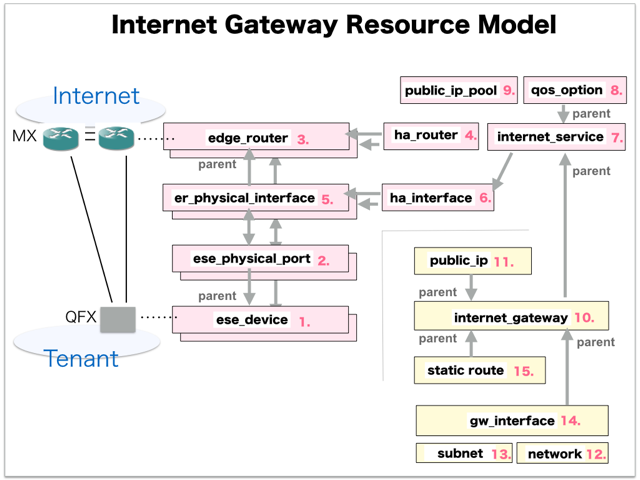

[Return to Top Page](../README.md)

# ESI interface for Internet Gateway 
This section is for the purpose of documenting ESI interface.

* Initinalizing gohan ...
* Receiving HTTP Methods for Creating Resource ...

# Resource model for Internet Gateway
First of all, you can see the overview of resources model of "Internet Gateway".

* [01: Ese Device](01_ese_device.md)
* [02: Ese Physical Port](02_ese_physical_port.md)
* [03: Edge Router](03_edge_router.md)
* [04: Ha Router](04_ha_router.md)
* [05: Er Physical Interface](05_er_physical_interface.md)
* [06: Ha Interface](06_ha_interface.md)
* [07: Internet Service](07_internet_service.md)
* [08: Qos Option](08_qos_option.md)
* [09: Public Ip Pool](09_public_ip_pool.md)
* [10: Internet Gateway](10_internet_gateway.md)
* [11: Public Ip](11_public_ip.md)
* [12: Network](12_network.md)
* [13: Subnet](13_subnet.md)
* [14: Gw Interface](14_gw_interface.md)
* [15: Static Route](15_static_route.md)

