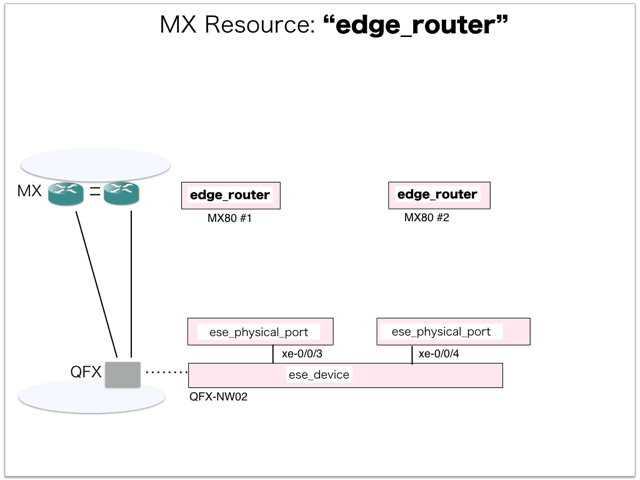

[Return to Previous Page](00_internet_gateway.md)

# 3. Clarification of interface in Sequence Diagram "Create Edge Router"
You can see the relations of "Edge Router" as following.



## 3.1. Sequence Diagram between gohan and etcd
This is a diagram that has been described as interfaces for "Edge Router" between gohan and etcd.

* Initinalizing gohan ...
* Receiving HTTP Methods for Creating Resource ...


## 3.2. Stored data in etcd after initinalizing gohan
These are stored data for "heat_templates" in etcd.

* [Checking stored data for "edge_router_monitoring"](../heat_template/edge_router_monitoring.md)


## 3.3. HTTP Methods for RESTful between Gohan and Client
This is JSON data for "Create Edge Router" in HTTP Methods from client.

* Checking JSON data at post method
```
POST /v2.0/edge_routers
```
```
{
    "edge_router": {
        "autonomous_system": "65101",
        "description": "MX80 #2",
        "ip": "10.79.5.185",
        "name": "vMX-router-02",
        "login": "esi",
        "password": "esiesi0000",
        "ssh_port": 830,
        "tenant_id": "0b576f6f4cbf414f829cd12f008bf08f"
    }
}
```
* Checking JSON data at post method
```
POST /v2.0/edge_routers
```
```
{
    "edge_router": {
        "autonomous_system": "65101",
        "description": "MX80 #1",
        "ip": "10.79.5.184",
        "name": "vMX-router-01",
        "login": "esi",
        "password": "esiesi0000",
        "ssh_port": 830,
        "tenant_id": "0b576f6f4cbf414f829cd12f008bf08f"
    }
}
```


## 3.4. Stored data in etcd after receiving HTTP Methods for RESTful
These are stored data for "Create Edge Router" in etcd.

* [Checking stored data for creating "MX80 #2"](stored_in_etcd/CreateEdgeRouter_01.md)
* [Checking stored data for creating "MX80 #1"](stored_in_etcd/CreateEdgeRouter_02.md)


## 3.5. Stored resource for monitoring in Kafka
This is JSON data for "Create Edge Router" between monitoring-worker and kafka

* [Checking the topic "monitor_snmp_device" for monitoring "edge_router"](stored_in_kafka/CreateEdgeRouter_01.md)


## 3.6. Stored resource in gohan
As a result, checking resources regarding of "Edge Router" in gohan.

* Checking the target of resources via gohan client
```
$ gohan client edge_router show --output-format json 9b82b55a-551e-4069-ae77-c972e30ab0cc
{
    "edge_router": {
        "autonomous_system": "65101",
        "description": "MX80 #2",
        "id": "9b82b55a-551e-4069-ae77-c972e30ab0cc",
        "ip": "10.79.5.185",
        "login": "esi",
        "name": "vMX-router-02",
        "password": "esiesi0000",
        "ssh_port": 830,
        "status": "ACTIVE",
        "tenant_id": "0b576f6f4cbf414f829cd12f008bf08f"
    }
}
```
```
$ gohan client edge_router show --output-format json 198b93f2-006e-45b6-96d3-e7ef6f759501
{
    "edge_router": {
        "autonomous_system": "65101",
        "description": "MX80 #1",
        "id": "198b93f2-006e-45b6-96d3-e7ef6f759501",
        "ip": "10.79.5.184",
        "login": "esi",
        "name": "vMX-router-01",
        "password": "esiesi0000",
        "ssh_port": 830,
        "status": "ACTIVE",
        "tenant_id": "0b576f6f4cbf414f829cd12f008bf08f"
    }
}
```


[Return to Previous Page](00_internet_gateway.md)
