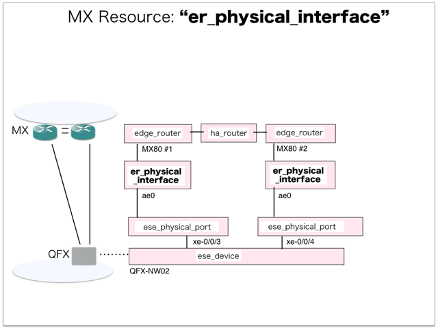
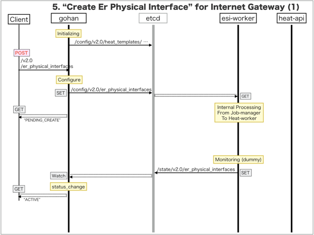
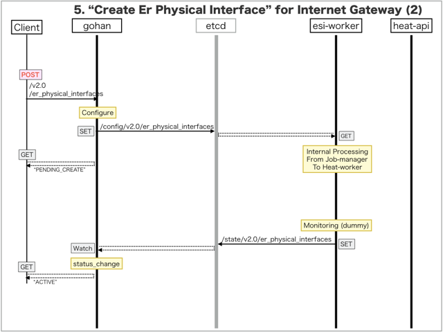

[Return to Previous Page](00_internet_gateway.md)

# 5. Clarification of interface in Sequence Diagram "Create Er Physical Interface"
You can see the relations of "Create Er Physical Interface" as following.



## 5.1. Sequence Diagram between gohan and etcd
This is a diagram that has been described as interfaces for "Er Physical Interface" between gohan and etcd.

* Initinalizing gohan ...
* Receiving HTTP Methods for Creating Resource ...




## 5.2. Stored data in etcd after initinalizing gohan
These are stored data for "heat_templates" in etcd.

* [Checking stored data for "er_physical_interface_monitoring"](../heat_template/er_physical_interface_monitoring.md)


## 5.3. HTTP Methods for RESTful between Gohan and Client
This is JSON data for "Create Er Physical Interface" in HTTP Methods from client.

* Checking JSON data at post method
```
POST /v2.0/er_physical_interfaces
```
```
{
    "er_physical_interface": {
        "connected_ese_port_id": "97fcdf3a-81a4-41a5-8ae6-52c431fc5a5c",
        "device_id": "9b82b55a-551e-4069-ae77-c972e30ab0cc",
        "name": "ae0",
        "tenant_id": "0b576f6f4cbf414f829cd12f008bf08f"
    }
}
```
* Checking JSON data at post method
```
POST /v2.0/er_physical_interfaces
```
```
{
    "er_physical_interface": {
        "connected_ese_port_id": "8a4bbfe0-5aae-42f5-8b94-c4c14b9e7306",
        "device_id": "198b93f2-006e-45b6-96d3-e7ef6f759501",
        "name": "ae0",
        "tenant_id": "0b576f6f4cbf414f829cd12f008bf08f"
    }
}
```


## 5.4. Stored data in etcd after receiving HTTP Methods for RESTful
These are stored data for "Create Er Physical Interface" in etcd.

* [Checking stored data for creating "ae0"](stored_in_etcd/CreateErPhysicalInterface_01.md)
* [Checking stored data for creating "ae0"](stored_in_etcd/CreateErPhysicalInterface_02.md)


## 5.5. Stored resource for monitoring in Kafka
This is JSON data for "Create Er Physical Interface" between monitoring-worker and kafka

* [Checking the topic "monitor_physical_port" for monitoring "er_physical_interface"](stored_in_kafka/CreateErPhysicalInterface_01.md) 


## 5.6. Stored resource in gohan
As a result, checking resources regarding of "Er Physical Interface" in gohan.

* Checking the target of resources via gohan client
```
$ gohan client er_physical_interface show --output-format json 1fda2a88-f7e9-4982-9ce2-d65c9611aae7
{
    "er_physical_interface": {
        "connected_ese_port_id": "97fcdf3a-81a4-41a5-8ae6-52c431fc5a5c",
        "description": "",
        "device_id": "9b82b55a-551e-4069-ae77-c972e30ab0cc",
        "id": "1fda2a88-f7e9-4982-9ce2-d65c9611aae7",
        "name": "ae0",
        "status": "ACTIVE",
        "tenant_id": "0b576f6f4cbf414f829cd12f008bf08f"
    }
}
```
```
$ gohan client er_physical_interface show --output-format json 469e4283-80e6-491c-830f-c483c1f7c695
{
    "er_physical_interface": {
        "connected_ese_port_id": "8a4bbfe0-5aae-42f5-8b94-c4c14b9e7306",
        "description": "",
        "device_id": "198b93f2-006e-45b6-96d3-e7ef6f759501",
        "id": "469e4283-80e6-491c-830f-c483c1f7c695",
        "name": "ae0",
        "status": "ACTIVE",
        "tenant_id": "0b576f6f4cbf414f829cd12f008bf08f"
    }
}
```


[Return to Previous Page](00_internet_gateway.md)
