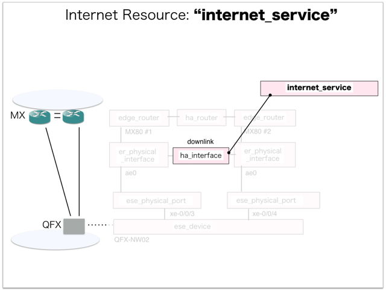
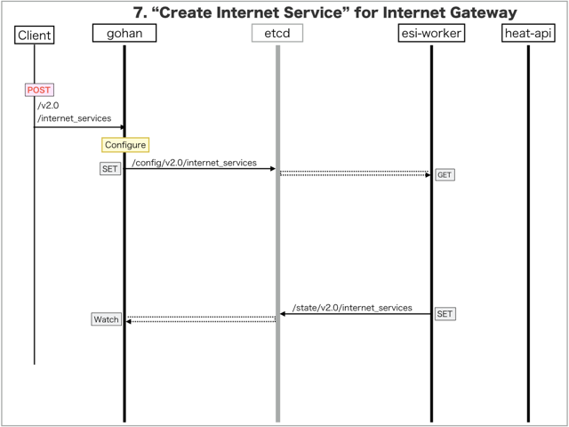

[Return to Previous Page](00_internet_gateway.md)

# 7. Clarification of interface in Sequence Diagram "Create Internet Service"
You can see the relations of "Internet Service" as following.



## 7.1. Sequence Diagram between gohan and etcd
This is a diagram that has been described as interfaces for "Internet Service" between gohan and etcd.

* Receiving HTTP Methods for Creating Resource ...




## 7.2. HTTP Methods for RESTful between Gohan and Client
This is JSON data for "Create Internet Service" in HTTP Methods from client.

* Checking JSON data at post method
```
POST /v2.0/internet_services
```
```
{
    "internet_service": {
        "be_forwarding_class": "FC-INET-BE",
        "default_static_routes_per_gateway": 32,
        "downlink_interfaces": ["1205d3f2-7568-412a-a554-012340ab3172"],
        "ga_forwarding_class": "FC-INET-GA",
        "inet_in_filter": "INET_IN",
        "inet_out_filter": "INET_OUT",
        "minimal_submask_length": 26,
        "name": "sample-internet-service",
        "neighbour_prefix": "BGP-VIRTUAL-ROUTER-PEERS",
        "primary_ibgp_config_group": "InetGW2-RI-IBGP",
        "primary_vrrp_config_group": "InetGW1-VRRP",
        "secondary_ibgp_config_group": "InetGW1-RI-IBGP",
        "secondary_vrrp_config_group": "InetGW2-VRRP",
        "uplink_import_policy": "INSTANCE-MASTER_IN",
        "vrf_export_policy": "INSTANCE-USER_OUT",
        "vrf_import_policy": "INSTANCE-USER_IN",
        "zone": "jp1-zone1",
        "tenant_id": "0b576f6f4cbf414f829cd12f008bf08f"
    }
}
```


## 7.3. Stored data in etcd after receiving HTTP Methods for RESTful
These are stored data for "Create Internet Service" in etcd.

* [Checking stored data for creating "internet_service"](stored_in_etcd/CreateInternetService_01.md)


## 7.4. Stored resource in gohan
As a result, checking resources regarding of "Internet Service" in gohan.

* Checking the target of resources via gohan client
```
$ gohan client internet_service show --output-format json 848e04de-733d-4f98-8971-bdb3b83e0296
{
    "internet_service": {
        "be_forwarding_class": "FC-INET-BE",
        "default_static_routes_per_gateway": 32,
        "description": "",
        "downlink_interfaces": [
            "1205d3f2-7568-412a-a554-012340ab3172"
        ],
        "ga_forwarding_class": "FC-INET-GA",
        "id": "848e04de-733d-4f98-8971-bdb3b83e0296",
        "inet_in_filter": "INET_IN",
        "inet_out_filter": "INET_OUT",
        "minimal_submask_length": 26,
        "name": "sample-internet-service",
        "neighbour_prefix": "BGP-VIRTUAL-ROUTER-PEERS",
        "primary_ibgp_config_group": "InetGW2-RI-IBGP",
        "primary_vrrp_config_group": "InetGW1-VRRP",
        "secondary_ibgp_config_group": "InetGW1-RI-IBGP",
        "secondary_vrrp_config_group": "InetGW2-VRRP",
        "tenant_id": "0b576f6f4cbf414f829cd12f008bf08f",
        "uplink_import_policy": "INSTANCE-MASTER_IN",
        "vrf_config": "",
        "vrf_export_policy": "INSTANCE-USER_OUT",
        "vrf_import_policy": "INSTANCE-USER_IN",
        "zone": "jp1-zone1"
    }
}
```

[Return to Previous Page](00_internet_gateway.md)
