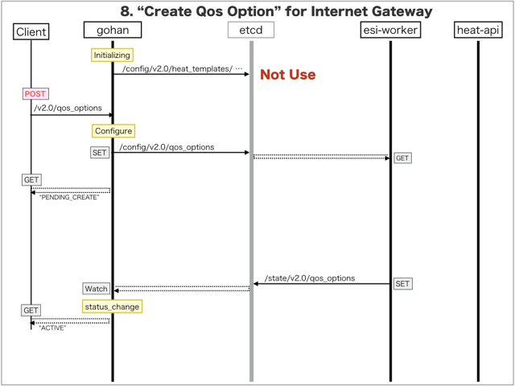

[Return to Previous Page](00_internet_gateway.md)

# 8. Clarification of interface in Sequence Diagram "Create Qos Option"
You can see the relations of "Qos Option" as following.


## 8.1. Sequence Diagram between gohan and etcd
This is a diagram that has been described as interfaces for "Qos Option" between gohan and etcd.

* Initinalizing gohan (but no use) ...
* Receiving HTTP Methods for Creating Resource ...




## 8.2. HTTP Methods for RESTful between Gohan and Client
This is JSON data for "Create Qos Option" in HTTP Methods from client.

* Checking JSON data at post method
```
POST /v2.0/qos_options
```
```
{
    "qos_option": {
        "bandwidth": "10",
        "incoming_policer_config": "action { loss-priority high then discard; } single-rate { color-blind; committed-information-rate 10m; committed-burst-size 187500000; excess-burst-size 187500000; }",
        "incoming_policer_name": "10M-GA-UP-INET",
        "name": "10Mbps-Guaranteed",
        "outgoing_policer_config": "if-exceeding { bandwidth-limit 10m; burst-size-limit 187500000; } then discard;",
        "outgoing_policer_name": "10M-GA-DOWN-INET",
        "qos_type": "guarantee",
        "service_type": "internet",
        "internet_service_id": "848e04de-733d-4f98-8971-bdb3b83e0296",
        "tenant_id": "0b576f6f4cbf414f829cd12f008bf08f"
    }
}
```


## 8.3. Stored data in etcd after receiving HTTP Methods for RESTful
These are stored data for "Create Qos Option" in etcd.

* [Checking stored data for creating "qos_option"](stored_in_etcd/CreateQosOption_01.md)


## 8.4. Stored resource in gohan
As a result, checking resources regarding of "Qos Option" in gohan.

* Checking the target of resources via gohan client
```
$ gohan client qos_option show --output-format json e25f6309-c384-446e-bdc1-5241cb14890b
{
    "qos_option": {
        "aws_service_id": null,
        "bandwidth": "10",
        "charge_type": null,
        "description": "",
        "ha_router_id": "d4286c1d-86e7-42d3-9d84-a4d9daa3ae17",
        "id": "e25f6309-c384-446e-bdc1-5241cb14890b",
        "incoming_policer_config": "action { loss-priority high then discard; } single-rate { color-blind; committed-information-rate 10m; committed-burst-size 187500000; excess-burst-size 187500000; }",
        "incoming_policer_name": "10M-GA-UP-INET",
        "interdc_service_id": null,
        "internet_service_id": "848e04de-733d-4f98-8971-bdb3b83e0296",
        "name": "10Mbps-Guaranteed",
        "outgoing_policer_config": "if-exceeding { bandwidth-limit 10m; burst-size-limit 187500000; } then discard;",
        "outgoing_policer_name": "10M-GA-DOWN-INET",
        "qos_type": "guarantee",
        "service_type": "internet",
        "status": "ACTIVE",
        "tenant_id": "0b576f6f4cbf414f829cd12f008bf08f",
        "vpn_service_id": null
    }
}
```

[Return to Previous Page](00_internet_gateway.md)
