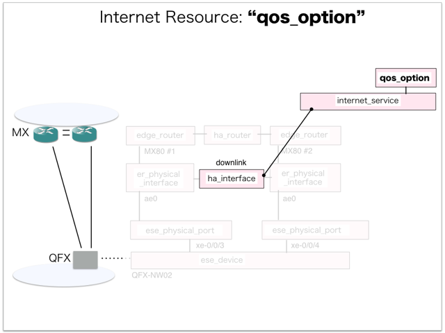

[Return to Previous Page](00_internet_gateway.md)

# 8. Clarification of interface in Sequence Diagram "Create Qos Option"
You can see the relations of "Qos Option" as following.




## 8.1. Gohan


### Outline
First of all, Gohan has received JSON data for "Create Qos Option" in HTTP Methods from client.

* Checking JSON data at post method
```
POST /v2.0/qos_options
```
```
{
    "qos_option": {
        "bandwidth": "10",
        "incoming_policer_config": "action { loss-priority high then discard; } single-rate { color-blind; committed-information-rate 10m; committed-burst-size 187500000; excess-burst-size 187500000; }",
        "incoming_policer_name": "10M-GA-UP-INET",
        "name": "10Mbps-Guaranteed",
        "outgoing_policer_config": "if-exceeding { bandwidth-limit 10m; burst-size-limit 187500000; } then discard;",
        "outgoing_policer_name": "10M-GA-DOWN-INET",
        "qos_type": "guarantee",
        "service_type": "internet",
        "internet_service_id": "986a140f-81da-4e5c-afc3-26f463a85786",
        "tenant_id": "06d6b792b31c40daa546fb0f4e35980d"
    }
}
```
After processing, Gohan has stored data for "Create Qos Option" in etcd

* [Checking stored data for creating "qos_option"](stored_in_etcd/01_Gohan/CreateQosOption_01.md)


## 8.2. ResourceReader
When ResourceReader has started, it gets all of schemas from Gohan.
After that, these schemas are converted as a template_mappings.
And then, ResourceReader keeps storing template_mappings for following processing.

### Reference
* [Checking schemas in ResourceReader](../memo/schemas.txt)
* [Checking template_mappings in ResourceReader](../memo/template_mappings.md)


### Outline
After fetching resource_data for "Create Qos Option" in etcd, ResourceReader has not fetched heat_templates in etcd because of non_workable_resource.
And then, ResourceReader has stored data as finishing resource

* [Checking stored data for creating "qos_option"](stored_in_etcd/00_ResourceReader/CreateQosOption_01.md)


## 8.3. Stored resource in gohan
As a result, checking resources regarding of "Qos Option" in gohan.

* Checking the target of resources via gohan client
```
$ gohan client qos_option show --output-format json 0e6b35d9-d74d-4d3a-922a-d79b9df9b78c
{
    "qos_option": {
        "aws_service_id": null,
        "azure_service_id": null,
        "bandwidth": "10",
        "charge_type": null,
        "description": "",
        "gcp_service_id": null,
        "ha_router_id": "add04ae7-e48a-4583-a726-bed5f3b748c4",
        "id": "0e6b35d9-d74d-4d3a-922a-d79b9df9b78c",
        "incoming_policer_config": "action { loss-priority high then discard; } single-rate { color-blind; committed-information-rate 10m; committed-burst-size 187500000; excess-burst-size 187500000; }",
        "incoming_policer_name": "10M-GA-UP-INET",
        "interdc_service_id": null,
        "internet_service_id": "986a140f-81da-4e5c-afc3-26f463a85786",
        "name": "10Mbps-Guaranteed",
        "orchestration_state": "SYNC_COMPLETE",
        "outgoing_policer_config": "if-exceeding { bandwidth-limit 10m; burst-size-limit 187500000; } then discard;",
        "outgoing_policer_name": "10M-GA-DOWN-INET",
        "qos_type": "guarantee",
        "service_type": "internet",
        "status": "ACTIVE",
        "tenant_id": "06d6b792b31c40daa546fb0f4e35980d",
        "vpn_service_id": null
    }
}
```

[Return to Previous Page](00_internet_gateway.md)
