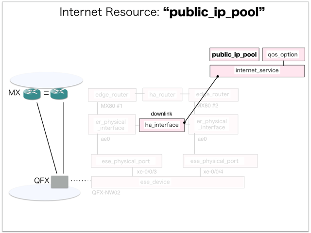

[Return to Previous Page](00_internet_gateway.md)

# 9. Clarification of interface in Sequence Diagram "Create Public Ip Pool"
You can see the relations of "Public Ip Pool" as following.




## 9.1. Gohan


### Outline
First of all, Gohan has received JSON data for "Create Public Ip Pool" in HTTP Methods from client.

* Checking JSON data at post method
```
POST /v2.0/public_ip_pools
```
```
{
    "public_ip_pool": {
        "ha_router_id": "add04ae7-e48a-4583-a726-bed5f3b748c4",
        "internet_service_id": "986a140f-81da-4e5c-afc3-26f463a85786",
        "ip_version": 4,
        "submask_length": 23,
        "subnet_ip": "203.0.112.0",
        "tenant_id": "06d6b792b31c40daa546fb0f4e35980d"
    }
}
```
After processing, Gohan has stored data for "Create Public Ip Pool" in etcd

* [Checking stored data for creating "public_ip_pool"](stored_in_etcd/01_Gohan/CreatePublicIpPool_01.md)


## 9.2. ResourceReader
When ResourceReader has started, it gets all of schemas from Gohan.
After that, these schemas are converted as a template_mappings.
And then, ResourceReader keeps storing template_mappings for following processing.

### Reference
* [Checking schemas in ResourceReader](../memo/schemas.txt)
* [Checking template_mappings in ResourceReader](../memo/template_mappings.md)


### Outline
After fetching resource_data for "Create Public Ip Pool" in etcd, ResourceReader has not fetched heat_templates in etcd because of non_workable_resource.
And then, ResourceReader has stored data as finishing resource

* [Checking stored data for creating "public_ip_pool"](stored_in_etcd/00_ResourceReader/CreatePublicIpPool_01.md)


## 9.3. Stored resource in gohan
As a result, checking resources regarding of "Public Ip Pool" in gohan.

* Checking the target of resources via gohan client
```
$ gohan client public_ip_pool show --output-format json c8072205-8aec-4fb5-9437-03900c14127a
{
    "public_ip_pool": {
        "addresses_available": 512,
        "ha_router_id": "add04ae7-e48a-4583-a726-bed5f3b748c4",
        "id": "c8072205-8aec-4fb5-9437-03900c14127a",
        "internet_service_id": "986a140f-81da-4e5c-afc3-26f463a85786",
        "ip_version": 4,
        "pool_state": "AAAAAAAAAAAAAAAAAAAAAAAAAAAAAAAAAAAAAAAAAAAAAAAAAAAAAAAAAAAAAAAAAAAAAAAAAAAAAAAAAAAAAAAAAAAAAAAAAAAAAAAAAAAAAAAAAAAAAAAAAAAAAAAAAAAAAAAAAAAAAAAAAAAAAAAAAAAAAAAAAAAAAAAAAAAAAAAAAAAAAAAAAAAAAAAAAAAAAAAAAAAAAAAAAAAAAAAAAAAAAAAAAAAAAAAAAAAAAAAAAAAAAAAAAAAAAAAAAAAAAAAAAAAAAAAAAAAAAAAAAAAAAAAAAAAAAAAAAAAAAAAAAAAAAAAAAAAAAAAAAAAAAAAAAAAAAAAAAAAAAA==",
        "submask_length": 23,
        "subnet_ip": "203.0.112.0",
        "tenant_id": "06d6b792b31c40daa546fb0f4e35980d"
    }
}
```

[Return to Previous Page](00_internet_gateway.md)
