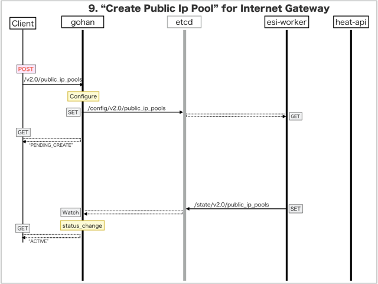

[Return to Previous Page](00_internet_gateway.md)

# 9. Clarification of interface in Sequence Diagram "Create Public Ip Pool"
You can see the relations of "Public Ip Pool" as following.


## 9.1. Sequence Diagram between gohan and etcd
This is a diagram that has been described as interfaces for "Public Ip Pool" between gohan and etcd.

* Receiving HTTP Methods for Creating Resource ...



## 9.2. HTTP Methods for RESTful between Gohan and Client
This is JSON data for "Create Public Ip Pool" in HTTP Methods from client.

* Checking JSON data at post method
```
POST /v2.0/public_ip_pools
```
```
{
    "public_ip_pool": {
        "ha_router_id": "d4286c1d-86e7-42d3-9d84-a4d9daa3ae17",
        "internet_service_id": "848e04de-733d-4f98-8971-bdb3b83e0296",
        "ip_version": 4,
        "submask_length": 23,
        "subnet_ip": "203.0.112.0",
        "tenant_id": "0b576f6f4cbf414f829cd12f008bf08f"
    }
}
```


## 9.3. Stored data in etcd after receiving HTTP Methods for RESTful
These are stored data for "Create Public Ip Pool" in etcd.

* [Checking stored data for creating "public_ip_pool"](stored_in_etcd/CreatePublicIpPool_01.md)


## 9.4. Stored resource in gohan
As a result, checking resources regarding of "Public Ip Pool" in gohan.

* Checking the target of resources via gohan client
```
$ gohan client public_ip_pool show --output-format json 5cd14f90-cf3c-4aeb-b30a-227b3c936761
{
    "public_ip_pool": {
        "addresses_available": 512,
        "ha_router_id": "d4286c1d-86e7-42d3-9d84-a4d9daa3ae17",
        "id": "5cd14f90-cf3c-4aeb-b30a-227b3c936761",
        "internet_service_id": "848e04de-733d-4f98-8971-bdb3b83e0296",
        "ip_version": 4,
        "pool_state": "AAAAAAAAAAAAAAAAAAAAAAAAAAAAAAAAAAAAAAAAAAAAAAAAAAAAAAAAAAAAAAAAAAAAAAAAAAAAAAAAAAAAAAAAAAAAAAAAAAAAAAAAAAAAAAAAAAAAAAAAAAAAAAAAAAAAAAAAAAAAAAAAAAAAAAAAAAAAAAAAAAAAAAAAAAAAAAAAAAAAAAAAAAAAAAAAAAAAAAAAAAAAAAAAAAAAAAAAAAAAAAAAAAAAAAAAAAAAAAAAAAAAAAAAAAAAAAAAAAAAAAAAAAAAAAAAAAAAAAAAAAAAAAAAAAAAAAAAAAAAAAAAAAAAAAAAAAAAAAAAAAAAAAAAAAAAAAAAAAAAAA==",
        "submask_length": 23,
        "subnet_ip": "203.0.112.0",
        "tenant_id": "0b576f6f4cbf414f829cd12f008bf08f"
    }
}
```

[Return to Previous Page](00_internet_gateway.md)
