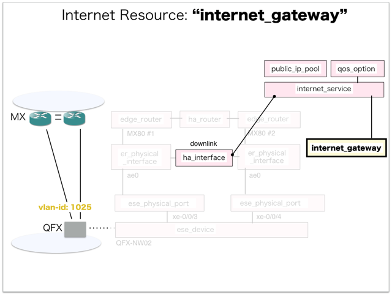

[Return to Previous Page](00_internet_gateway.md)

# 10. Clarification of interface in Sequence Diagram "Create Internet Gateway"
You can see the relations of "Internet Gateway" as following.




## 10.1. Gohan


### Outline
First of all, Gohan has received JSON data for "Create Internet Gateway" in HTTP Methods from client.

* Checking JSON data at post method
```
POST /v2.0/internet_gateways
```
```
{
    "internet_gateway": {
        "description": "Sample Internet-gateway",
        "maximum_static_routes": 32,
        "name": "sample-internet-gateway",
        "qos_option_id": "0e6b35d9-d74d-4d3a-922a-d79b9df9b78c",
        "internet_service_id": "986a140f-81da-4e5c-afc3-26f463a85786",
        "tenant_id": "06d6b792b31c40daa546fb0f4e35980d"
    }
}
```
After processing, Gohan has stored data for "Create Internet Gateway" in etcd.

* [Checking stored data for creating "internet_gateway"](stored_in_etcd/01_Gohan/CreateInternetGateway_01.md)


## 10.2. ResourceReader
When ResourceReader has started, it gets all of schemas from Gohan.
After that, these schemas are converted as a template_mappings.
And then, ResourceReader keeps storing template_mappings for following processing.

### Reference
* [Checking schemas in ResourceReader](../memo/schemas.txt)
* [Checking template_mappings in ResourceReader](../memo/template_mappings.md)


### Outline
After fetching resource_data for "Create Internet Gateway" in etcd, ResourceReader has fetched heat_templates in etcd.

* [Checking stored data for "internet_gateway"](../heat_template/internet_gateway.md)


## 10.3. JobManager


### Outline
After converting resource_data to job_data, JobManager has stored it in etcd.

* [Checking stored data for creating "internet_gateway"](stored_in_etcd/02_JobManager/CreateInternetGateway_01.md)


## 10.4. HeatWorker


### Outline
After fetching job_data, HeatWorker has handled job_data.
And then, HeatWorker has stored the result of handling job_data.

* [Checking stored data for creating "internet_gateway"](stored_in_etcd/03_HeatWorker/CreateInternetGateway_01.md)


## 10.5. Heat


### Outline
Heat has conducted some tasks for "Create Internet Gateway".
As a result, Heat has stored heat-stacks for "Create Internet Gateway".

* [Checking heat-stack of "internet_gateway"](heat-stack/CreateInternetGateway_01.md)


## 10.6. CollectorAgent


### Outline
CollectorAgent has conducted some tasks for "Create Internet Gateway" based heat-stacks via Heat.
As a result, CollectorAgent has responded the result of status information as handling tasks.

* [Checking monitoring of "internet_gateway"](collector_agents/CreateInternetGateway_01.md)
* [Checking monitoring of "internet_gateway"](collector_agents/CreateInternetGateway_02.md)


## 10.7. Applying JUNOS Configurations via netconf
Checking configuration in Edge Router

* MX-1
```
[edit interfaces ae0]
+    unit 1025 {
+        apply-groups InetGW2-VRRP;
+        description inet_gw;
+        vlan-id 1025;
+        family inet {
+            filter {
+                input FILTER_10M-GA-UP-INET;
+                output FILTER_10M-GA-DOWN-INET;
+            }
+        }
+    }
```
```
[edit policy-options]
    prefix-list BGP-VIRTUAL-ROUTER-PEERS { ... }
+   prefix-list vrf_gw_sample-ha-router-downlink_1025_prefix;
```
```
[edit policy-options]
+   policy-statement INSTANCE-MASTER_IN {
+       term vrf_gw_sample-ha-router-downlink_1025 {
+           from instance vrf_gw_sample-ha-router-downlink_1025;
+           then accept;
+       }
+   }
```
```
[edit firewall family inet filter INET_IN]
+      term vrf_gw_sample-ha-router-downlink_1025_filter {
+          from {
+              destination-prefix-list {
+                  vrf_gw_sample-ha-router-downlink_1025_prefix;
+              }
+          }
+          then {
+              count vrf_gw_sample-ha-router-downlink_1025_IN;
+              accept;
+          }
+      }
       term all-accept { ... }
```
```
[edit firewall family inet filter INET_OUT]
+      term vrf_gw_sample-ha-router-downlink_1025_filter {
+          from {
+              source-prefix-list {
+                  vrf_gw_sample-ha-router-downlink_1025_prefix;
+              }
+          }
+          then {
+              count vrf_gw_sample-ha-router-downlink_1025_OUT;
+              accept;
+          }
+      }
       term all-accept { ... }
```
```
[edit routing-instances]
+   vrf_gw_sample-ha-router-downlink_1025 {
+       instance-type virtual-router;
+       interface ae0.1025;
+       routing-options {
+           instance-import INSTANCE-USER_IN;
+           instance-export INSTANCE-USER_OUT;
+       }
+   }

[edit]
```

* MX-2
```
[edit interfaces ae0]
+    unit 1025 {
+        apply-groups InetGW1-VRRP;
+        description inet_gw;
+        vlan-id 1025;
+        family inet {
+            filter {
+                input FILTER_10M-GA-UP-INET;
+                output FILTER_10M-GA-DOWN-INET;
+            }
+        }
+    }
```
```
[edit policy-options]
    prefix-list BGP-VIRTUAL-ROUTER-PEERS { ... }
+   prefix-list vrf_gw_sample-ha-router-downlink_1025_prefix;
```
```
[edit policy-options]
+   policy-statement INSTANCE-MASTER_IN {
+       term vrf_gw_sample-ha-router-downlink_1025 {
+           from instance vrf_gw_sample-ha-router-downlink_1025;
+           then accept;
+       }
+   }
```
```
[edit firewall family inet filter INET_IN]
+      term vrf_gw_sample-ha-router-downlink_1025_filter {
+          from {
+              destination-prefix-list {
+                  vrf_gw_sample-ha-router-downlink_1025_prefix;
+              }
+          }
+          then {
+              count vrf_gw_sample-ha-router-downlink_1025_IN;
+              accept;
+          }
+      }
       term all-accept { ... }
```
```
[edit firewall family inet filter INET_OUT]
+      term vrf_gw_sample-ha-router-downlink_1025_filter {
+          from {
+              source-prefix-list {
+                  vrf_gw_sample-ha-router-downlink_1025_prefix;
+              }
+          }
+          then {
+              count vrf_gw_sample-ha-router-downlink_1025_OUT;
+              accept;
+          }
+      }
       term all-accept { ... }
```
```
[edit routing-instances]
+   vrf_gw_sample-ha-router-downlink_1025 {
+       instance-type virtual-router;
+       interface ae0.1025;
+       routing-options {
+           instance-import INSTANCE-USER_IN;
+           instance-export INSTANCE-USER_OUT;
+       }
+   }

[edit]
```


## 10.8. Stored resource in gohan
As a result, checking resources regarding of "Internet Gateway" in gohan.

* Checking the target of resources via gohan client
```
$ gohan client internet_gateway show --output-format json f6e8c695-c4c1-4a93-9b7e-1663aee6dec9
{   
    "internet_gateway": {
        "associated_uplink_id": null,
        "description": "Sample Internet-gateway",
        "downlink_interface_id": "2595e193-84a8-49dc-aa2e-7a68c60ea11e",
        "id": "f6e8c695-c4c1-4a93-9b7e-1663aee6dec9",
        "internet_service_id": "986a140f-81da-4e5c-afc3-26f463a85786",
        "maximum_static_routes": 32,
        "name": "sample-internet-gateway",
        "orchestration_state": "CREATE_COMPLETE",
        "primary_logical_interface_name": "ae0.1025",
        "qos_option_id": "0e6b35d9-d74d-4d3a-922a-d79b9df9b78c",
        "secondary_logical_interface_name": "ae0.1025",
        "status": "ACTIVE",
        "tenant_id": "06d6b792b31c40daa546fb0f4e35980d",
        "vlan_id": "1025",
        "vrf_name": "vrf_gw_sample-ha-router-downlink_1025"
    }
}
```
* Checking billing_resource via gohan client
```
$ gohan client billing_resource list --output-format json
{
    "billing_resources": [
        {
            "config_version": 1,
            "ended": null,
            "id": "5a97fcc0-7d6f-4acd-bb87-75697ae19f94",
            "info": {
                "internet_service": "sample-internet-service"
            },
            "parent_billing_id": null,
            "resource_id": "f6e8c695-c4c1-4a93-9b7e-1663aee6dec9",
            "resource_type": "internet_gateway",
            "started": 1.522818049e+09,
            "tenant_id": "06d6b792b31c40daa546fb0f4e35980d",
            "unique_resource_id": "f6e8c695-c4c1-4a93-9b7e-1663aee6dec9"
        },
        {
            "config_version": 1,
            "ended": null,
            "id": "d20cde36-cd9c-4a8a-a10c-e62fe4f087e4",
            "info": {
                "bandwidth": "10",
                "qos_type": "guarantee"
            },
            "parent_billing_id": "5a97fcc0-7d6f-4acd-bb87-75697ae19f94",
            "resource_id": "0e6b35d9-d74d-4d3a-922a-d79b9df9b78c",
            "resource_type": "qos_option",
            "started": 1.522818049e+09,
            "tenant_id": "06d6b792b31c40daa546fb0f4e35980d",
            "unique_resource_id": null
        }
    ]
}
```

[Return to Previous Page](00_internet_gateway.md)
