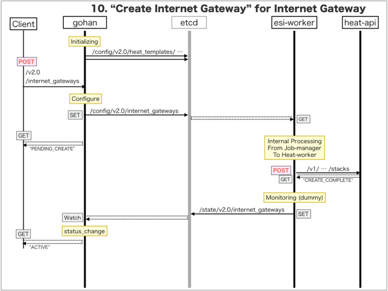

[Return to Previous Page](00_internet_gateway.md)

# 10. Clarification of interface in Sequence Diagram "Create Internet Gateway"
You can see the relations of "Internet Gateway" as following.


## 10.1. Sequence Diagram between gohan and etcd
This is a diagram that has been described as interfaces for "Internet Gateway" between gohan and etcd.

* Initinalizing gohan ...
* Receiving HTTP Methods for Creating Resource ...



## 10.2. Stored data in etcd after initinalizing gohan
These are stored data for "heat_templates" in etcd.

* [Checking stored data for "internet_gateway"](../heat_template/internet_gateway.md)
* [Checking stored data for "internet_gateway_monitoring"](../heat_template/internet_gateway_monitoring.md)


## 10.3. HTTP Methods for RESTful between Gohan and Client
This is JSON data for "Create Internet Gateway" in HTTP Methods from client.

* Checking JSON data at post method
```
POST /v2.0/internet_gateways
```
```
{
    "internet_gateway": {
        "description": "Sample Internet-gateway",
        "maximum_static_routes": 32,
        "name": "sample-internet-gateway",
        "qos_option_id": "e25f6309-c384-446e-bdc1-5241cb14890b",
        "internet_service_id": "848e04de-733d-4f98-8971-bdb3b83e0296",
        "tenant_id": "0b576f6f4cbf414f829cd12f008bf08f"
    }
}
```


## 10.4. Stored data in etcd after receiving HTTP Methods for RESTful
These are stored data for "Create Internet Gateway" in etcd.

* [Checking stored data for creating "internet_gateway"](stored_in_etcd/CreateInternetGateway_01.md)


## 10.5. Stored heat-stack via heat-api
These are stored heat-stacks for "Create Internet Gateway" in heat-engine.

* [Checking heat-stack of "internet_gateway"](heat-stack/CreateInternetGateway_01.md)


## 10.6. Stored resource for monitoring in Kafka
This is JSON data for "Create Internet Gateway" between monitoring-worker and kafka

* [Checking the topic "monitor_igs_counter" for monitoring "internet_gateway"](stored_in_kafka/CreateInternetGateway_01.md)


## 10.7. Applying JUNOS Configurations via netconf
Checking configuration in Edge Router

* MX-1
```
[edit interfaces ae0]
+    unit 1025 {
+        apply-groups InetGW2-VRRP;
+        description inet_gw;
+        vlan-id 1025;
+        family inet {
+            filter {
+                input FILTER_10M-GA-UP-INET;
+                output FILTER_10M-GA-DOWN-INET;
+            }
+        }
+    }

[edit policy-options]
    prefix-list BGP-VIRTUAL-ROUTER-PEERS { ... }
+   prefix-list vrf_gw_sample-ha-router-downlink_1025_prefix;

[edit policy-options]
+   policy-statement INSTANCE-MASTER_IN {
+       term vrf_gw_sample-ha-router-downlink_1025 {
+           from instance vrf_gw_sample-ha-router-downlink_1025;
+           then accept;
+       }
+   }

[edit firewall family inet filter INET_IN]
+      term vrf_gw_sample-ha-router-downlink_1025_filter {
+          from {
+              destination-prefix-list {
+                  vrf_gw_sample-ha-router-downlink_1025_prefix;
+              }
+          }
+          then {
+              count vrf_gw_sample-ha-router-downlink_1025_IN;
+              accept;
+          }
+      }
       term all-accept { ... }

[edit firewall family inet filter INET_OUT]
+      term vrf_gw_sample-ha-router-downlink_1025_filter {
+          from {
+              source-prefix-list {
+                  vrf_gw_sample-ha-router-downlink_1025_prefix;
+              }
+          }
+          then {
+              count vrf_gw_sample-ha-router-downlink_1025_OUT;
+              accept;
+          }
+      }
       term all-accept { ... }

[edit routing-instances]
+   vrf_gw_sample-ha-router-downlink_1025 {
+       instance-type virtual-router;
+       interface ae0.1025;
+       routing-options {
+           instance-import INSTANCE-USER_IN;
+           instance-export INSTANCE-USER_OUT;
+       }
+   }

[edit]
```

* MX-2
```
[edit interfaces ae0]
+    unit 1025 {
+        apply-groups InetGW1-VRRP;
+        description inet_gw;
+        vlan-id 1025;
+        family inet {
+            filter {
+                input FILTER_10M-GA-UP-INET;
+                output FILTER_10M-GA-DOWN-INET;
+            }
+        }
+    }

[edit policy-options]
    prefix-list BGP-VIRTUAL-ROUTER-PEERS { ... }
+   prefix-list vrf_gw_sample-ha-router-downlink_1025_prefix;

[edit policy-options]
+   policy-statement INSTANCE-MASTER_IN {
+       term vrf_gw_sample-ha-router-downlink_1025 {
+           from instance vrf_gw_sample-ha-router-downlink_1025;
+           then accept;
+       }
+   }

[edit firewall family inet filter INET_IN]
+      term vrf_gw_sample-ha-router-downlink_1025_filter {
+          from {
+              destination-prefix-list {
+                  vrf_gw_sample-ha-router-downlink_1025_prefix;
+              }
+          }
+          then {
+              count vrf_gw_sample-ha-router-downlink_1025_IN;
+              accept;
+          }
+      }
       term all-accept { ... }

[edit firewall family inet filter INET_OUT]
+      term vrf_gw_sample-ha-router-downlink_1025_filter {
+          from {
+              source-prefix-list {
+                  vrf_gw_sample-ha-router-downlink_1025_prefix;
+              }
+          }
+          then {
+              count vrf_gw_sample-ha-router-downlink_1025_OUT;
+              accept;
+          }
+      }
       term all-accept { ... }

[edit routing-instances]
+   vrf_gw_sample-ha-router-downlink_1025 {
+       instance-type virtual-router;
+       interface ae0.1025;
+       routing-options {
+           instance-import INSTANCE-USER_IN;
+           instance-export INSTANCE-USER_OUT;
+       }
+   }

[edit]
```


## 10.8. Stored resource in gohan
As a result, checking resources regarding of "Internet Gateway" in gohan.

* Checking the target of resources via gohan client
```
$ gohan client internet_gateway show --output-format json 429e24b5-a2f0-4fb8-b467-e335857e9476
{
    "internet_gateway": {
        "associated_uplink_id": null,
        "description": "Sample Internet-gateway",
        "downlink_interface_id": "1205d3f2-7568-412a-a554-012340ab3172",
        "id": "429e24b5-a2f0-4fb8-b467-e335857e9476",
        "internet_service_id": "848e04de-733d-4f98-8971-bdb3b83e0296",
        "maximum_static_routes": 32,
        "name": "sample-internet-gateway",
        "primary_logical_interface_name": "ae0.1025",
        "qos_option_id": "e25f6309-c384-446e-bdc1-5241cb14890b",
        "secondary_logical_interface_name": "ae0.1025",
        "status": "ACTIVE",
        "tenant_id": "0b576f6f4cbf414f829cd12f008bf08f",
        "vlan_id": "1025",
        "vrf_name": "vrf_gw_sample-ha-router-downlink_1025"
    }
}
```
* Checking resource_mapping via gohan client
```
$ gohan client resource_mapping list --output-format json
{
    "resource_mappings": [
        {
            "created": 1.494476663e+09,
            "deleted": null,
            "id": "075c5413-cdf3-4bb5-b7b1-6100f3cecb25",
            "mapped_id": "10.79.5.184-INET_IN-vrf_gw_sample-ha-router-downlink_1025_IN",
            "relation": "secondary_in",
            "resource_id": "429e24b5-a2f0-4fb8-b467-e335857e9476",
            "resource_type": "internet_gateway",
            "tenant_id": "0b576f6f4cbf414f829cd12f008bf08f"
        },
        {
            "created": 1.494476663e+09,
            "deleted": null,
            "id": "11cb2015-fadc-4ae2-b0cf-b7ae280baebb",
            "mapped_id": "10.79.5.185-INET_OUT-vrf_gw_sample-ha-router-downlink_1025_OUT",
            "relation": "primary_out",
            "resource_id": "429e24b5-a2f0-4fb8-b467-e335857e9476",
            "resource_type": "internet_gateway",
            "tenant_id": "0b576f6f4cbf414f829cd12f008bf08f"
        },
        {
            "created": 1.494476663e+09,
            "deleted": null,
            "id": "b3d2f0fb-3765-4485-a88d-44b46fe191df",
            "mapped_id": "10.79.5.184-INET_OUT-vrf_gw_sample-ha-router-downlink_1025_OUT",
            "relation": "secondary_out",
            "resource_id": "429e24b5-a2f0-4fb8-b467-e335857e9476",
            "resource_type": "internet_gateway",
            "tenant_id": "0b576f6f4cbf414f829cd12f008bf08f"
        },
        {
            "created": 1.494476663e+09,
            "deleted": null,
            "id": "f3010659-2a05-4b5f-add1-0e2abc31f75a",
            "mapped_id": "10.79.5.185-INET_IN-vrf_gw_sample-ha-router-downlink_1025_IN",
            "relation": "primary_in",
            "resource_id": "429e24b5-a2f0-4fb8-b467-e335857e9476",
            "resource_type": "internet_gateway",
            "tenant_id": "0b576f6f4cbf414f829cd12f008bf08f"
        }
    ]
}
```
* Checking billing_resource via gohan client
```
$ gohan client billing_resource list --output-format json
{
    "billing_resources": [
        {
            "config_version": 1,
            "ended": null,
            "id": "35e4ba02-217d-492d-b256-adbe19c516d5",
            "info": {
                "internet_service": "sample-internet-service"
            },
            "parent_billing_id": null,
            "resource_id": "429e24b5-a2f0-4fb8-b467-e335857e9476",
            "resource_type": "internet_gateway",
            "started": 1.494476663e+09,
            "tenant_id": "0b576f6f4cbf414f829cd12f008bf08f",
            "unique_resource_id": "429e24b5-a2f0-4fb8-b467-e335857e9476"
        },
        {
            "config_version": 1,
            "ended": null,
            "id": "e32e992e-8553-448c-860f-6e63bbe30c19",
            "info": {
                "bandwidth": "10",
                "qos_type": "guarantee"
            },
            "parent_billing_id": "35e4ba02-217d-492d-b256-adbe19c516d5",
            "resource_id": "e25f6309-c384-446e-bdc1-5241cb14890b",
            "resource_type": "qos_option",
            "started": 1.494476663e+09,
            "tenant_id": "0b576f6f4cbf414f829cd12f008bf08f",
            "unique_resource_id": null
        }
    ]
}
```

[Return to Previous Page](00_internet_gateway.md)
