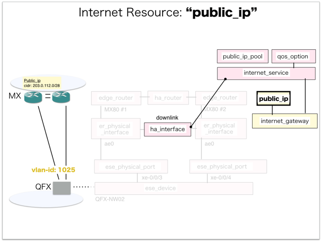

[Return to Previous Page](00_internet_gateway.md)

# 11. Clarification of interface in Sequence Diagram "Create Public Ip"
You can see the relations of "Public Ip" as following.




## 11.1. Gohan


### Outline
First of all, Gohan has received JSON data for "Create Public Ip" in HTTP Methods from client.

* Checking JSON data at post method
```
POST /v2.0/public_ips
```
```
{
    "public_ip": {
        "description": "Sample Public-Ip",
        "internet_gw_id": "f6e8c695-c4c1-4a93-9b7e-1663aee6dec9",
        "name": "sample-public_ip",
        "submask_length": 28,
        "tenant_id": "06d6b792b31c40daa546fb0f4e35980d"
    }
}
```
After processing, Gohan has stored data for "Create Public Ip" in etcd.

* [Checking stored data for creating "public_ip_pool"](stored_in_etcd/01_Gohan/CreatePublicIp_01.md)
* [Checking stored data for creating "public_ip"](stored_in_etcd/01_Gohan/CreatePublicIp_02.md)


## 11.2. ResourceReader
When ResourceReader has started, it gets all of schemas from Gohan.
After that, these schemas are converted as a template_mappings.
And then, ResourceReader keeps storing template_mappings for following processing.

### Reference
* [Checking schemas in ResourceReader](../memo/schemas.txt)
* [Checking template_mappings in ResourceReader](../memo/template_mappings.md)


### Outline
After fetching resource_data for "Create Public Ip" in etcd, ResourceReader has fetched heat_templates in etcd.

* [Checking stored data for "public_ip"](../heat_template/public_ip.md)

And then, ResourceReader has stored data as finishing resource

* [Checking stored data for creating "public_ip_pool"](stored_in_etcd/00_ResourceReader/CreatePublicIp_01.md)


## 11.3. JobManager


### Outline
After converting resource_data to job_data, JobManager has stored it in etcd.

* [Checking stored data for creating "public_ip"](stored_in_etcd/02_JobManager/CreatePublicIp_02.md)


## 11.4. HeatWorker


### Outline
After fetching job_data, HeatWorker has handled job_data.
And then, HeatWorker has stored the result of handling job_data.

* [Checking stored data for creating "public_ip"](stored_in_etcd/03_HeatWorker/CreatePublicIp_02.md)


## 11.5. Heat


### Outline
Heat has conducted some tasks for "Create Public Ip".
As a result, Heat has stored heat-stacks for "Create Public Ip".

* [Checking heat-stack of "public_ip"](heat-stack/CreatePublicIp_01.md)


## 11.6. CollectorAgent


### Outline
CollectorAgent has conducted some tasks for "Create Public Ip" based heat-stacks via Heat.
As a result, CollectorAgent has responded the result of status information as handling tasks.

* [Checking monitoring of "public_ip"](collector_agents/CreatePublicIp_01.md)


## 11.7. Applying JUNOS Configurations via netconf
Checking configuration in Edge Router

* MX-1
```
[edit policy-options prefix-list vrf_gw_sample-ha-router-downlink_1025_prefix]
+   203.0.112.0/28;

[edit]
```

* MX-2
```
[edit policy-options prefix-list vrf_gw_sample-ha-router-downlink_1025_prefix]
+   203.0.112.0/28;

[edit]
```


## 11.8. Stored resource in gohan
As a result, checking resources regarding of "Public Ip" in gohan.

* Checking the target of resources via gohan client
```
$ gohan client public_ip show --output-format json d5622781-f06a-4fad-b800-b577a05ad8b2
{
    "public_ip": {
        "cidr": "203.0.112.0",
        "description": "Sample Public-Ip",
        "id": "d5622781-f06a-4fad-b800-b577a05ad8b2",
        "internet_gw_id": "f6e8c695-c4c1-4a93-9b7e-1663aee6dec9",
        "ip_pool_id": "c8072205-8aec-4fb5-9437-03900c14127a",
        "name": "sample-public_ip",
        "orchestration_state": "CREATE_COMPLETE",
        "status": "ACTIVE",
        "submask_length": 28,
        "suspended_public_ip_id": null,
        "tenant_id": "06d6b792b31c40daa546fb0f4e35980d"
    }
}
```
* Checking billing_resource via gohan client
```
$ gohan client billing_resource list --output-format json
{
    "billing_resources": [

        ... (snip)

        {
            "config_version": 1,
            "ended": null,
            "id": "6a72cbe8-17c7-444e-a9c8-685b4d47ff97",
            "info": {
                "cidr": "203.0.112.0",
                "submask_length": 28
            },
            "parent_billing_id": null,
            "resource_id": "d5622781-f06a-4fad-b800-b577a05ad8b2",
            "resource_type": "public_ip",
            "started": 1.522818073e+09,
            "tenant_id": "06d6b792b31c40daa546fb0f4e35980d",
            "unique_resource_id": "d5622781-f06a-4fad-b800-b577a05ad8b2"
        }
    ]
}
```

[Return to Previous Page](00_internet_gateway.md)
