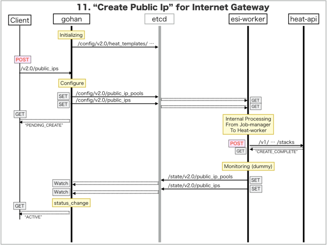

[Return to Previous Page](00_internet_gateway.md)

# 11. Clarification of interface in Sequence Diagram "Create Public Ip"
You can see the relations of "Public Ip" as following.


## 11.1. Sequence Diagram between gohan and etcd
This is a diagram that has been described as interfaces for "Public Ip" between gohan and etcd.

* Initinalizing gohan ...
* Receiving HTTP Methods for Creating Resource ...



## 11.2. Stored data in etcd after initinalizing gohan
These are stored data for "heat_templates" in etcd.

* [Checking stored data for "public_ip"](../heat_template/public_ip.md)


## 11.3. HTTP Methods for RESTful between Gohan and Client
This is JSON data for "Create Public Ip" in HTTP Methods from client.

* Checking JSON data at post method
```
POST /v2.0/public_ips
```
```
{
    "public_ip": {
        "description": "Sample Public-Ip",
        "internet_gw_id": "429e24b5-a2f0-4fb8-b467-e335857e9476",
        "name": "sample-public_ip",
        "submask_length": 28,
        "tenant_id": "0b576f6f4cbf414f829cd12f008bf08f"
    }
}
```


## 11.4. Stored data in etcd after receiving HTTP Methods for RESTful
These are stored data for "Create Public Ip" in etcd.

* [Checking stored data for creating "public_ip_pool"](stored_in_etcd/CreatePublicIp_01.md)
* [Checking stored data for creating "public_ip"](stored_in_etcd/CreatePublicIp_02.md)


## 11.5. Stored heat-stack via heat-api
These are stored heat-stacks for "Create Public Ip" in heat-engine.

* [Checking heat-stack of "public_ip"](heat-stack/CreatePublicIp_01.md)


## 11.6. Applying JUNOS Configurations via netconf
Checking configuration in Edge Router

* MX-1
```
[edit policy-options prefix-list vrf_gw_sample-ha-router-downlink_1025_prefix]
+   203.0.112.0/28;

[edit]
```

* MX-2
```
[edit policy-options prefix-list vrf_gw_sample-ha-router-downlink_1025_prefix]
+   203.0.112.0/28;

[edit]
```


## 11.7. Stored resource in gohan
As a result, checking resources regarding of "Public Ip" in gohan.

* Checking the target of resources via gohan client
```
$ gohan client public_ip show --output-format json bc6f2c6d-59be-4f56-a2d7-96ab578c0735
{
    "public_ip": {
        "cidr": "203.0.112.0",
        "description": "Sample Public-Ip",
        "id": "bc6f2c6d-59be-4f56-a2d7-96ab578c0735",
        "internet_gw_id": "429e24b5-a2f0-4fb8-b467-e335857e9476",
        "ip_pool_id": "5cd14f90-cf3c-4aeb-b30a-227b3c936761",
        "name": "sample-public_ip",
        "status": "ACTIVE",
        "submask_length": 28,
        "suspended_public_ip_id": null,
        "tenant_id": "0b576f6f4cbf414f829cd12f008bf08f"
    }
}
```
* Checking billing_resource via gohan client
```
$ gohan client billing_resource list --output-format json
{
    "billing_resources": [

        ... (snip)

        {
            "config_version": 1,
            "ended": null,
            "id": "6e74227c-1d04-472f-b511-81d88e219502",
            "info": {
                "cidr": "203.0.112.0",
                "submask_length": 28
            },
            "parent_billing_id": null,
            "resource_id": "bc6f2c6d-59be-4f56-a2d7-96ab578c0735",
            "resource_type": "public_ip",
            "started": 1.494476677e+09,
            "tenant_id": "0b576f6f4cbf414f829cd12f008bf08f",
            "unique_resource_id": "bc6f2c6d-59be-4f56-a2d7-96ab578c0735"
        }
    ]
}
```

[Return to Previous Page](00_internet_gateway.md)
