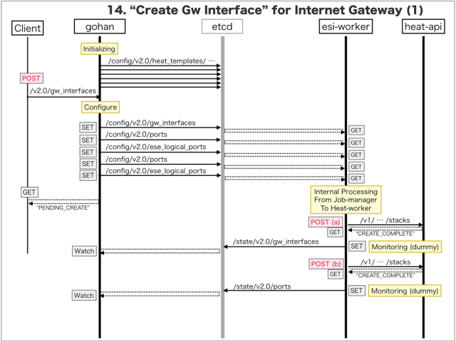
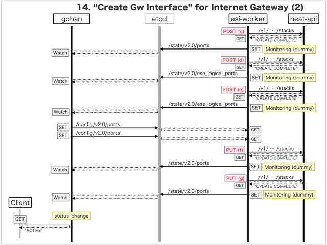

[Return to Previous Page](00_internet_gateway.md)

# 14. Clarification of interface in Sequence Diagram "Create Gw Interface"
You can see the relations of "Gw Interface" as following.


## 14.1. Sequence Diagram between gohan and etcd
This is a diagram that has been described as interfaces for "Gw Interface" between gohan and etcd.

* Initinalizing gohan ...
* Receiving HTTP Methods for Creating Resource ...




## 14.2. Stored data in etcd after initinalizing gohan
These are stored data for "heat_templates" in etcd.

* [Checking stored data for "gw_interface_internet"](../heat_template/gw_interface_internet.md)
* [Checking stored data for "port"](../heat_template/port.md)
* [Checking stored data for "ese_logical_port"](../heat_template/ese_logical_port.md)
* [Checking stored data for "gw_interface_monitoring"](../heat_template/gw_interface_monitoring.md)
* [Checking stored data for "port_monitoring"](../heat_template/port_monitoring.md)
* [Checking stored data for "ese_logical_port_monitoring"](../heat_template/ese_logical_port_monitoring.md)


## 14.3. HTTP Methods for RESTful between Gohan and Client
This is JSON data for "Create Gw Interface" in HTTP Methods from client.

* Checking JSON data at post method
```
POST /v2.0/gw_interfaces
```
```
{
    "gw_interface": {
        "description": "Sample Gw-interface",
        "gw_vipv4": "172.16.101.151",
        "name": "sample-gw-interface",
        "netmask": 24,
        "network_id": "52d7bef8-aa17-45c3-b63e-6a0e504603f0",
        "primary_ipv4": "172.16.101.152",
        "secondary_ipv4": "172.16.101.153",
        "service_type": "internet",
        "vrid": 20,
        "internet_gw_id": "429e24b5-a2f0-4fb8-b467-e335857e9476",
        "tenant_id": "0b576f6f4cbf414f829cd12f008bf08f"
    }
}
```


## 14.4. Stored data in etcd after receiving HTTP Methods for RESTful
These are stored data for "Create Gw Interface" in etcd.

* [Checking stored data for creating "gw_interface"](stored_in_etcd/CreateGwInterface_01.md)
* [Checking stored data for creating "port"](stored_in_etcd/CreateGwInterface_02.md)
* [Checking stored data for creating "ese_logical_port"](stored_in_etcd/CreateGwInterface_03.md)
* [Checking stored data for creating "port"](stored_in_etcd/CreateGwInterface_04.md)
* [Checking stored data for creating "ese_logical_port"](stored_in_etcd/CreateGwInterface_05.md)
* [Checking stored data for creating "port"](stored_in_etcd/CreateGwInterface_06.md)
* [Checking stored data for creating "port"](stored_in_etcd/CreateGwInterface_07.md)


## 14.5. Stored heat-stack via heat-api
These are stored heat-stacks for "Create Gw Interface" in heat-engine.

* [Checking heat-stack of "gw_interface" for creating at "(a)" in section "14.1."](heat-stack/CreateGwInterface_01.md)
* [Checking heat-stack of "port" for creating at "(b)" in section "14.1."](heat-stack/CreateGwInterface_02.md)
* [Checking heat-stack of "port" for creating at "(c)" in section "14.1."](heat-stack/CreateGwInterface_03.md)
* [Checking heat-stack of "ese_logical_port" for creating at "(d)" in section "14.1."](heat-stack/CreateGwInterface_04.md)
* [Checking heat-stack of "ese_logical_port" for creating at "(e)" in section "14.1."](heat-stack/CreateGwInterface_05.md)
* [Checking heat-stack of "port" for updating at "(f)" in section "14.1."](heat-stack/CreateGwInterface_06.md)
* [Checking heat-stack of "port" for updating at "(g)" in section "14.1."](heat-stack/CreateGwInterface_07.md)


## 14.6. Stored resource for monitoring in Kafka
This is JSON data for "Create Gw Interface" between monitoring-worker and kafka

* [Checking the topic "monitor_igs_interface" for monitoring "gw_interface"](stored_in_kafka/CreateGwInterface_01.md)
* [Checking the topic "monitor_logical_port" for monitoring "ese_logical_port"](stored_in_kafka/CreateGwInterface_02.md)
* [Checking the topic "monitor_virtual_machine_interface" for monitoring "port"](stored_in_kafka/CreateGwInterface_03.md)


## 14.7. Applying JUNOS Configurations via netconf
Checking configuration in Edge Router

* MX-1
```
[edit interfaces ae0 unit 1025 family inet]
+       address 172.16.101.153/24 {
+           vrrp-group 20 {
+               virtual-address 172.16.101.151;
+               priority 100;
+           }
+       }

[edit routing-instances vrf_gw_sample-ha-router-downlink_1025]
+    protocols {
+        bgp {
+            group inet-gw-group {
+                apply-groups InetGW1-RI-IBGP;
+                local-address 172.16.101.153;
+                neighbor 172.16.101.152;
+            }
+        }
+    }

[edit]
```

* MX-2
```
[edit interfaces ae0 unit 1025 family inet]
+       address 172.16.101.152/24 {
+           vrrp-group 20 {
+               virtual-address 172.16.101.151;
+               priority 105;
+           }
+       }

[edit routing-instances vrf_gw_sample-ha-router-downlink_1025]
+    protocols {
+        bgp {
+            group inet-gw-group {
+                apply-groups InetGW2-RI-IBGP;
+                local-address 172.16.101.152;
+                neighbor 172.16.101.153;
+            }
+        }
+    }

[edit]
```

## 14.8. Stored resource in gohan
As a result, checking resources regarding of "Gw Interface" in gohan.

* Checking the target of resources via gohan client
```
$ gohan client gw_interface show --output-format json b9618566-14ea-4505-8eae-8fdb4b6a0ec1
{
    "gw_interface": {
        "aws_gw_id": null,
        "description": "Sample Gw-interface",
        "gw_vipv4": "172.16.101.151",
        "gw_vipv6": null,
        "id": "b9618566-14ea-4505-8eae-8fdb4b6a0ec1",
        "interdc_gw_id": null,
        "internet_gw_id": "429e24b5-a2f0-4fb8-b467-e335857e9476",
        "name": "sample-gw-interface",
        "netmask": 24,
        "network_id": "52d7bef8-aa17-45c3-b63e-6a0e504603f0",
        "primary_ipv4": "172.16.101.152",
        "primary_ipv6": null,
        "public_ip_id": null,
        "secondary_ipv4": "172.16.101.153",
        "secondary_ipv6": null,
        "service_type": "internet",
        "status": "ACTIVE",
        "tenant_id": "0b576f6f4cbf414f829cd12f008bf08f",
        "vpn_gw_id": null,
        "vrid": 20
    }
}
```
* Checking resource_mapping via gohan client
```
$ gohan client resource_mapping list --output-format json
{
    "resource_mappings": [

        ... (snip)

        {
            "created": 1.494476757e+09,
            "deleted": null,
            "id": "132e577f-b4ee-4ed1-8736-9f6d95caf41a",
            "mapped_id": "10.79.5.185-ae0.1025",
            "relation": "internet_primary",
            "resource_id": "b9618566-14ea-4505-8eae-8fdb4b6a0ec1",
            "resource_type": "gw_interface",
            "tenant_id": "0b576f6f4cbf414f829cd12f008bf08f"
        },
        {
            "created": 1.494476757e+09,
            "deleted": null,
            "id": "28146326-7873-403b-a4e4-dcbb88120814",
            "mapped_id": "10.79.5.184-ae0.1025",
            "relation": "internet_secondary",
            "resource_id": "b9618566-14ea-4505-8eae-8fdb4b6a0ec1",
            "resource_type": "gw_interface",
            "tenant_id": "0b576f6f4cbf414f829cd12f008bf08f"
        },
        {
            "created": 1.494476763e+09,
            "deleted": null,
            "id": "5bfe4c2c-4028-4342-b7f3-5f23c7decf0f",
            "mapped_id": "10.161.0.34-xe-0/0/4.1025",
            "relation": "baremetal",
            "resource_id": "7abe783f-4837-417d-b76f-771ec4d38b97",
            "resource_type": "port",
            "tenant_id": "0b576f6f4cbf414f829cd12f008bf08f"
        },
        {
            "created": 1.494476763e+09,
            "deleted": null,
            "id": "bba0ee42-7e4a-45ed-a6d3-49a1a7e3c706",
            "mapped_id": "10.161.0.34-xe-0/0/3.1025",
            "relation": "baremetal",
            "resource_id": "b411d930-df4c-4766-ae66-d0aed9d27c76",
            "resource_type": "port",
            "tenant_id": "0b576f6f4cbf414f829cd12f008bf08f"
        }
    ]
}
```
* Checking another resources via gohan client
```
$ gohan client ese_logical_port show --output-format json 3ce86e39-7a81-46f8-b0c4-62a4776746f1
{
    "ese_logical_port": {
        "common_function_gateway_id": null,
        "connected_resource": "gw_interface",
        "description": "ESE Logical port for Port 7abe783f-4837-417d-b76f-771ec4d38b97",
        "ese_physical_port_id": "8a4bbfe0-5aae-42f5-8b94-c4c14b9e7306",
        "gw_interface_id": "b9618566-14ea-4505-8eae-8fdb4b6a0ec1",
        "id": "3ce86e39-7a81-46f8-b0c4-62a4776746f1",
        "name": "xe-0/0/4.1025",
        "network_id": "52d7bef8-aa17-45c3-b63e-6a0e504603f0",
        "port_ids": [
            "7abe783f-4837-417d-b76f-771ec4d38b97"
        ],
        "status": "ACTIVE",
        "tags": {},
        "tenant_id": "0b576f6f4cbf414f829cd12f008bf08f",
        "type": "L2",
        "vlan_id": 1025
    }
}
```
```
$ gohan client port show --output-format json 7abe783f-4837-417d-b76f-771ec4d38b97
{
    "port": {
        "admin_state_up": true,
        "allowed_address_pairs": [],
        "attached": true,
        "binding:vif_type": "vrouter",
        "description": "",
        "device_id": "b9618566-14ea-4505-8eae-8fdb4b6a0ec1",
        "device_owner": "network:gw_interface",
        "ese_logical_port_id": "3ce86e39-7a81-46f8-b0c4-62a4776746f1",
        "fake_delete": false,
        "fixed_ips": [
            {
                "ip_address": "172.16.101.153",
                "subnet_id": "a510f785-7758-4ce5-8fd4-c107d11b8e40"
            }
        ],
        "id": "7abe783f-4837-417d-b76f-771ec4d38b97",
        "mac_address": "fa:16:3e:f8:45:26",
        "managed_by_service": true,
        "name": "Port for : 8a4bbfe0-5aae-42f5-8b94-c4c14b9e7306",
        "network_id": "52d7bef8-aa17-45c3-b63e-6a0e504603f0",
        "segmentation_id": 1025,
        "segmentation_type": "vlan",
        "status": "ACTIVE",
        "tags": {},
        "tenant_id": "0b576f6f4cbf414f829cd12f008bf08f"
    }
}
```
```
$ gohan client ese_logical_port show --output-format json b1cf2461-ecb9-4923-966e-e61211f8b03c
{
    "ese_logical_port": {
        "common_function_gateway_id": null,
        "connected_resource": "gw_interface",
        "description": "ESE Logical port for Port b411d930-df4c-4766-ae66-d0aed9d27c76",
        "ese_physical_port_id": "97fcdf3a-81a4-41a5-8ae6-52c431fc5a5c",
        "gw_interface_id": "b9618566-14ea-4505-8eae-8fdb4b6a0ec1",
        "id": "b1cf2461-ecb9-4923-966e-e61211f8b03c",
        "name": "xe-0/0/3.1025",
        "network_id": "52d7bef8-aa17-45c3-b63e-6a0e504603f0",
        "port_ids": [
            "b411d930-df4c-4766-ae66-d0aed9d27c76"
        ],
        "status": "ACTIVE",
        "tags": {},
        "tenant_id": "0b576f6f4cbf414f829cd12f008bf08f",
        "type": "L2",
        "vlan_id": 1025
    }
}
```
```
$ gohan client port show --output-format json b411d930-df4c-4766-ae66-d0aed9d27c76
{
    "port": {
        "admin_state_up": true,
        "allowed_address_pairs": [],
        "attached": true,
        "binding:vif_type": "vrouter",
        "description": "",
        "device_id": "b9618566-14ea-4505-8eae-8fdb4b6a0ec1",
        "device_owner": "network:gw_interface",
        "ese_logical_port_id": "b1cf2461-ecb9-4923-966e-e61211f8b03c",
        "fake_delete": false,
        "fixed_ips": [
            {
                "ip_address": "172.16.101.151",
                "subnet_id": "a510f785-7758-4ce5-8fd4-c107d11b8e40"
            },
            {
                "ip_address": "172.16.101.152",
                "subnet_id": "a510f785-7758-4ce5-8fd4-c107d11b8e40"
            }
        ],
        "id": "b411d930-df4c-4766-ae66-d0aed9d27c76",
        "mac_address": "fa:16:3e:49:3c:12",
        "managed_by_service": true,
        "name": "Port for : 97fcdf3a-81a4-41a5-8ae6-52c431fc5a5c",
        "network_id": "52d7bef8-aa17-45c3-b63e-6a0e504603f0",
        "segmentation_id": 1025,
        "segmentation_type": "vlan",
        "status": "ACTIVE",
        "tags": {},
        "tenant_id": "0b576f6f4cbf414f829cd12f008bf08f"
    }
}
```

[Return to Previous Page](00_internet_gateway.md)
