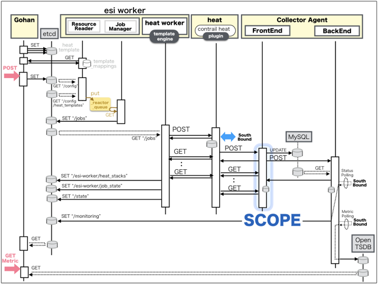

[Return to Previous Page](00_internet_gateway.md)

# 14. Clarification of interface in Sequence Diagram "Create Gw Interface"
You can see the relations of "Gw Interface" as following.


## 14.1. Gohan


### Outline
First of all, Gohan has received JSON data for "Create Gw Interface" in HTTP Methods from client.

* Checking JSON data at post method
```
POST /v2.0/gw_interfaces
```
```
{
    "gw_interface": {
        "description": "Sample Gw-interface",
        "gw_vipv4": "172.16.101.151",
        "name": "sample-gw-interface",
        "netmask": 24,
        "network_id": "6e557507-1c2a-49b1-ba90-5f616a1f1f3e",
        "primary_ipv4": "172.16.101.152",
        "secondary_ipv4": "172.16.101.153",
        "service_type": "internet",
        "vrid": 20,
        "internet_gw_id": "f6e8c695-c4c1-4a93-9b7e-1663aee6dec9",
        "tenant_id": "06d6b792b31c40daa546fb0f4e35980d"
    }
}
```
After processing, Gohan has stored data for "Create Gw Interface" in etcd.

* [Checking stored data for creating "gw_interface"](stored_in_etcd/01_Gohan/CreateGwInterface_01.md)
* [Checking stored data for creating "port (172.16.101.151,152 / device_owner:"network:gw_interface" / attached:false)"](stored_in_etcd/01_Gohan/CreateGwInterface_02.md)
* [Checking stored data for creating "ese_logical_port (xe-0/0/3.1025)"](stored_in_etcd/01_Gohan/CreateGwInterface_03.md)
* [Checking stored data for creating "port (172.16.101.153 / device_owner:"network:gw_interface" / attached:false)"](stored_in_etcd/01_Gohan/CreateGwInterface_04.md)
* [Checking stored data for creating "ese_logical_port (xe-0/0/4.1025)"](stored_in_etcd/01_Gohan/CreateGwInterface_05.md)
* [Checking stored data for creating "port (172.16.101.153 / device_owner:"network:gw_interface" / attached:true)"](stored_in_etcd/01_Gohan/CreateGwInterface_06.md)
* [Checking stored data for creating "port (172.16.101.151,152 / device_owner:"network:gw_interface" / attached:true)"](stored_in_etcd/01_Gohan/CreateGwInterface_07.md)


## 14.2. ResourceReader
When ResourceReader has started, it gets all of schemas from Gohan.
After that, these schemas are converted as a template_mappings.
And then, ResourceReader keeps storing template_mappings for following processing.

### Reference
* [Checking schemas in ResourceReader](../memo/schemas.txt)
* [Checking template_mappings in ResourceReader](../memo/template_mappings.md)


### Outline
After fetching resource_data for "Create Gw Interface" in etcd, ResourceReader has fetched heat_templates in etcd.

* [Checking stored data for "gw_interface_internet"](../heat_template/gw_interface_internet.md)
* [Checking stored data for "port"](../heat_template/port.md)
* [Checking stored data for "ese_logical_port"](../heat_template/ese_logical_port.md)


## 14.3. JobManager


### Outline
After converting resource_data to job_data, JobManager has stored it in etcd.

* [Checking stored data for creating "gw_interface"](stored_in_etcd/02_JobManager/CreateGwInterface_01.md)
* [Checking stored data for creating "port (172.16.101.151,152 / device_owner:"network:gw_interface" / attached:false)"](stored_in_etcd/02_JobManager/CreateGwInterface_02.md)
* [Checking stored data for creating "ese_logical_port (xe-0/0/3.1025)"](stored_in_etcd/02_JobManager/CreateGwInterface_03.md)
* [Checking stored data for creating "port (172.16.101.153 / device_owner:"network:gw_interface" / attached:false)"](stored_in_etcd/02_JobManager/CreateGwInterface_04.md)
* [Checking stored data for creating "ese_logical_port (xe-0/0/4.1025)"](stored_in_etcd/02_JobManager/CreateGwInterface_05.md)
* [Checking stored data for creating "port (172.16.101.153 / device_owner:"network:gw_interface" / attached:true)"](stored_in_etcd/02_JobManager/CreateGwInterface_06.md)
* [Checking stored data for creating "port (172.16.101.151,152 / device_owner:"network:gw_interface" / attached:true)"](stored_in_etcd/02_JobManager/CreateGwInterface_07.md)


## 14.4. HeatWorker


### Outline
After fetching job_data, HeatWorker has handled job_data.
And then, HeatWorker has stored the result of handling job_data.

* [Checking stored data for creating "gw_interface"](stored_in_etcd/03_HeatWorker/CreateGwInterface_01.md)
* [Checking stored data for creating "port (172.16.101.151,152 / device_owner:"network:gw_interface" / attached:false)"](stored_in_etcd/03_HeatWorker/CreateGwInterface_02.md)
* [Checking stored data for creating "ese_logical_port (xe-0/0/3.1025)"](stored_in_etcd/03_HeatWorker/CreateGwInterface_03.md)
* [Checking stored data for creating "port (172.16.101.153 / device_owner:"network:gw_interface" / attached:false)"](stored_in_etcd/03_HeatWorker/CreateGwInterface_04.md)
* [Checking stored data for creating "ese_logical_port (xe-0/0/4.1025)"](stored_in_etcd/03_HeatWorker/CreateGwInterface_05.md)
* [Checking stored data for creating "port (172.16.101.153 / device_owner:"network:gw_interface" / attached:true)"](stored_in_etcd/03_HeatWorker/CreateGwInterface_06.md)
* [Checking stored data for creating "port (172.16.101.151,152 / device_owner:"network:gw_interface" / attached:true)"](stored_in_etcd/03_HeatWorker/CreateGwInterface_07.md)


## 14.5. Heat


### Outline
Heat has conducted some tasks for "Create Gw Interface".
As a result, Heat has stored heat-stacks for "Create Gw Interface".

* [Checking heat-stack of "gw_interface"](heat-stack/CreateGwInterface_01.md)
* [Checking heat-stack of "ese_logical_port"](heat-stack/CreateGwInterface_02.md)
* [Checking heat-stack of "ese_logical_port"](heat-stack/CreateGwInterface_03.md)
* [Checking heat-stack of "port"](heat-stack/CreateGwInterface_04.md)
* [Checking heat-stack of "port"](heat-stack/CreateGwInterface_05.md)


## 14.6. CollectorAgent



### Outline
CollectorAgent has conducted some tasks for "Create Gw Interface" based heat-stacks via Heat.
As a result, CollectorAgent has responded the result of status information as handling tasks.

* [Checking monitoring of "gw_interface"](collector_agents/CreateGwInterface_01.md)
* [Checking monitoring of "port"](collector_agents/CreateGwInterface_02.md)
* [Checking monitoring of "port"](collector_agents/CreateGwInterface_03.md)
* [Checking monitoring of "ese_logical_port"](collector_agents/CreateGwInterface_04.md)
* [Checking monitoring of "ese_logical_port"](collector_agents/CreateGwInterface_05.md)
* [Checking monitoring of "port"](collector_agents/CreateGwInterface_06.md)
* [Checking monitoring of "port"](collector_agents/CreateGwInterface_07.md)

And then, CollectorAgent has stored the result of status information.

* [Checking stored data for creating "gw_interface"](stored_in_etcd/04_CollectorAgent/CreateGwInterface_01.md)
* [Checking stored data for creating "ese_logical_port (xe-0/0/3.1025)"](stored_in_etcd/04_CollectorAgent/CreateGwInterface_03.md)
* [Checking stored data for creating "ese_logical_port (xe-0/0/4.1025)"](stored_in_etcd/04_CollectorAgent/CreateGwInterface_05.md)
* [Checking stored data for creating "port (172.16.101.153 / device_owner:"network:gw_interface" / attached:true)"](stored_in_etcd/04_CollectorAgent/CreateGwInterface_06.md)
* [Checking stored data for creating "port (172.16.101.151,152 / device_owner:"network:gw_interface" / attached:true)"](stored_in_etcd/04_CollectorAgent/CreateGwInterface_07.md)


## 14.7. Applying JUNOS Configurations via netconf
Checking configuration in Edge Router

* MX-1
```
[edit]
root@vMX-1# show | compare rollback 2
[edit interfaces ae0 unit 1025 family inet]
+       address 172.16.101.153/24 {
+           vrrp-group 20 {
+               virtual-address 172.16.101.151;
+               priority 100;
+           }
+       }
```
```
[edit routing-instances vrf_gw_sample-ha-router-downlink_1025]
+    protocols {
+        bgp {
+            group inet-gw-group {
+                apply-groups InetGW1-RI-IBGP;
+                local-address 172.16.101.153;
+                neighbor 172.16.101.152;
+            }
+        }
+    }

[edit]
```

* MX-2
```
[edit]
root@vMX-2# show | compare rollback 2
[edit interfaces ae0 unit 1025 family inet]
+       address 172.16.101.152/24 {
+           vrrp-group 20 {
+               virtual-address 172.16.101.151;
+               priority 105;
+           }
+       }
```
```
[edit routing-instances vrf_gw_sample-ha-router-downlink_1025]
+    protocols {
+        bgp {
+            group inet-gw-group {
+                apply-groups InetGW2-RI-IBGP;
+                local-address 172.16.101.152;
+                neighbor 172.16.101.153;
+            }
+        }
+    }

[edit]
```

## 14.8. Stored resource in gohan
As a result, checking resources regarding of "Gw Interface" in gohan.

* Checking the target of resources via gohan client
```
$ gohan client gw_interface show --output-format json ce8831fd-d30c-41e3-95de-feaee0b95405
{   
    "gw_interface": {
        "aws_gw_id": null,
        "azure_gw_id": null,
        "description": "Sample Gw-interface",
        "gcp_gw_id": null,
        "gw_vipv4": "172.16.101.151",
        "gw_vipv6": null,
        "id": "ce8831fd-d30c-41e3-95de-feaee0b95405",
        "interdc_gw_id": null,
        "internet_gw_id": "f6e8c695-c4c1-4a93-9b7e-1663aee6dec9",
        "name": "sample-gw-interface",
        "netmask": 24,
        "network_id": "6e557507-1c2a-49b1-ba90-5f616a1f1f3e",
        "operational_state": "UP",
        "orchestration_state": "CREATE_COMPLETE",
        "primary_ipv4": "172.16.101.152",
        "primary_ipv6": null,
        "public_ip_id": null,
        "secondary_ipv4": "172.16.101.153",
        "secondary_ipv6": null,
        "service_type": "internet",
        "status": "ACTIVE",
        "tenant_id": "06d6b792b31c40daa546fb0f4e35980d",
        "vpn_gw_id": null,
        "vrid": 20
    }
}
```
* Checking another resources via gohan client
```
$ gohan client ese_logical_port show --output-format json 02112bb1-389c-4ff8-9354-94ab43459892
{   
    "ese_logical_port": {
        "common_function_gateway_id": null,
        "connected_resource": "gw_interface",
        "description": "ESE Logical port for Port f3867a99-de18-4512-8e94-f9aaa7b05c3a",
        "ese_physical_port_id": "887fecdd-956b-47fa-a348-8940c53a5bf9",
        "gw_interface_id": "ce8831fd-d30c-41e3-95de-feaee0b95405",
        "id": "02112bb1-389c-4ff8-9354-94ab43459892",
        "name": "xe-0/0/3.1025",
        "network_id": "6e557507-1c2a-49b1-ba90-5f616a1f1f3e",
        "operational_state": "UP",
        "orchestration_state": "CREATE_COMPLETE",
        "port_ids": [
            "f3867a99-de18-4512-8e94-f9aaa7b05c3a"
        ],
        "status": "ACTIVE",
        "tags": {},
        "tenant_id": "06d6b792b31c40daa546fb0f4e35980d",
        "type": "L2",
        "vlan_id": 1025
    }
}
```
```
$ gohan client port show --output-format json f3867a99-de18-4512-8e94-f9aaa7b05c3a
{
    "port": {
        "admin_state_up": true,
        "allowed_address_pairs": [],
        "attached": true,
        "binding:vif_type": "vrouter",
        "description": "",
        "device_id": "ce8831fd-d30c-41e3-95de-feaee0b95405",
        "device_owner": "network:gw_interface",
        "ese_logical_port_id": "02112bb1-389c-4ff8-9354-94ab43459892",
        "fake_delete": false,
        "fixed_ips": [
            {
                "ip_address": "172.16.101.151",
                "subnet_id": "67877f2d-0547-4cea-a6ce-2e3b937aa31b"
            },
            {
                "ip_address": "172.16.101.152",
                "subnet_id": "67877f2d-0547-4cea-a6ce-2e3b937aa31b"
            }
        ],
        "id": "f3867a99-de18-4512-8e94-f9aaa7b05c3a",
        "mac_address": "fa:16:3e:c5:2b:92",
        "managed_by_service": true,
        "name": "Port for : 887fecdd-956b-47fa-a348-8940c53a5bf9",
        "network_id": "6e557507-1c2a-49b1-ba90-5f616a1f1f3e",
        "operational_state": "UP",
        "orchestration_state": "UPDATE_COMPLETE",
        "security_groups": [],
        "segmentation_id": 1025,
        "segmentation_type": "vlan",
        "status": "ACTIVE",
        "tags": {},
        "tenant_id": "06d6b792b31c40daa546fb0f4e35980d"
    }
}
```
```
$ gohan client ese_logical_port show --output-format json aabc9b64-ec2c-4894-a6a8-ee0ea429c066
{   
    "ese_logical_port": {
        "common_function_gateway_id": null,
        "connected_resource": "gw_interface",
        "description": "ESE Logical port for Port ce965922-538a-4335-9644-7a98dce9fb47",
        "ese_physical_port_id": "6b29894f-8694-4865-92c1-2e78360e65a6",
        "gw_interface_id": "ce8831fd-d30c-41e3-95de-feaee0b95405",
        "id": "aabc9b64-ec2c-4894-a6a8-ee0ea429c066",
        "name": "xe-0/0/4.1025",
        "network_id": "6e557507-1c2a-49b1-ba90-5f616a1f1f3e",
        "operational_state": "UP",
        "orchestration_state": "CREATE_COMPLETE",
        "port_ids": [
            "ce965922-538a-4335-9644-7a98dce9fb47"
        ],
        "status": "ACTIVE",
        "tags": {},
        "tenant_id": "06d6b792b31c40daa546fb0f4e35980d",
        "type": "L2",
        "vlan_id": 1025
    }
}
```
```
$ gohan client port show --output-format json ce965922-538a-4335-9644-7a98dce9fb47
{
    "port": {
        "admin_state_up": true,
        "allowed_address_pairs": [],
        "attached": true,
        "binding:vif_type": "vrouter",
        "description": "",
        "device_id": "ce8831fd-d30c-41e3-95de-feaee0b95405",
        "device_owner": "network:gw_interface",
        "ese_logical_port_id": "aabc9b64-ec2c-4894-a6a8-ee0ea429c066",
        "fake_delete": false,
        "fixed_ips": [
            {
                "ip_address": "172.16.101.153",
                "subnet_id": "67877f2d-0547-4cea-a6ce-2e3b937aa31b"
            }
        ],
        "id": "ce965922-538a-4335-9644-7a98dce9fb47",
        "mac_address": "fa:16:3e:41:7c:23",
        "managed_by_service": true,
        "name": "Port for : 6b29894f-8694-4865-92c1-2e78360e65a6",
        "network_id": "6e557507-1c2a-49b1-ba90-5f616a1f1f3e",
        "operational_state": "FAIL",
        "orchestration_state": "UPDATE_COMPLETE",
        "security_groups": [],
        "segmentation_id": 1025,
        "segmentation_type": "vlan",
        "status": "MONITORING_UNAVAILABLE",
        "tags": {},
        "tenant_id": "06d6b792b31c40daa546fb0f4e35980d"
    }
}
```
* Checking another resources via neutron client
```
$ neutron port-list
+--------------------------------------+-------------------------------------------------+-------------------+---------------------------------------------------------------------------------------+
| id                                   | name                                            | mac_address       | fixed_ips                                                                             |
+--------------------------------------+-------------------------------------------------+-------------------+---------------------------------------------------------------------------------------+
  ...
| ce965922-538a-4335-9644-7a98dce9fb47 | Port for : 6b29894f-8694-4865-92c1-2e78360e65a6 | fa:16:3e:41:7c:23 | {"subnet_id": "67877f2d-0547-4cea-a6ce-2e3b937aa31b", "ip_address": "172.16.101.153"} |
| f3867a99-de18-4512-8e94-f9aaa7b05c3a | Port for : 887fecdd-956b-47fa-a348-8940c53a5bf9 | fa:16:3e:c5:2b:92 | {"subnet_id": "67877f2d-0547-4cea-a6ce-2e3b937aa31b", "ip_address": "172.16.101.151"} |
|                                      |                                                 |                   | {"subnet_id": "67877f2d-0547-4cea-a6ce-2e3b937aa31b", "ip_address": "172.16.101.152"} |
+--------------------------------------+-------------------------------------------------+-------------------+---------------------------------------------------------------------------------------+
```
```
$ neutron port-show ce965922-538a-4335-9644-7a98dce9fb47
+-----------------------+---------------------------------------------------------------------------------------+
| Field                 | Value                                                                                 |
+-----------------------+---------------------------------------------------------------------------------------+
| admin_state_up        | True                                                                                  |
| allowed_address_pairs |                                                                                       |
| attached              | True                                                                                  |
| binding:vif_type      | vrouter                                                                               |
| description           |                                                                                       |
| device_id             | ce8831fd-d30c-41e3-95de-feaee0b95405                                                  |
| device_owner          | network:gw_interface                                                                  |
| ese_logical_port_id   | aabc9b64-ec2c-4894-a6a8-ee0ea429c066                                                  |
| fake_delete           | False                                                                                 |
| fixed_ips             | {"subnet_id": "67877f2d-0547-4cea-a6ce-2e3b937aa31b", "ip_address": "172.16.101.153"} |
| id                    | ce965922-538a-4335-9644-7a98dce9fb47                                                  |
| mac_address           | fa:16:3e:41:7c:23                                                                     |
| managed_by_service    | True                                                                                  |
| name                  | Port for : 6b29894f-8694-4865-92c1-2e78360e65a6                                       |
| network_id            | 6e557507-1c2a-49b1-ba90-5f616a1f1f3e                                                  |
| operational_state     | FAIL                                                                                  |
| orchestration_state   | UPDATE_COMPLETE                                                                       |
| security_groups       |                                                                                       |
| segmentation_id       | 1025                                                                                  |
| segmentation_type     | vlan                                                                                  |
| status                | MONITORING_UNAVAILABLE                                                                |
| tags                  | {}                                                                                    |
| tenant_id             | 06d6b792b31c40daa546fb0f4e35980d                                                      |
+-----------------------+---------------------------------------------------------------------------------------+
```
```
$ neutron port-show f3867a99-de18-4512-8e94-f9aaa7b05c3a
+-----------------------+---------------------------------------------------------------------------------------+
| Field                 | Value                                                                                 |
+-----------------------+---------------------------------------------------------------------------------------+
| admin_state_up        | True                                                                                  |
| allowed_address_pairs |                                                                                       |
| attached              | True                                                                                  |
| binding:vif_type      | vrouter                                                                               |
| description           |                                                                                       |
| device_id             | ce8831fd-d30c-41e3-95de-feaee0b95405                                                  |
| device_owner          | network:gw_interface                                                                  |
| ese_logical_port_id   | 02112bb1-389c-4ff8-9354-94ab43459892                                                  |
| fake_delete           | False                                                                                 |
| fixed_ips             | {"subnet_id": "67877f2d-0547-4cea-a6ce-2e3b937aa31b", "ip_address": "172.16.101.151"} |
|                       | {"subnet_id": "67877f2d-0547-4cea-a6ce-2e3b937aa31b", "ip_address": "172.16.101.152"} |
| id                    | f3867a99-de18-4512-8e94-f9aaa7b05c3a                                                  |
| mac_address           | fa:16:3e:c5:2b:92                                                                     |
| managed_by_service    | True                                                                                  |
| name                  | Port for : 887fecdd-956b-47fa-a348-8940c53a5bf9                                       |
| network_id            | 6e557507-1c2a-49b1-ba90-5f616a1f1f3e                                                  |
| operational_state     | UP                                                                                    |
| orchestration_state   | UPDATE_COMPLETE                                                                       |
| security_groups       |                                                                                       |
| segmentation_id       | 1025                                                                                  |
| segmentation_type     | vlan                                                                                  |
| status                | ACTIVE                                                                                |
| tags                  | {}                                                                                    |
| tenant_id             | 06d6b792b31c40daa546fb0f4e35980d                                                      |
+-----------------------+---------------------------------------------------------------------------------------+
```


[Return to Previous Page](00_internet_gateway.md)
