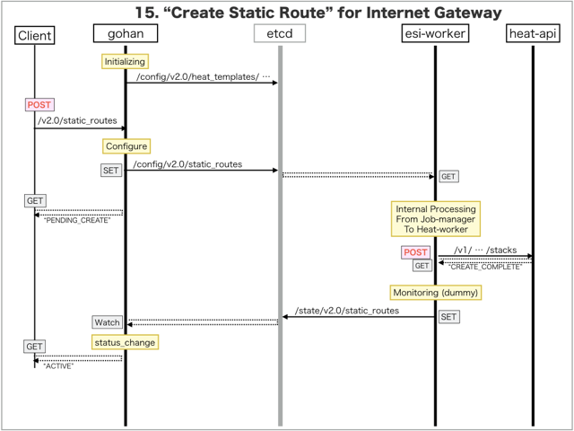

[Return to Previous Page](00_internet_gateway.md)

# 15. Clarification of interface in Sequence Diagram "Create Static Route"
You can see the relations of "Static Route" as following.


## 15.1. Sequence Diagram between gohan and etcd
This is a diagram that has been described as interfaces for "Static Route" between gohan and etcd.

* Initinalizing gohan ...
* Receiving HTTP Methods for Creating Resource ...



## 15.2. Stored data in etcd after initinalizing gohan
These are stored data for "heat_templates" in etcd.

* [Checking stored data for "static_route_internet"](../heat_template/static_route_internet.md)


## 15.3. HTTP Methods for RESTful between Gohan and Client
This is JSON data for "Create Static Route" in HTTP Methods from client.

* Checking JSON data at post method
```
POST /v2.0/static_routes
```
```
{
    "static_route": {
        "description": "Sample Static-route",
        "destination": "203.0.112.0/28",
        "name": "sample-static-route",
        "nexthop": "172.16.101.1",
        "service_type": "internet",
        "internet_gw_id": "8b9ba87a-5b28-4c67-ba04-4f1d436960f8",
        "tenant_id": "0b576f6f4cbf414f829cd12f008bf08f"
    }
}
```


## 15.4. Stored data in etcd after receiving HTTP Methods for RESTful
These are stored data for "Create Static Route" in etcd.

* [Checking stored data for creating "static_route"](stored_in_etcd/CreateStaticRoute_01.md)


## 15.5. Stored heat-stack via heat-api
These are stored heat-stacks for "Create Static Route" in heat-engine.

* [Checking heat-stack of "static_route"](heat-stack/CreateStaticRoute_01.md)


## 15.6. Applying JUNOS Configurations via netconf
Checking configuration in Edge Router

* MX-1
```
[edit routing-instances vrf_gw_sample-ha-router-downlink_1025 routing-options]
+     static {
+         route 203.0.112.0/28 next-hop 172.16.101.1;
+     }

[edit]
```

* MX-2
```
[edit routing-instances vrf_gw_sample-ha-router-downlink_1025 routing-options]
+     static {
+         route 203.0.112.0/28 next-hop 172.16.101.1;
+     }

[edit]
```


## 15.7. Stored resource in gohan
As a result, checking resources regarding of "Static Route" in gohan.

* Checking the target of resources via gohan client
```
$ gohan client static_route show --output-format json 3ecf06a5-014e-48b0-841c-6ad812e69132
{
    "static_route": {
        "aws_gw_id": null,
        "description": "Sample Static-route",
        "destination": "203.0.112.0/28",
        "id": "3ecf06a5-014e-48b0-841c-6ad812e69132",
        "interdc_gw_id": null,
        "internet_gw_id": "8b9ba87a-5b28-4c67-ba04-4f1d436960f8",
        "name": "sample-static-route",
        "nexthop": "172.16.101.1",
        "public_ip_id": "07ff3a4e-f968-481e-8ee2-378a73b8f2a2",
        "service_type": "internet",
        "status": "ACTIVE",
        "tenant_id": "0b576f6f4cbf414f829cd12f008bf08f",
        "vpn_gw_id": null
    }
}
```

[Return to Previous Page](00_internet_gateway.md)
