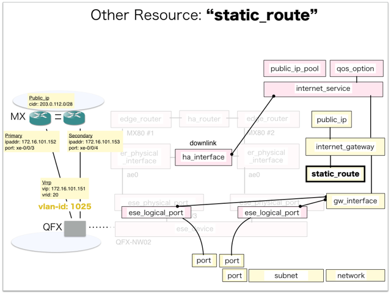

[Return to Previous Page](00_internet_gateway.md)

# 15. Clarification of interface in Sequence Diagram "Create Static Route"
You can see the relations of "Static Route" as following.




## 15.1. Gohan


### Outline
First of all, Gohan has received JSON data for "Create Static Route" in HTTP Methods from client.

* Checking JSON data at post method
```
POST /v2.0/static_routes
```
```
{
    "static_route": {
        "description": "Sample Static-route",
        "destination": "203.0.112.0/28",
        "name": "sample-static-route",
        "nexthop": "172.16.101.1",
        "service_type": "internet",
        "internet_gw_id": "f6e8c695-c4c1-4a93-9b7e-1663aee6dec9",
        "tenant_id": "06d6b792b31c40daa546fb0f4e35980d"
    }
}
```
After processing, Gohan has stored data for "Create Static Route" in etcd.

* [Checking stored data for creating "static_route"](stored_in_etcd/01_Gohan/CreateStaticRoute_01.md)


## 15.2. ResourceReader
When ResourceReader has started, it gets all of schemas from Gohan.
After that, these schemas are converted as a template_mappings.
And then, ResourceReader keeps storing template_mappings for following processing.

### Reference
* [Checking schemas in ResourceReader](../memo/schemas.txt)
* [Checking template_mappings in ResourceReader](../memo/template_mappings.md)


### Outline
After fetching resource_data for "Create Static Route" in etcd, ResourceReader has fetched heat_templates in etcd.

* [Checking stored data for "static_route_internet"](../heat_template/static_route_internet.md)


## 15.3. JobManager


### Outline
After converting resource_data to job_data, JobManager has stored it in etcd.

* [Checking stored data for creating "static_route"](stored_in_etcd/02_JobManager/CreateStaticRoute_01.md)


## 15.4. HeatWorker


### Outline
After fetching job_data, HeatWorker has handled job_data.
And then, HeatWorker has stored the result of handling job_data.

* [Checking stored data for creating "static_route"](stored_in_etcd/03_HeatWorker/CreateStaticRoute_01.md)


## 15.5. Heat


### Outline
Heat has conducted some tasks for "Create Static Route".
As a result, Heat has stored heat-stacks for "Create Static Route".

* [Checking heat-stack of "static_route"](heat-stack/CreateStaticRoute_01.md)


## 15.6. Applying JUNOS Configurations via netconf
Checking configuration in Edge Router

* MX-1
```
[edit routing-instances vrf_gw_sample-ha-router-downlink_1025 routing-options]
+     static {
+         route 203.0.112.0/28 next-hop 172.16.101.1;
+     }

[edit]
```

* MX-2
```
[edit routing-instances vrf_gw_sample-ha-router-downlink_1025 routing-options]
+     static {
+         route 203.0.112.0/28 next-hop 172.16.101.1;
+     }

[edit]
```


## 15.6. Stored resource in gohan
As a result, checking resources regarding of "Static Route" in gohan.

* Checking the target of resources via gohan client
```
$ gohan client static_route show --output-format json d0aa20b1-9302-4b43-a3c1-9edce0811af8
{
    "static_route": {
        "aws_gw_id": null,
        "azure_gw_id": null,
        "description": "Sample Static-route",
        "destination": "203.0.112.0/28",
        "gcp_gw_id": null,
        "id": "d0aa20b1-9302-4b43-a3c1-9edce0811af8",
        "interdc_gw_id": null,
        "internet_gw_id": "f6e8c695-c4c1-4a93-9b7e-1663aee6dec9",
        "name": "sample-static-route",
        "nexthop": "172.16.101.1",
        "orchestration_state": "CREATE_COMPLETE",
        "public_ip_id": "d5622781-f06a-4fad-b800-b577a05ad8b2",
        "service_type": "internet",
        "status": "ACTIVE",
        "tenant_id": "06d6b792b31c40daa546fb0f4e35980d",
        "vpn_gw_id": null
    }
}
```

[Return to Previous Page](00_internet_gateway.md)
