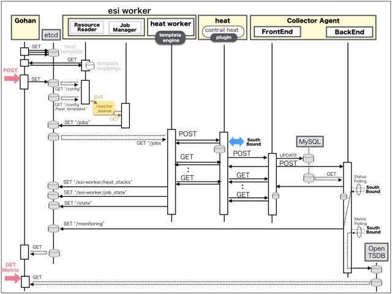
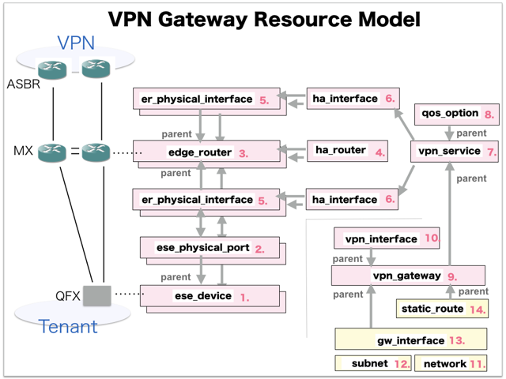

[Return to Top Page](../README.md)

# ESI interface for VPN Gateway
This section is for the purpose of documenting ESI interface.

* Initinalizing gohan ...
* Receiving HTTP Methods for Creating Resource ...

# Resource model for VPN Gateway
First of all, you can see the overview of resources model of "VPN Gateway".

* [01: Ese Device](01_ese_device.md)
* [02: Ese Physical Port](02_ese_physical_port.md)
* [03: Edge Router](03_edge_router.md)
* [04: Ha Router](04_ha_router.md)
* [05: Er Physical Interface](05_er_physical_interface.md)
* [06: Ha Interface](06_ha_interface.md)
* [07: Vpn Service](07_vpn_service.md)
* [08: Qos Option](08_qos_option.md)
* [09: Vpn Gateway](09_vpn_gateway.md)
* [10: Vpn Interface](10_vpn_interface.md)
* [11: Network](11_network.md)
* [12: Subnet](12_subnet.md)
* [13: Gw Interface](13_gw_interface.md)
* [14: Static Route](14_static_route.md)

