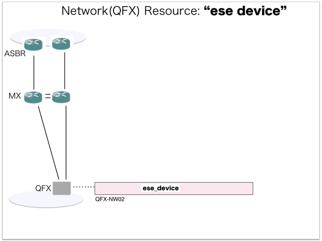

[Return to Previous Page](00_vpn_gateway.md)

# 1. Clarification of interface in Sequence Diagram "Create Ese Device"
You can see the relations of "Ese Device" as following.




## 1.1. Gohan


### Outline
First of all, Gohan has received JSON data for "Create Ese Device" in HTTP Methods from client.

* Checking JSON data at post method
```
POST /v2.0/ese_devices
```
```
{
    "ese_device": {
        "username": "esi",
        "password": "***",
        "public_ip_address": "10.161.0.34",
        "hostname": "QFX-NW02",
        "name": "QFX-NW02",
        "management_ip_address": "10.161.0.34",
        "type": "tor",
        "existing": "existing",
        "tenant_id": "b3e3095c0a5b4383805efe9cf2a6b5ef"
    }
}
```
After processing, Gohan has stored data for "Create Ese Device" in etcd.

* [Checking stored data for creating "ese_device"](stored_in_etcd/01_Gohan/CreateEseDevice_01.md)


## 1.2. ResourceReader
When ResourceReader has started, it gets all of schemas from Gohan.
After that, these schemas are converted as a template_mappings.
And then, ResourceReader keeps storing template_mappings for following processing.

### Reference
* [Checking schemas in ResourceReader](../memo/schemas.txt)
* [Checking template_mappings in ResourceReader](../memo/template_mappings.md)


### Outline
After fetching resource_data for "Create Ese Device" in etcd, ResourceReader has fetched heat_templates in etcd.

* [Checking stored data for "ese_device_existing"](../heat_template/ese_device_existing.md)


## 1.3. JobManager


### Outline
After converting resource_data to job_data, JobManager has stored it in etcd.

* [Checking stored data for creating "ese_device"](stored_in_etcd/02_JobManager/CreateEseDevice_01.md)


## 1.4. HeatWorker


### Outline
After fetching job_data, HeatWorker has handled job_data.
And then, HeatWorker has stored the result of handling job_data.

* [Checking stored data for creating "ese_device"](stored_in_etcd/03_HeatWorker/CreateEseDevice_01.md)


## 1.5. Heat


### Outline
Heat has conducted some tasks for "Create Ese Device".
As a result, Heat has stored heat-stacks for "Create Ese Device".

* [Checking heat-stack of "ese_device"](heat-stack/CreateEseDevice_01.md)


## 1.6. CollectorAgent


### Outline
CollectorAgent has conducted some tasks for "Create Ese Device" based heat-stacks via Heat.
As a result, CollectorAgent has responded the result of status information as handling tasks.

* [Checking monitoring of "ese_devices"](collector_agents/CreateEseDevice_01.md)

And then, CollectorAgent has stored the result of status information.

* [Checking stored data for creating "ese_device"](stored_in_etcd/04_CollectorAgent/CreateEseDevice_01.md)


## 1.7. Stored resource in gohan
As a result, checking resources regarding of "Ese Device" in gohan.

* Checking the target of resources via gohan client
```
$ gohan client ese_device show --output-format json 4d8371c0-1b91-4818-a6e7-26425178e5d4
{
    "ese_device": {
        "description": "",
        "existing": "existing",
        "flavor": null,
        "hostname": "QFX-NW02",
        "id": "4d8371c0-1b91-4818-a6e7-26425178e5d4",
        "location": null,
        "management_ip_address": "10.161.0.34",
        "name": "QFX-NW02",
        "operational_state": "UP",
        "orchestration_state": "CREATE_COMPLETE",
        "password": "password",
        "public_ip_address": "10.161.0.34",
        "status": "ACTIVE",
        "tags": {},
        "tenant_id": "b3e3095c0a5b4383805efe9cf2a6b5ef",
        "tor_agent_names": null,
        "tsn_names": null,
        "type": "tor",
        "username": "esi"
    }
}
```


[Return to Previous Page](00_vpn_gateway.md)
