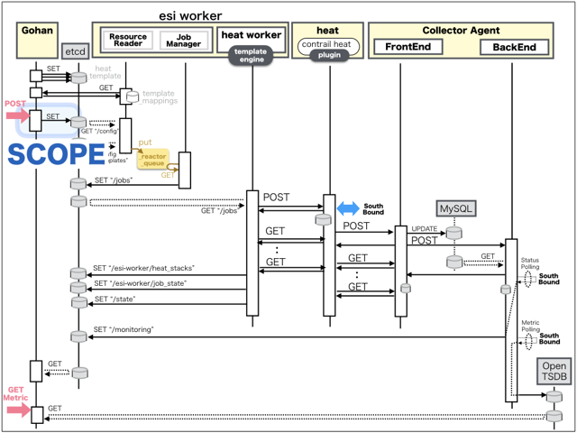
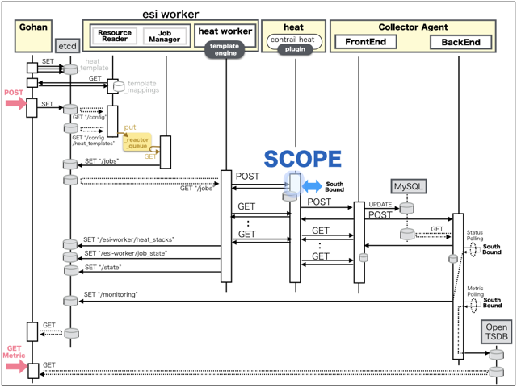

[Return to Previous Page](00_vpn_gateway.md)

# 3. Clarification of interface in Sequence Diagram "Create Edge Router"
You can see the relations of "Edge Router" as following.


## 3.1. Gohan



### Outline
First of all, Gohan has received JSON data for "Create Edge Router" in HTTP Methods from client.

* Checking JSON data at post method
```
POST /v2.0/edge_routers
```
```
{
    "edge_router": {
        "autonomous_system": "65101",
        "description": "MX80 #2",
        "ip": "10.79.5.185",
        "name": "vMX-router-02",
        "login": "esi",
        "password": "***",
        "ssh_port": 830,
        "tenant_id": "b3e3095c0a5b4383805efe9cf2a6b5ef"
    }
}
```
* Checking JSON data at post method
```
POST /v2.0/edge_routers
```
```
{
    "edge_router": {
        "autonomous_system": "65101",
        "description": "MX80 #1",
        "ip": "10.79.5.184",
        "name": "vMX-router-01",
        "login": "esi",
        "password": "***",
        "ssh_port": 830,
        "tenant_id": "b3e3095c0a5b4383805efe9cf2a6b5ef"
    }
}
```
After processing, Gohan has stored data for "Create Edge Router" in etcd.

* [Checking stored data for creating "MX80 #2"](stored_in_etcd/01_Gohan/CreateEdgeRouter_01.md)
* [Checking stored data for creating "MX80 #1"](stored_in_etcd/01_Gohan/CreateEdgeRouter_02.md)


## 3.2. ResourceReader
When ResourceReader has started, it gets all of schemas from Gohan.
After that, these schemas are converted as a template_mappings.
And then, ResourceReader keeps storing template_mappings for following processing.

### Reference
* [Checking schemas in ResourceReader](../memo/schemas.txt)
* [Checking template_mappings in ResourceReader](../memo/template_mappings.md)


### Outline
After fetching resource_data for "Create Edge Router" in etcd, ResourceReader has fetched heat_templates in etcd.

* [Checking stored data for "edge_router"](../heat_template/edge_router.md)


## 3.3. JobManager


### Outline
After converting resource_data to job_data, JobManager has stored it in etcd.

* [Checking stored data for creating "MX80 #2"](stored_in_etcd/02_JobManager/CreateEdgeRouter_01.md)
* [Checking stored data for creating "MX80 #1"](stored_in_etcd/02_JobManager/CreateEdgeRouter_02.md)


## 3.4. HeatWorker


### Outline
After fetching job_data, HeatWorker has handled job_data.
And then, HeatWorker has stored the result of handling job_data.

* [Checking stored data for creating "MX80 #2"](stored_in_etcd/03_HeatWorker/CreateEdgeRouter_01.md)
* [Checking stored data for creating "MX80 #1"](stored_in_etcd/03_HeatWorker/CreateEdgeRouter_02.md)


## 3.5. Heat



### Outline
Heat has conducted some tasks for "Create Edge Router".
As a result, Heat has stored heat-stacks for "Create Edge Router".

* [Checking heat-stack of "MX80 #2"](heat-stack/CreateEdgeRouter_01.md)
* [Checking heat-stack of "MX80 #1"](heat-stack/CreateEdgeRouter_02.md)


## 3.6. CollectorAgent


### Outline
CollectorAgent has conducted some tasks for "Create Edge Router" based heat-stacks via Heat.
As a result, CollectorAgent has responded the result of status information as handling tasks.

* [Checking monitoring of "MX80 #2"](collector_agents/CreateEdgeRouter_01.md)
* [Checking monitoring of "MX80 #1"](collector_agents/CreateEdgeRouter_02.md)

And then, CollectorAgent has stored the result of status information.

* [Checking stored data for creating "MX80 #2"](stored_in_etcd/04_CollectorAgent/CreateEdgeRouter_01.md)
* [Checking stored data for creating "MX80 #1"](stored_in_etcd/04_CollectorAgent/CreateEdgeRouter_02.md)


## 3.7. Stored resource in gohan
As a result, checking resources regarding of "Edge Router" in gohan.

* Checking the target of resources via gohan client
```
$ gohan client edge_router show --output-format json 7a35974a-a19f-49e2-b907-ad7fd8692975
{
    "edge_router": {
        "autonomous_system": "65101",
        "description": "MX80 #2",
        "id": "7a35974a-a19f-49e2-b907-ad7fd8692975",
        "ip": "10.79.5.185",
        "login": "esi",
        "name": "vMX-router-02",
        "operational_state": "UP",
        "orchestration_state": "CREATE_COMPLETE",
        "password": "esiesi0000",
        "ssh_port": 830,
        "status": "ACTIVE",
        "tenant_id": "b3e3095c0a5b4383805efe9cf2a6b5ef"
    }
}
```
```
$ gohan client edge_router show --output-format json b7e6d8ad-5377-4380-bbb4-1a62566cbd6d
{
    "edge_router": {
        "autonomous_system": "65101",
        "description": "MX80 #1",
        "id": "b7e6d8ad-5377-4380-bbb4-1a62566cbd6d",
        "ip": "10.79.5.184",
        "login": "esi",
        "name": "vMX-router-01",
        "operational_state": "UP",
        "orchestration_state": "CREATE_COMPLETE",
        "password": "esiesi0000",
        "ssh_port": 830,
        "status": "ACTIVE",
        "tenant_id": "b3e3095c0a5b4383805efe9cf2a6b5ef"
    }
}
```


[Return to Previous Page](00_vpn_gateway.md)
