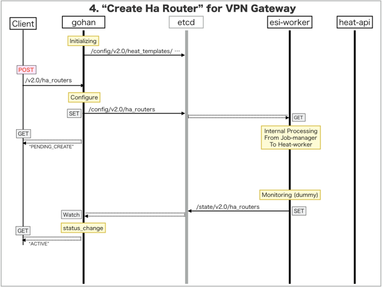

[Return to Previous Page](00_vpn_gateway.md)

# 4. Clarification of interface in Sequence Diagram "Create Ha Router"
You can see the relations of "Ha Router" as following.


## 4.1. Sequence Diagram between gohan and etcd
This is a diagram that has been described as interfaces for "Ha Router" between gohan and etcd.

* Initinalizing gohan ...
* Receiving HTTP Methods for Creating Resource ...



## 4.2. Stored data in etcd after initinalizing gohan
These are stored data for "heat_templates" in etcd.

* [Checking stored data for "ha_router_monitoring"](../heat_template/ha_router_monitoring.md)


## 4.3. HTTP Methods for RESTful between Gohan and Client
This is JSON data for "Create Ha Router" in HTTP Methods from client.

* Checking JSON data at post method
```
POST /v2.0/ha_routers
```
```
{
    "ha_router": {
        "description": "sample_ha_router",
        "name": "sample-ha-router",
        "primary_router_id": "792c7a6d-19b5-4d6f-b9f6-1e5b1eb45198",
        "secondary_router_id": "3ca3a59a-4f92-4a8a-9ec1-1c55a97c794e",
        "tenant_id": "0b576f6f4cbf414f829cd12f008bf08f"
    }
}
```


## 4.4. Stored data in etcd after receiving HTTP Methods for RESTful
These are stored data for "Create Ha Router" in etcd.

* [Checking stored data for creating "ha_router"](stored_in_etcd/CreateHaRouter_01.md)


## 4.5. Stored resource in gohan
As a result, checking resources regarding of "Ha Router" in gohan.

* Checking the target of resources via gohan client
```
$ gohan client ha_router show --output-format json f01ed0a6-7094-4e54-b14b-94657fff1efb
{
    "ha_router": {
        "available_gateways": 500,
        "description": "sample_ha_router",
        "id": "f01ed0a6-7094-4e54-b14b-94657fff1efb",
        "maximum_gateways": 500,
        "name": "sample-ha-router",
        "primary_router_id": "792c7a6d-19b5-4d6f-b9f6-1e5b1eb45198",
        "secondary_router_id": "3ca3a59a-4f92-4a8a-9ec1-1c55a97c794e",
        "status": "ACTIVE",
        "tenant_id": "0b576f6f4cbf414f829cd12f008bf08f"
    }
}
```

[Return to Previous Page](00_vpn_gateway.md)
