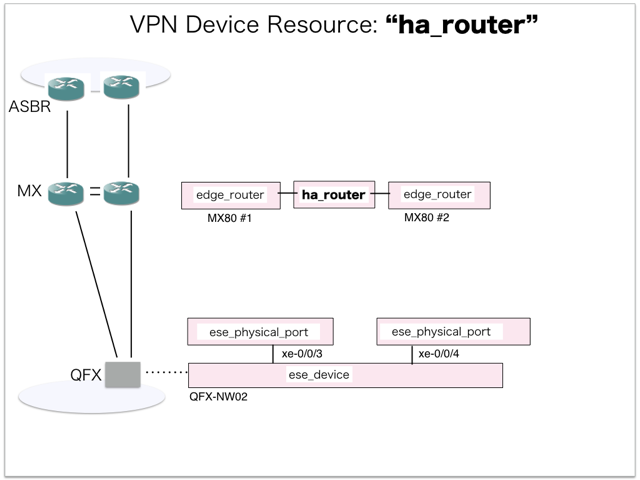

[Return to Previous Page](00_vpn_gateway.md)

# 4. Clarification of interface in Sequence Diagram "Create Ha Router"
You can see the relations of "Ha Router" as following.




## 4.1. Gohan


### Outline
First of all, Gohan has received JSON data for "Create Ha Router" in HTTP Methods from client.

* Checking JSON data at post method
```
POST /v2.0/ha_routers
```
```
{
    "ha_router": {
        "description": "sample_ha_router",
        "name": "sample-ha-router",
        "primary_router_id": "7a35974a-a19f-49e2-b907-ad7fd8692975",
        "secondary_router_id": "b7e6d8ad-5377-4380-bbb4-1a62566cbd6d",
        "tenant_id": "b3e3095c0a5b4383805efe9cf2a6b5ef"
    }
}
```
After processing, Gohan has stored data for "Create Ha Router" in etcd

* [Checking stored data for creating "ha_router"](stored_in_etcd/01_Gohan/CreateHaRouter_01.md)


## 4.2. ResourceReader
When ResourceReader has started, it gets all of schemas from Gohan.
After that, these schemas are converted as a template_mappings.
And then, ResourceReader keeps storing template_mappings for following processing.

### Reference
* [Checking schemas in ResourceReader](../memo/schemas.txt)
* [Checking template_mappings in ResourceReader](../memo/template_mappings.md)


### Outline
After fetching resource_data for "Create Ha Router" in etcd, ResourceReader has not fetched heat_templates in etcd because of non_workable_resource.
And then, ResourceReader has stored data as finishing resource

* [Checking stored data for creating "ha_router"](stored_in_etcd/00_ResourceReader/CreateHaRouter_01.md)


## 4.3. Stored resource in gohan
As a result, checking resources regarding of "Ha Router" in gohan.

* Checking the target of resources via gohan client
```
$ gohan client ha_router show --output-format json 8c233862-895f-4cca-b377-c353e733c768
{
    "ha_router": {
        "available_gateways": 500,
        "description": "sample_ha_router",
        "id": "8c233862-895f-4cca-b377-c353e733c768",
        "maximum_gateways": 500,
        "name": "sample-ha-router",
        "primary_router_id": "7a35974a-a19f-49e2-b907-ad7fd8692975",
        "secondary_router_id": "b7e6d8ad-5377-4380-bbb4-1a62566cbd6d",
        "status": "ACTIVE",
        "tenant_id": "b3e3095c0a5b4383805efe9cf2a6b5ef"
    }
}
```

[Return to Previous Page](00_vpn_gateway.md)
