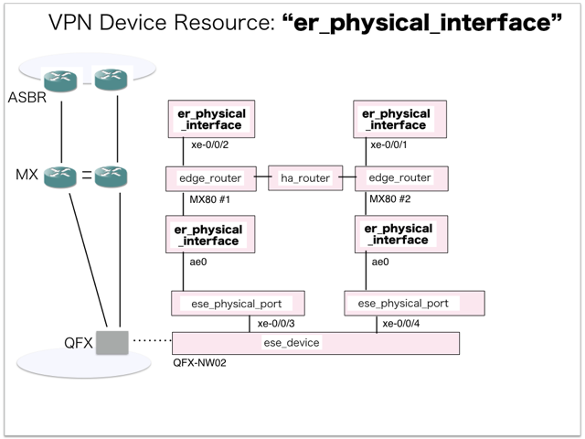
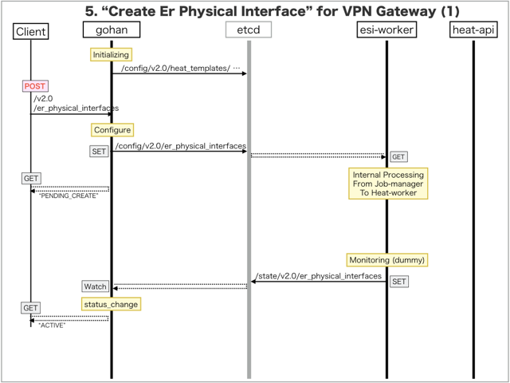
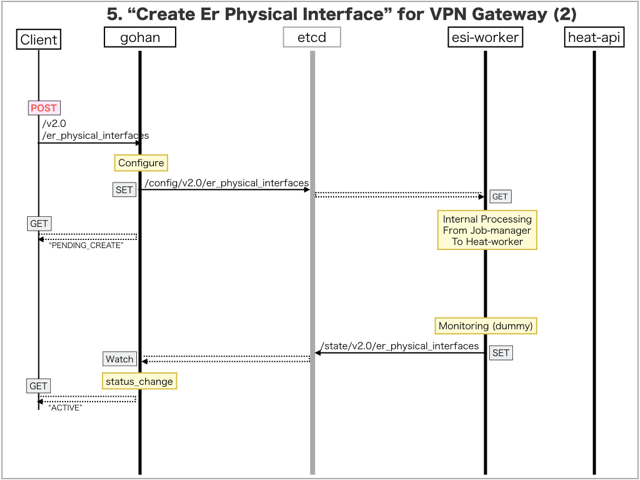

[Return to Previous Page](00_vpn_gateway.md)

# 5. Clarification of interface in Sequence Diagram "Create Er Physical Interface"
You can see the relations of "Create Er Physical Interface" as following.



## 5.1. Sequence Diagram between gohan and etcd
This is a diagram that has been described as interfaces for "Er Physical Interface" between gohan and etcd.

* Initinalizing gohan ...
* Receiving HTTP Methods for Creating Resource ...





## 5.2. Stored data in etcd after initinalizing gohan
These are stored data for "heat_templates" in etcd.

* [Checking stored data for "er_physical_interface_monitoring"](../heat_template/er_physical_interface_monitoring.md)


## 5.3. HTTP Methods for RESTful between Gohan and Client
This is JSON data for "Create Er Physical Interface" in HTTP Methods from client.

* Checking JSON data at post method
```
POST /v2.0/er_physical_interfaces
```
```
{
    "er_physical_interface": {
        "device_id": "792c7a6d-19b5-4d6f-b9f6-1e5b1eb45198",
        "name": "ge-0/0/1",
        "tenant_id": "0b576f6f4cbf414f829cd12f008bf08f"
    }
}
```
* Checking JSON data at post method
```
POST /v2.0/er_physical_interfaces
```
```
{
    "er_physical_interface": {
        "connected_ese_port_id": "eec156b0-7317-48dd-b76c-019c0758e99d",
        "device_id": "792c7a6d-19b5-4d6f-b9f6-1e5b1eb45198",
        "name": "ae0",
        "tenant_id": "0b576f6f4cbf414f829cd12f008bf08f"
    }
}
```
* Checking JSON data at post method
```
POST /v2.0/er_physical_interfaces
```
```
{
    "er_physical_interface": {
        "connected_ese_port_id": "176ec475-e9e8-4605-8b41-802fbc6220c1",
        "device_id": "3ca3a59a-4f92-4a8a-9ec1-1c55a97c794e",
        "name": "ae0",
        "tenant_id": "0b576f6f4cbf414f829cd12f008bf08f"
    }
}
```
* Checking JSON data at post method
```
POST /v2.0/er_physical_interfaces
```
```
{
    "er_physical_interface": {
        "device_id": "3ca3a59a-4f92-4a8a-9ec1-1c55a97c794e",
        "name": "ge-0/0/1",
        "tenant_id": "0b576f6f4cbf414f829cd12f008bf08f"
    }
}
```


## 5.4. Stored data in etcd after receiving HTTP Methods for RESTful
These are stored data for "Create Er Physical Interface" in etcd.

* [Checking stored data for creating "ge-0/0/1"](stored_in_etcd/CreateErPhysicalInterface_01.md)
* [Checking stored data for creating "ae0"](stored_in_etcd/CreateErPhysicalInterface_02.md)
* [Checking stored data for creating "ae0"](stored_in_etcd/CreateErPhysicalInterface_03.md)
* [Checking stored data for creating "ge-0/0/1"](stored_in_etcd/CreateErPhysicalInterface_04.md)


## 5.5. Stored resource for monitoring in Kafka
This is JSON data for "Create Er Physical Interface" between monitoring-worker and kafka

* [Checking the topic "monitor_physical_port" for monitoring "er_physical_interface"](stored_in_kafka/CreateErPhysicalInterface_01.md)


## 5.6. Stored resource in gohan
As a result, checking resources regarding of "Er Physical Interface" in gohan.

* Checking the target of resources via gohan client
```
$ gohan client er_physical_interface show --output-format json 6e8f473f-47ec-4b54-8f0f-d459d440393b
{
    "er_physical_interface": {
        "connected_ese_port_id": null,
        "description": "",
        "device_id": "792c7a6d-19b5-4d6f-b9f6-1e5b1eb45198",
        "id": "6e8f473f-47ec-4b54-8f0f-d459d440393b",
        "name": "ge-0/0/1",
        "status": "ACTIVE",
        "tenant_id": "0b576f6f4cbf414f829cd12f008bf08f"
    }
}
```
```
$ gohan client er_physical_interface show --output-format json 8ff57ce4-55f9-40d4-82ed-1f00c9051678
{
    "er_physical_interface": {
        "connected_ese_port_id": "eec156b0-7317-48dd-b76c-019c0758e99d",
        "description": "",
        "device_id": "792c7a6d-19b5-4d6f-b9f6-1e5b1eb45198",
        "id": "8ff57ce4-55f9-40d4-82ed-1f00c9051678",
        "name": "ae0",
        "status": "ACTIVE",
        "tenant_id": "0b576f6f4cbf414f829cd12f008bf08f"
    }
}
```
```
$ gohan client er_physical_interface show --output-format json 6b160a8d-fdad-4fe7-aaed-3ff5f729d6c8
{
    "er_physical_interface": {
        "connected_ese_port_id": "176ec475-e9e8-4605-8b41-802fbc6220c1",
        "description": "",
        "device_id": "3ca3a59a-4f92-4a8a-9ec1-1c55a97c794e",
        "id": "6b160a8d-fdad-4fe7-aaed-3ff5f729d6c8",
        "name": "ae0",
        "status": "ACTIVE",
        "tenant_id": "0b576f6f4cbf414f829cd12f008bf08f"
    }
}
```
```
$ gohan client er_physical_interface show --output-format json f87c6efe-f590-4c29-8fc9-2f914e1eb362
{
    "er_physical_interface": {
        "connected_ese_port_id": null,
        "description": "",
        "device_id": "3ca3a59a-4f92-4a8a-9ec1-1c55a97c794e",
        "id": "f87c6efe-f590-4c29-8fc9-2f914e1eb362",
        "name": "ge-0/0/1",
        "status": "ACTIVE",
        "tenant_id": "0b576f6f4cbf414f829cd12f008bf08f"
    }
}
```


[Return to Previous Page](00_vpn_gateway.md)
