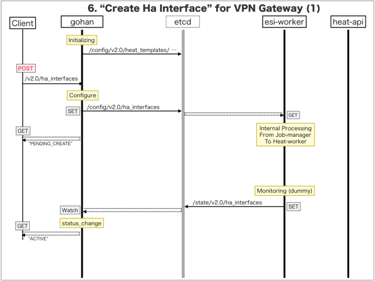
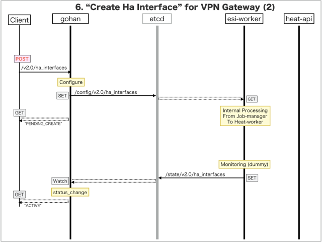

[Return to Previous Page](00_vpn_gateway.md)

# 6. Clarification of interface in Sequence Diagram "Create Ha Interface"
You can see the relations of "Ha Interface" as following.


## 6.1. Sequence Diagram between gohan and etcd
This is a diagram that has been described as interfaces for "Ha Interface" between gohan and etcd.

* Initinalizing gohan ...
* Receiving HTTP Methods for Creating Resource ...




## 6.2. Stored data in etcd after initinalizing gohan
These are stored data for "heat_templates" in etcd.

* [Checking stored data for "ha_interface_monitoring"](../heat_template/ha_interface_monitoring.md)


## 6.3. HTTP Methods for RESTful between Gohan and Client
This is JSON data for "Create Ha Interface" in HTTP Methods from client.

* Checking JSON data at post method
```
POST /v2.0/ha_interfaces
```
```
{
    "ha_interface": {
        "ha_router_id": "f01ed0a6-7094-4e54-b14b-94657fff1efb",
        "link_type": "uplink",
        "name": "sample-ha-router-uplink",
        "primary_interface_id": "6e8f473f-47ec-4b54-8f0f-d459d440393b",
        "secondary_interface_id": "f87c6efe-f590-4c29-8fc9-2f914e1eb362",
        "tenant_id": "0b576f6f4cbf414f829cd12f008bf08f"
    }
}
```
* Checking JSON data at post method
```
POST /v2.0/ha_interfaces
```
```
{
    "ha_interface": {
        "ha_router_id": "f01ed0a6-7094-4e54-b14b-94657fff1efb",
        "link_type": "downlink",
        "maximum_be_bandwidth": 500,
        "maximum_ga_bandwidth": 500,
        "name": "sample-ha-router-downlink",
        "primary_interface_id": "8ff57ce4-55f9-40d4-82ed-1f00c9051678",
        "secondary_interface_id": "6b160a8d-fdad-4fe7-aaed-3ff5f729d6c8",
        "restricted_vlans": "0-1024,4094",
        "tenant_id": "0b576f6f4cbf414f829cd12f008bf08f"
    }
}
```


## 6.4. Stored data in etcd after receiving HTTP Methods for RESTful
These are stored data for "Create Ha Interface" in etcd.

* [Checking stored data for creating "uplink"](stored_in_etcd/CreateHaInterface_01.md)
* [Checking stored data for creating "downlink"](stored_in_etcd/CreateHaInterface_02.md)


## 6.5. Stored resource in gohan
As a result, checking resources regarding of "Ha Interface" in gohan.

* Checking the target of resources via gohan client
```
$ gohan client ha_interface show --output-format json 5e552b8f-cd5a-454c-a224-33f7da0afa24
{
    "ha_interface": {
        "admin_state_up": true,
        "available_be_bandwidth": 0,
        "available_ga_bandwidth": 0,
        "description": "",
        "gateway_instances_count": 0,
        "ha_router_id": "f01ed0a6-7094-4e54-b14b-94657fff1efb",
        "id": "5e552b8f-cd5a-454c-a224-33f7da0afa24",
        "link_type": "uplink",
        "maximum_be_bandwidth": 0,
        "maximum_ga_bandwidth": 0,
        "name": "sample-ha-router-uplink",
        "primary_interface_id": "6e8f473f-47ec-4b54-8f0f-d459d440393b",
        "restricted_vlans": "",
        "secondary_interface_id": "f87c6efe-f590-4c29-8fc9-2f914e1eb362",
        "status": "ACTIVE",
        "tenant_id": "0b576f6f4cbf414f829cd12f008bf08f",
        "vlan_ids_available": 4093,
        "vlan_pool_state": "gAAAAQAAAAAAAAAAAAAAAAAAAAAAAAAAAAAAAAAAAAAAAAAAAAAAAAAAAAAAAAAAAAAAAAAAAAAAAAAAAAAAAAAAAAAAAAAAAAAAAAAAAAAAAAAAAAAAAAAAAAAAAAAAAAAAAAAAAAAAAAAAAAAAAAAAAAAAAAAAAAAAAAAAAAAAAAAAAAAAAAAAAAAAAAAAAAAAAAAAAAAAAAAAAAAAAAAAAAAAAAAAAAAAAAAAAAAAAAAAAAAAAAAAAAAAAAAAAAAAAAAAAAAAAAAAAAAAAAAAAAAAAAAAAAAAAAAAAAAAAAAAAAAAAAAAAAAAAAAAAAAAAAAAAAAAAAAAAAAAAAAAAAAAAAAAAAAAAAAAAAAAAAAAAAAAAAAAAAAAAAAAAAAAAAAAAAAAAAAAAAAAAAAAAAAAAAAAAAAAAAAAAAAAAAAAAAAAAAAAAAAAAAAAAAAAAAAAAAAAAAAAAAAAAAAAAAAAAAAAAAAAAAAAAAAAAAAAAAAAAAAAAAAAAAAAAAAAAAAAAAAAAAAAAAAAAAAAAAAAAAAAAAAAAAAAAAAAAAAAAAAAAAAAAAAAAAAAAAAAAAAAAAAAAAAAAAAAAAAAAAAAAAAAAAAAAAAAAAAAAAAAAAAAAAAAAAAAAAAAAAAAAAAAAAAAAAAAAAAAAAAAAAAAAAAAAAAAAAAAAAE="
    }
}
```
```
$ gohan client ha_interface show --output-format json a3a62a37-5657-4822-98e0-991ab63f0e96
{
    "ha_interface": {
        "admin_state_up": true,
        "available_be_bandwidth": 500,
        "available_ga_bandwidth": 500,
        "description": "",
        "gateway_instances_count": 0,
        "ha_router_id": "f01ed0a6-7094-4e54-b14b-94657fff1efb",
        "id": "a3a62a37-5657-4822-98e0-991ab63f0e96",
        "link_type": "downlink",
        "maximum_be_bandwidth": 500,
        "maximum_ga_bandwidth": 500,
        "name": "sample-ha-router-downlink",
        "primary_interface_id": "8ff57ce4-55f9-40d4-82ed-1f00c9051678",
        "restricted_vlans": "0-1024,4094",
        "secondary_interface_id": "6b160a8d-fdad-4fe7-aaed-3ff5f729d6c8",
        "status": "ACTIVE",
        "tenant_id": "0b576f6f4cbf414f829cd12f008bf08f",
        "vlan_ids_available": 3069,
        "vlan_pool_state": "//////////////////////////////////////////////////////////////////////////////////////////////////////////////////////////////////////////////////////////////////////////+AAAAAAAAAAAAAAAAAAAAAAAAAAAAAAAAAAAAAAAAAAAAAAAAAAAAAAAAAAAAAAAAAAAAAAAAAAAAAAAAAAAAAAAAAAAAAAAAAAAAAAAAAAAAAAAAAAAAAAAAAAAAAAAAAAAAAAAAAAAAAAAAAAAAAAAAAAAAAAAAAAAAAAAAAAAAAAAAAAAAAAAAAAAAAAAAAAAAAAAAAAAAAAAAAAAAAAAAAAAAAAAAAAAAAAAAAAAAAAAAAAAAAAAAAAAAAAAAAAAAAAAAAAAAAAAAAAAAAAAAAAAAAAAAAAAAAAAAAAAAAAAAAAAAAAAAAAAAAAAAAAAAAAAAAAAAAAAAAAAAAAAAAAAAAAAAAAAAAAAAAAAAAAAAAAAAAAAAAAAAAAAAAAAAAAAAAAAAAAAAAAAAAAAAAAAAAAAAAAAAAAAAAAAAAAAAAAAAAAAAAAAAAAAAAAAAAAAAAAAAAAAAAAAAAAAAAAAAAAAAAAAAAAAAAAAAAAAAAAAAAAAAAAAAAAAM="
    }
}
```

[Return to Previous Page](00_vpn_gateway.md)
