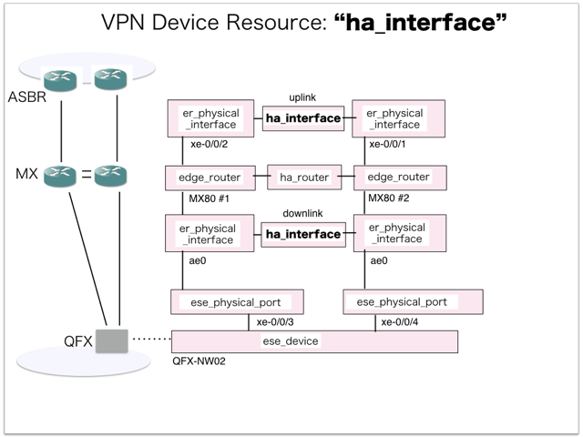

[Return to Previous Page](00_vpn_gateway.md)

# 6. Clarification of interface in Sequence Diagram "Create Ha Interface"
You can see the relations of "Ha Interface" as following.




## 6.1. Gohan


### Outline
First of all, Gohan has received JSON data for "Create Ha Interface" in HTTP Methods from client.

* Checking JSON data at post method
```
POST /v2.0/ha_interfaces
```
```
{
    "ha_interface": {
        "ha_router_id": "8c233862-895f-4cca-b377-c353e733c768",
        "link_type": "uplink",
        "name": "sample-ha-router-uplink",
        "primary_interface_id": "f3ecf585-5c3b-445a-97a7-d8e124c99e16",
        "secondary_interface_id": "2bc8e40d-ab01-4738-a4aa-e69d8fd30688",
        "tenant_id": "b3e3095c0a5b4383805efe9cf2a6b5ef"
    }
}
```
* Checking JSON data at post method
```
POST /v2.0/ha_interfaces
```
```
{
    "ha_interface": {
        "ha_router_id": "8c233862-895f-4cca-b377-c353e733c768",
        "link_type": "downlink",
        "maximum_be_bandwidth": 500,
        "maximum_ga_bandwidth": 500,
        "name": "sample-ha-router-downlink",
        "primary_interface_id": "3118d6be-b1cb-472a-805f-7e1ec46aa5e7",
        "secondary_interface_id": "c8e2d558-02ee-4bf3-ba5b-958821a21043",
        "restricted_vlans": "0-1024,4094",
        "tenant_id": "b3e3095c0a5b4383805efe9cf2a6b5ef"
    }
}
```
After processing, Gohan has stored data for "Create Ha Interface" in etcd

* [Checking stored data for creating "uplink"](stored_in_etcd/01_Gohan/CreateHaInterface_01.md)
* [Checking stored data for creating "downlink"](stored_in_etcd/01_Gohan/CreateHaInterface_02.md)


## 6.2. ResourceReader
When ResourceReader has started, it gets all of schemas from Gohan.
After that, these schemas are converted as a template_mappings.
And then, ResourceReader keeps storing template_mappings for following processing.

### Reference
* [Checking schemas in ResourceReader](../memo/schemas.txt)
* [Checking template_mappings in ResourceReader](../memo/template_mappings.md)


### Outline
After fetching resource_data for "Create Ha Interface" in etcd, ResourceReader has not fetched heat_templates in etcd because of non_workable_resource.
And then, ResourceReader has stored data as finishing resource

* [Checking stored data for creating "uplink"](stored_in_etcd/00_ResourceReader/CreateHaInterface_01.md)
* [Checking stored data for creating "downlink"](stored_in_etcd/00_ResourceReader/CreateHaInterface_02.md)


## 6.5. Stored resource in gohan
As a result, checking resources regarding of "Ha Interface" in gohan.

* Checking the target of resources via gohan client
```
$ gohan client ha_interface show --output-format json c50006de-8afe-48fc-b7b8-37dc7617764a
{
    "ha_interface": {
        "admin_state_up": true,
        "available_be_bandwidth": 0,
        "available_ga_bandwidth": 0,
        "description": "",
        "gateway_instances_count": 0,
        "ha_router_id": "8c233862-895f-4cca-b377-c353e733c768",
        "id": "c50006de-8afe-48fc-b7b8-37dc7617764a",
        "link_type": "uplink",
        "maximum_be_bandwidth": 0,
        "maximum_ga_bandwidth": 0,
        "name": "sample-ha-router-uplink",
        "primary_interface_id": "f3ecf585-5c3b-445a-97a7-d8e124c99e16",
        "restricted_vlans": "",
        "secondary_interface_id": "2bc8e40d-ab01-4738-a4aa-e69d8fd30688",
        "status": "ACTIVE",
        "tenant_id": "b3e3095c0a5b4383805efe9cf2a6b5ef",
        "vlan_ids_available": 4093,
        "vlan_pool_state": "gAAAAQAAAAAAAAAAAAAAAAAAAAAAAAAAAAAAAAAAAAAAAAAAAAAAAAAAAAAAAAAAAAAAAAAAAAAAAAAAAAAAAAAAAAAAAAAAAAAAAAAAAAAAAAAAAAAAAAAAAAAAAAAAAAAAAAAAAAAAAAAAAAAAAAAAAAAAAAAAAAAAAAAAAAAAAAAAAAAAAAAAAAAAAAAAAAAAAAAAAAAAAAAAAAAAAAAAAAAAAAAAAAAAAAAAAAAAAAAAAAAAAAAAAAAAAAAAAAAAAAAAAAAAAAAAAAAAAAAAAAAAAAAAAAAAAAAAAAAAAAAAAAAAAAAAAAAAAAAAAAAAAAAAAAAAAAAAAAAAAAAAAAAAAAAAAAAAAAAAAAAAAAAAAAAAAAAAAAAAAAAAAAAAAAAAAAAAAAAAAAAAAAAAAAAAAAAAAAAAAAAAAAAAAAAAAAAAAAAAAAAAAAAAAAAAAAAAAAAAAAAAAAAAAAAAAAAAAAAAAAAAAAAAAAAAAAAAAAAAAAAAAAAAAAAAAAAAAAAAAAAAAAAAAAAAAAAAAAAAAAAAAAAAAAAAAAAAAAAAAAAAAAAAAAAAAAAAAAAAAAAAAAAAAAAAAAAAAAAAAAAAAAAAAAAAAAAAAAAAAAAAAAAAAAAAAAAAAAAAAAAAAAAAAAAAAAAAAAAAAAAAAAAAAAAAAAAAAAAAAAE="
    }
}
```
```
$ gohan client ha_interface show --output-format json 66bdfe91-b9e6-42f2-8942-bb4d4a67d5ba
{
    "ha_interface": {
        "admin_state_up": true,
        "available_be_bandwidth": 500,
        "available_ga_bandwidth": 500,
        "description": "",
        "gateway_instances_count": 0,
        "ha_router_id": "8c233862-895f-4cca-b377-c353e733c768",
        "id": "66bdfe91-b9e6-42f2-8942-bb4d4a67d5ba",
        "link_type": "downlink",
        "maximum_be_bandwidth": 500,
        "maximum_ga_bandwidth": 500,
        "name": "sample-ha-router-downlink",
        "primary_interface_id": "3118d6be-b1cb-472a-805f-7e1ec46aa5e7",
        "restricted_vlans": "0-1024,4094",
        "secondary_interface_id": "c8e2d558-02ee-4bf3-ba5b-958821a21043",
        "status": "ACTIVE",
        "tenant_id": "b3e3095c0a5b4383805efe9cf2a6b5ef",
        "vlan_ids_available": 3069,
        "vlan_pool_state": "//////////////////////////////////////////////////////////////////////////////////////////////////////////////////////////////////////////////////////////////////////////+AAAAAAAAAAAAAAAAAAAAAAAAAAAAAAAAAAAAAAAAAAAAAAAAAAAAAAAAAAAAAAAAAAAAAAAAAAAAAAAAAAAAAAAAAAAAAAAAAAAAAAAAAAAAAAAAAAAAAAAAAAAAAAAAAAAAAAAAAAAAAAAAAAAAAAAAAAAAAAAAAAAAAAAAAAAAAAAAAAAAAAAAAAAAAAAAAAAAAAAAAAAAAAAAAAAAAAAAAAAAAAAAAAAAAAAAAAAAAAAAAAAAAAAAAAAAAAAAAAAAAAAAAAAAAAAAAAAAAAAAAAAAAAAAAAAAAAAAAAAAAAAAAAAAAAAAAAAAAAAAAAAAAAAAAAAAAAAAAAAAAAAAAAAAAAAAAAAAAAAAAAAAAAAAAAAAAAAAAAAAAAAAAAAAAAAAAAAAAAAAAAAAAAAAAAAAAAAAAAAAAAAAAAAAAAAAAAAAAAAAAAAAAAAAAAAAAAAAAAAAAAAAAAAAAAAAAAAAAAAAAAAAAAAAAAAAAAAAAAAAAAAAAAAAAAAM="
    }
}
```

[Return to Previous Page](00_vpn_gateway.md)
