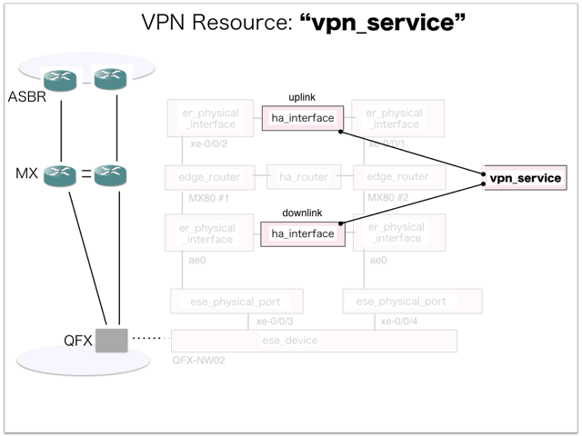
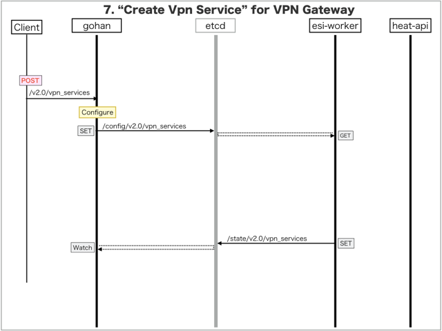

[Return to Previous Page](00_vpn_gateway.md)

# 7. Clarification of interface in Sequence Diagram "Create Vpn Service"
You can see the relations of "Vpn Service" as following.



## 7.1. Sequence Diagram between gohan and etcd
This is a diagram that has been described as interfaces for "Vpn Service" between gohan and etcd.

* Receiving HTTP Methods for Creating Resource ...



## 7.2. HTTP Methods for RESTful between Gohan and Client
This is JSON data for "Create Vpn Service" in HTTP Methods from client.

* Checking JSON data at post method
```
POST /v2.0/vpn_services
```
```
{
    "vpn_service": {
        "be_forwarding_class": "FC-VPN-BE",
        "default_static_routes_per_gateway": 32,
        "downlink_interfaces": ["a3a62a37-5657-4822-98e0-991ab63f0e96"],
        "ga_forwarding_class": "FC-VPN-GA",
        "name": "sample-vpn-service",
        "neighbour_prefix": "BGP-VIRTUAL-ROUTER-PEERS",
        "primary_downlink_vrrp_config_group": "VPNGW1-VRRP",
        "primary_ebgp_config_group": "VPNGW1-RI-EBGP",
        "primary_ibgp_config_group": "VPNGW1-RI-IBGP",
        "secondary_downlink_vrrp_config_group": "VPNGW2-VRRP",
        "secondary_ebgp_config_group": "VPNGW2-RI-EBGP",
        "secondary_ibgp_config_group": "VPNGW2-RI-IBGP",
        "uplink_interfaces": ["5e552b8f-cd5a-454c-a224-33f7da0afa24"],
        "zone": "jp1-zone1",
        "tenant_id": "0b576f6f4cbf414f829cd12f008bf08f"
    }
}
```


## 7.3. Stored data in etcd after receiving HTTP Methods for RESTful
These are stored data for "Create Vpn Service" in etcd.

* [Checking stored data for creating "vpn_service"](stored_in_etcd/CreateVpnService_01.md)


## 7.4. Stored resource in gohan
As a result, checking resources regarding of "Vpn Service" in gohan.

* Checking the target of resources via gohan client
```
$ gohan client vpn_service show --output-format json 72b05fe5-88c6-4888-a6fb-feb793fffae8
{
    "vpn_service": {
        "be_forwarding_class": "FC-VPN-BE",
        "default_static_routes_per_gateway": 32,
        "description": "",
        "downlink_interfaces": [
            "a3a62a37-5657-4822-98e0-991ab63f0e96"
        ],
        "ga_forwarding_class": "FC-VPN-GA",
        "id": "72b05fe5-88c6-4888-a6fb-feb793fffae8",
        "name": "sample-vpn-service",
        "neighbour_prefix": "BGP-VIRTUAL-ROUTER-PEERS",
        "primary_downlink_vrrp_config_group": "VPNGW1-VRRP",
        "primary_ebgp_config_group": "VPNGW1-RI-EBGP",
        "primary_ibgp_config_group": "VPNGW1-RI-IBGP",
        "secondary_downlink_vrrp_config_group": "VPNGW2-VRRP",
        "secondary_ebgp_config_group": "VPNGW2-RI-EBGP",
        "secondary_ibgp_config_group": "VPNGW2-RI-IBGP",
        "tenant_id": "0b576f6f4cbf414f829cd12f008bf08f",
        "uplink_interfaces": [
            "5e552b8f-cd5a-454c-a224-33f7da0afa24"
        ],
        "vrf_config": null,
        "zone": "jp1-zone1"
    }
}
```

[Return to Previous Page](00_vpn_gateway.md)
