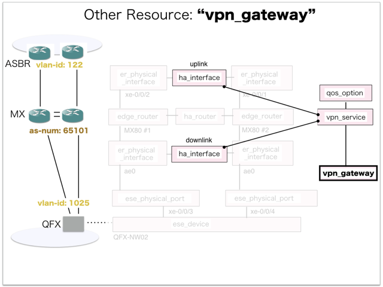

[Return to Previous Page](00_vpn_gateway.md)

# 9. Clarification of interface in Sequence Diagram "Create Vpn Gateway"
You can see the relations of "Vpn Gateway" as following.




## 9.1. Gohan


### Outline
First of all, Gohan has received JSON data for "Create Vpn Gateway" in HTTP Methods from client.

* Checking JSON data at post method
```
POST /v2.0/vpn_gateways
```
```
{
    "vpn_gateway": {
        "description": "this resource is vpn-gateway",
        "local_as_number": "65101",
        "maximum_static_routes": 32,
        "name": "sample-vpn-gateway",
        "qos_option_id": "d35a3c95-8647-44d7-b32f-405b77d77f51",
        "uplink_vlan_id": "122",
        "vpn_service_id": "c8d57f7e-b439-475e-a6fb-ee2594390177",
        "tenant_id": "b3e3095c0a5b4383805efe9cf2a6b5ef"
    }
}
```
After processing, Gohan has stored data for "Create Vpn Gateway" in etcd.

* [Checking stored data for creating "vpn_gateway"](stored_in_etcd/01_Gohan/CreateVpnGateway_01.md)


## 9.2. ResourceReader
When ResourceReader has started, it gets all of schemas from Gohan.
After that, these schemas are converted as a template_mappings.
And then, ResourceReader keeps storing template_mappings for following processing.

### Reference
* [Checking schemas in ResourceReader](../memo/schemas.txt)
* [Checking template_mappings in ResourceReader](../memo/template_mappings.md)


### Outline
After fetching resource_data for "Create Internet Gateway" in etcd, ResourceReader has fetched heat_templates in etcd.

* [Checking stored data for "vpn_gateway"](../heat_template/vpn_gateway.md)


## 9.3. JobManager


### Outline
After converting resource_data to job_data, JobManager has stored it in etcd.

* [Checking stored data for creating "vpn_gateway"](stored_in_etcd/02_JobManager/CreateVpnGateway_01.md)


## 9.4. HeatWorker


### Outline
After fetching job_data, HeatWorker has handled job_data.
And then, HeatWorker has stored the result of handling job_data.

* [Checking stored data for creating "vpn_gateway"](stored_in_etcd/03_HeatWorker/CreateVpnGateway_01.md)


## 9.5. Heat


### Outline
Heat has conducted some tasks for "Create Vpn Gateway".
As a result, Heat has stored heat-stacks for "Create Vpn Gateway".

* [Checking heat-stack of "vpn_gateway"](heat-stack/CreateVpnGateway_01.md)


## 9.6. Applying JUNOS Configurations via netconf
Checking configuration in Edge Router

* MX-1
```
[edit interfaces ge-0/0/1]
+    unit 122 {
+        description CloudGW_vpn;
+        vlan-id 122;
+    }
```
```
[edit interfaces ae0]
+    unit 1025 {
+        apply-groups VPNGW2-VRRP;
+        description vpn_gw;
+        vlan-id 1025;
+        family inet {
+            filter {
+                input FILTER_10M-GA-UP-VPN;
+                output FILTER_10M-GA-DOWN-VPN;
+            }
+        }
+    }
```
```
[edit routing-instances]
+   vrf_gw_sample-ha-router-downlink_1025 {
+       instance-type virtual-router;
+       interface ge-0/0/1.122;
+       interface ae0.1025;
+   }

[edit]
```

* MX-2
```
[edit interfaces ge-0/0/1]
+    unit 122 {
+        description CloudGW_vpn;
+        vlan-id 122;
+    }
```
```
[edit interfaces ae0]
+    unit 1025 {
+        apply-groups VPNGW1-VRRP;
+        description vpn_gw;
+        vlan-id 1025;
+        family inet {
+            filter {
+                input FILTER_10M-GA-UP-VPN;
+                output FILTER_10M-GA-DOWN-VPN;
+            }
+        }
+    }
```
```
[edit routing-instances]
+   vrf_gw_sample-ha-router-downlink_1025 {
+       instance-type virtual-router;
+       interface ge-0/0/1.122;
+       interface ae0.1025;
+   }

[edit]
```


## 9.7. Stored resource in gohan
As a result, checking resources regarding of "Vpn Gateway" in gohan.

* Checking the target of resources via gohan client
```
$ gohan client vpn_gateway show --output-format json b1da850c-3344-4de2-aa18-d96a30b54f69
{
    "vpn_gateway": {
        "connected_vpn_interface": "",
        "description": "this resource is vpn-gateway",
        "downlink_interface_id": "66bdfe91-b9e6-42f2-8942-bb4d4a67d5ba",
        "downlink_vlan_id": "1025",
        "id": "b1da850c-3344-4de2-aa18-d96a30b54f69",
        "local_as_number": "65101",
        "maximum_static_routes": 32,
        "name": "sample-vpn-gateway",
        "orchestration_state": "CREATE_COMPLETE",
        "primary_logical_downlink_interface_name": "ae0.1025",
        "primary_logical_uplink_interface_name": "ge-0/0/1.122",
        "qos_option_id": "d35a3c95-8647-44d7-b32f-405b77d77f51",
        "secondary_logical_downlink_interface_name": "ae0.1025",
        "secondary_logical_uplink_interface_name": "ge-0/0/1.122",
        "status": "ACTIVE",
        "tenant_id": "b3e3095c0a5b4383805efe9cf2a6b5ef",
        "uplink_interface_id": "c50006de-8afe-48fc-b7b8-37dc7617764a",
        "uplink_vlan_id": "122",
        "vpn_service_id": "c8d57f7e-b439-475e-a6fb-ee2594390177",
        "vrf_name": "vrf_gw_sample-ha-router-downlink_1025"
    }
}
```

[Return to Previous Page](00_vpn_gateway.md)
