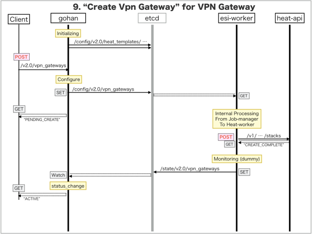

[Return to Previous Page](00_vpn_gateway.md)

# 9. Clarification of interface in Sequence Diagram "Create Vpn Gateway"
You can see the relations of "Vpn Gateway" as following.


## 9.1. Sequence Diagram between gohan and etcd
This is a diagram that has been described as interfaces for "Vpn Gateway" between gohan and etcd.

* Initinalizing gohan ...
* Receiving HTTP Methods for Creating Resource ...



## 9.2. Stored data in etcd after initinalizing gohan
These are stored data for "heat_templates" in etcd.

* [Checking stored data for "vpn_gateway"](../heat_template/vpn_gateway.md)
* [Checking stored data for "vpn_gateway_monitoring"](../heat_template/vpn_gateway_monitoring.md)


## 9.3. HTTP Methods for RESTful between Gohan and Client
This is JSON data for "Create Vpn Gateway" in HTTP Methods from client.

* Checking JSON data at post method
```
POST /v2.0/vpn_gateways
```
```
{
    "vpn_gateway": {
        "description": "this resource is vpn-gateway",
        "local_as_number": "65101",
        "maximum_static_routes": 32,
        "name": "sample-vpn-gateway",
        "qos_option_id": "4f59680b-52b6-41da-b15a-09946c155efd",
        "uplink_vlan_id": "122",
        "vpn_service_id": "72b05fe5-88c6-4888-a6fb-feb793fffae8",
        "tenant_id": "0b576f6f4cbf414f829cd12f008bf08f"
    }
}
```


## 9.4. Stored data in etcd after receiving HTTP Methods for RESTful
These are stored data for "Create Vpn Gateway" in etcd.

* [Checking stored data for creating "vpn_gateway"](stored_in_etcd/CreateVpnGateway_01.md)


## 9.5. Stored heat-stack via heat-api
These are stored heat-stacks for "Create Vpn Gateway" in heat-engine.

* [Checking heat-stack of "vpn_gateway"](heat-stack/CreateVpnGateway_01.md)


## 9.6. Applying JUNOS Configurations via netconf
Checking configuration in Edge Router

* MX-1
```
[edit interfaces ge-0/0/1]
+    unit 122 {
+        description CloudGW_vpn;
+        vlan-id 122;
+    }

[edit interfaces ae0]
+    unit 1025 {
+        apply-groups VPNGW2-VRRP;
+        description vpn_gw;
+        vlan-id 1025;
+        family inet {
+            filter {
+                input FILTER_10M-GA-UP-VPN;
+                output FILTER_10M-GA-DOWN-VPN;
+            }
+        }
+    }

[edit routing-instances]
+   vrf_gw_sample-ha-router-downlink_1025 {
+       instance-type virtual-router;
+       interface ge-0/0/1.122;
+       interface ae0.1025;
+   }

[edit]
```

* MX-2
```
[edit interfaces ge-0/0/1]
+    unit 122 {
+        description CloudGW_vpn;
+        vlan-id 122;
+    }

[edit interfaces ae0]
+    unit 1025 {
+        apply-groups VPNGW1-VRRP;
+        description vpn_gw;
+        vlan-id 1025;
+        family inet {
+            filter {
+                input FILTER_10M-GA-UP-VPN;
+                output FILTER_10M-GA-DOWN-VPN;
+            }
+        }
+    }

[edit routing-instances]
+   vrf_gw_sample-ha-router-downlink_1025 {
+       instance-type virtual-router;
+       interface ge-0/0/1.122;
+       interface ae0.1025;
+   }

[edit]
```


## 9.7. Stored resource in gohan
As a result, checking resources regarding of "Vpn Gateway" in gohan.

* Checking the target of resources via gohan client
```
$ gohan client vpn_gateway show --output-format json 4fab887d-8f73-40e6-b2d8-2426255231bf
{
    "vpn_gateway": {
        "connected_vpn_interface": "",
        "description": "this resource is vpn-gateway",
        "downlink_interface_id": "a3a62a37-5657-4822-98e0-991ab63f0e96",
        "downlink_vlan_id": "1025",
        "id": "4fab887d-8f73-40e6-b2d8-2426255231bf",
        "local_as_number": "65101",
        "maximum_static_routes": 32,
        "name": "sample-vpn-gateway",
        "primary_logical_downlink_interface_name": "ae0.1025",
        "primary_logical_uplink_interface_name": "ge-0/0/1.122",
        "qos_option_id": "4f59680b-52b6-41da-b15a-09946c155efd",
        "secondary_logical_downlink_interface_name": "ae0.1025",
        "secondary_logical_uplink_interface_name": "ge-0/0/1.122",
        "status": "ACTIVE",
        "tenant_id": "0b576f6f4cbf414f829cd12f008bf08f",
        "uplink_interface_id": "5e552b8f-cd5a-454c-a224-33f7da0afa24",
        "uplink_vlan_id": "122",
        "vpn_service_id": "72b05fe5-88c6-4888-a6fb-feb793fffae8",
        "vrf_name": "vrf_gw_sample-ha-router-downlink_1025"
    }
}
```
* Checking resource_mapping via gohan client
```
$ gohan client resource_mapping list --output-format json
{
    "resource_mappings": [
        {
            "created": 1.494478827e+09,
            "deleted": null,
            "id": "7806e79c-7403-462f-abd4-57d4f4f20f54",
            "mapped_id": "10.79.5.185-a3a62a37-5657-4822-98e0-991ab63f0e96",
            "relation": "instance",
            "resource_id": "4fab887d-8f73-40e6-b2d8-2426255231bf",
            "resource_type": "vpn_gateway",
            "tenant_id": "0b576f6f4cbf414f829cd12f008bf08f"
        }
    ]
}
```

[Return to Previous Page](00_vpn_gateway.md)
