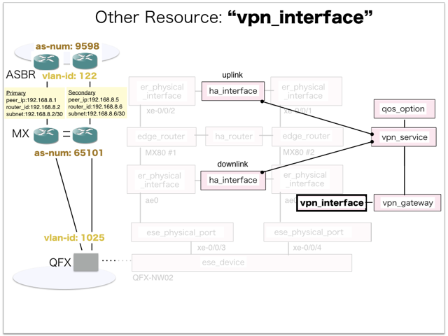

[Return to Previous Page](00_vpn_gateway.md)

# 10. Clarification of interface in Sequence Diagram "Create Vpn Interface"
You can see the relations of "Vpn Interface" as following.




## 10.1. Gohan


### Outline
First of all, Gohan has received JSON data for "Create Vpn Interface" in HTTP Methods from client.

* Checking JSON data at post method
```
POST /v2.0/vpn_interfaces
```
```
{
    "vpn_interface": {
        "bgp_md5": "test",
        "bgp_remote_as": "9598",
        "description": "Sample Vpn-interface",
        "name": "sample-vpn-interface",
        "primary": {
            "bgp_peer_ip": "192.168.8.1",
            "bgp_router_id": "192.168.8.2",
            "ip_address": "192.168.8.2/30"
        },
        "secondary": {
            "bgp_peer_ip": "192.168.8.5",
            "bgp_router_id": "192.168.8.6",
            "ip_address": "192.168.8.6/30"
        },
        "vpn_gw_id": "b1da850c-3344-4de2-aa18-d96a30b54f69",
        "tenant_id": "b3e3095c0a5b4383805efe9cf2a6b5ef"
    }
}
```
After processing, Gohan has stored data for "Create Vpn Interface" in etcd.

* [Checking stored data for creating "vpn_interface"](stored_in_etcd/01_Gohan/CreateVpnInterface_01.md)
* [Checking stored data for creating "vpn_gateway"](stored_in_etcd/01_Gohan/CreateVpnInterface_02.md)


## 10.2. ResourceReader
When ResourceReader has started, it gets all of schemas from Gohan.
After that, these schemas are converted as a template_mappings.
And then, ResourceReader keeps storing template_mappings for following processing.

### Reference
* [Checking schemas in ResourceReader](../memo/schemas.txt)
* [Checking template_mappings in ResourceReader](../memo/template_mappings.md)


### Outline
After fetching resource_data for "Create Vpn Interface" in etcd, ResourceReader has fetched heat_templates in etcd.

* [Checking stored data for "vpn_interface"](../heat_template/vpn_interface.md)
* [Checking stored data for "vpn_gateway"](../heat_template/vpn_gateway.md)


## 10.3. JobManager


### Outline
After converting resource_data to job_data, JobManager has stored it in etcd.

* [Checking stored data for creating "vpn_interface"](stored_in_etcd/02_JobManager/CreateVpnInterface_01.md)
* [Checking stored data for creating "vpn_gateway"](stored_in_etcd/02_JobManager/CreateVpnInterface_02.md)


## 10.4. HeatWorker


### Outline
After fetching job_data, HeatWorker has handled job_data.
And then, HeatWorker has stored the result of handling job_data.

* [Checking stored data for creating "vpn_interface"](stored_in_etcd/03_HeatWorker/CreateVpnInterface_01.md)
* [Checking stored data for creating "vpn_gateway"](stored_in_etcd/03_HeatWorker/CreateVpnInterface_02.md)


## 10.5. Heat


### Outline
Heat has conducted some tasks for "Create Vpn Interface".
As a result, Heat has stored heat-stacks for "Create Vpn Interface".

* [Checking heat-stack of "vpn_interface"](heat-stack/CreateVpnInterface_01.md)
* [Checking heat-stack of "vpn_gateway"](heat-stack/CreateVpnInterface_02.md)


## 10.6. CollectorAgent


### Outline
CollectorAgent has conducted some tasks for "Create Vpn Interface" based heat-stacks via Heat.
As a result, CollectorAgent has responded the result of status information as handling tasks.

* [Checking monitoring of "vpn_interface"](collector_agents/CreateVpnInterface_01.md)
* [Checking monitoring of "vpn_interface"](collector_agents/CreateVpnInterface_02.md)
* [Checking monitoring of "vpn_interface"](collector_agents/CreateVpnInterface_03.md)

And then, CollectorAgent has stored the result of status information.

* [Checking stored data for creating "vpn_interface"](stored_in_etcd/04_CollectorAgent/CreateVpnInterface_01.md)
* [Checking stored data for creating "vpn_gateway"](stored_in_etcd/04_CollectorAgent/CreateVpnInterface_02.md)


## 10.7. Applying JUNOS Configurations via netconf
Checking configuration in Edge Router

* MX-1
```
[edit interfaces ge-0/0/1 unit 122]
+     family inet {
+         address 192.168.8.6/30;
+     }
```
```
[edit routing-instances vrf_gw_sample-ha-router-downlink_1025]
+    routing-options {
+        router-id 192.168.8.6;
+        autonomous-system 65101;
+    }
+    protocols {
+        bgp {
+            group CloudGW1 {
+                apply-groups VPNGW2-RI-EBGP;
+                local-address 192.168.8.6;
+                peer-as 9598;
+                neighbor 192.168.8.5 {
+                    authentication-key "$9$ZiGkPF39pOR/C"; ## SECRET-DATA
+                }
+            }
+        }
+    }

[edit]
```

* MX-2
```
[edit interfaces ge-0/0/1 unit 122]
+     family inet {
+         address 192.168.8.2/30;
+     }
```
```
[edit routing-instances vrf_gw_sample-ha-router-downlink_1025]
+    routing-options {
+        router-id 192.168.8.2;
+        autonomous-system 65101;
+    }
+    protocols {
+        bgp {
+            group CloudGW1 {
+                apply-groups VPNGW1-RI-EBGP;
+                local-address 192.168.8.2;
+                peer-as 9598;
+                neighbor 192.168.8.1 {
+                    authentication-key "$9$6eJ//u1SyK8xdev"; ## SECRET-DATA
+                }
+            }
+        }
+    }

[edit]
```


## 10.8. Stored resource in gohan
As a result, checking resources regarding of "Vpn Interface" in gohan.

* Checking the target of resources via gohan client
```
$ gohan client vpn_interface show --output-format json 07d4f1fc-5142-4fae-b115-627fc009e222
{
    "vpn_interface": {
        "bgp_md5": "test",
        "bgp_remote_as": "9598",
        "description": "Sample Vpn-interface",
        "id": "07d4f1fc-5142-4fae-b115-627fc009e222",
        "name": "sample-vpn-interface",
        "operational_state": "UP",
        "orchestration_state": "CREATE_COMPLETE",
        "primary": {
            "bgp_peer_ip": "192.168.8.1",
            "bgp_router_id": "192.168.8.2",
            "ip_address": "192.168.8.2/30"
        },
        "secondary": {
            "bgp_peer_ip": "192.168.8.5",
            "bgp_router_id": "192.168.8.6",
            "ip_address": "192.168.8.6/30"
        },
        "status": "ACTIVE",
        "tenant_id": "b3e3095c0a5b4383805efe9cf2a6b5ef",
        "vpn_gw_id": "b1da850c-3344-4de2-aa18-d96a30b54f69"
    }
}
```
* Checking another resources via gohan client
```
$ gohan client vpn_gateway show --output-format json b1da850c-3344-4de2-aa18-d96a30b54f69
{
    "vpn_gateway": {
        "connected_vpn_interface": "07d4f1fc-5142-4fae-b115-627fc009e222",
        "description": "this resource is vpn-gateway",
        "downlink_interface_id": "66bdfe91-b9e6-42f2-8942-bb4d4a67d5ba",
        "downlink_vlan_id": "1025",
        "id": "b1da850c-3344-4de2-aa18-d96a30b54f69",
        "local_as_number": "65101",
        "maximum_static_routes": 32,
        "name": "sample-vpn-gateway",
        "orchestration_state": "UPDATE_COMPLETE",
        "primary_logical_downlink_interface_name": "ae0.1025",
        "primary_logical_uplink_interface_name": "ge-0/0/1.122",
        "qos_option_id": "d35a3c95-8647-44d7-b32f-405b77d77f51",
        "secondary_logical_downlink_interface_name": "ae0.1025",
        "secondary_logical_uplink_interface_name": "ge-0/0/1.122",
        "status": "ACTIVE",
        "tenant_id": "b3e3095c0a5b4383805efe9cf2a6b5ef",
        "uplink_interface_id": "c50006de-8afe-48fc-b7b8-37dc7617764a",
        "uplink_vlan_id": "122",
        "vpn_service_id": "c8d57f7e-b439-475e-a6fb-ee2594390177",
        "vrf_name": "vrf_gw_sample-ha-router-downlink_1025"
    }
}
```

[Return to Previous Page](00_vpn_gateway.md)
