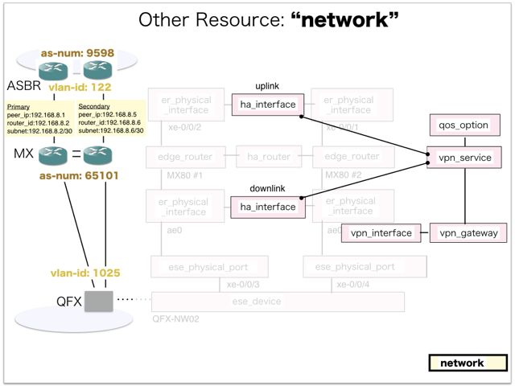

[Return to Previous Page](00_vpn_gateway.md)

# 11. Clarification of interface in Sequence Diagram "Create Network"
You can see the relations of "Network" as following.




## 11.1. Gohan


### Outline
First of all, Gohan has received JSON data for "Create Network" in HTTP Methods from client.

* Checking JSON data at post method
```
POST /v2.0/networks
```
```
{
    "network": {
        "admin_state_up": true,
        "description": "Sample Network",
        "name": "sample-network",
        "plane": "data",
        "tags": {},
        "tenant_id": "b3e3095c0a5b4383805efe9cf2a6b5ef"
    }
}
```
After processing, Gohan has stored data for "Network" in etcd.

* [Checking stored data for creating "network"](stored_in_etcd/01_Gohan/CreateNetwork_01.md)


## 11.2. ResourceReader
When ResourceReader has started, it gets all of schemas from Gohan.
After that, these schemas are converted as a template_mappings.
And then, ResourceReader keeps storing template_mappings for following processing.

### Reference
* [Checking schemas in ResourceReader](../memo/schemas.txt)
* [Checking template_mappings in ResourceReader](../memo/template_mappings.md)


### Outline
After fetching resource_data for "Network" in etcd, ResourceReader has fetched heat_templates in etcd.

* [Checking stored data for "network"](../heat_template/network.md)


## 11.3. JobManager


### Outline
After converting resource_data to job_data, JobManager has stored it in etcd.

* [Checking stored data for creating "network"](stored_in_etcd/02_JobManager/CreateNetwork_01.md)


## 11.4. HeatWorker


### Outline
After fetching job_data, HeatWorker has handled job_data.
And then, HeatWorker has stored the result of handling job_data.

* [Checking stored data for creating "network"](stored_in_etcd/03_HeatWorker/CreateNetwork_01.md)


## 11.5. Heat


### Outline
Heat has conducted some tasks for "Create Network".
As a result, Heat has stored heat-stacks for "Create Network".

* [Checking heat-stack of "network"](heat-stack/CreateNetwork_01.md)


## 11.6. Stored resource in gohan
As a result, checking resources regarding of "Network" in gohan.

* Checking the target of resources via gohan client
```
$ gohan client network show --output-format json afa0d9d6-84dc-4755-9c6e-db2f23f9dde2
{
    "network": {
        "admin_state_up": true,
        "description": "Sample Network",
        "id": "afa0d9d6-84dc-4755-9c6e-db2f23f9dde2",
        "name": "sample-network",
        "orchestration_state": "CREATE_COMPLETE",
        "plane": "data",
        "shared": false,
        "status": "ACTIVE",
        "subnets": [],
        "tags": {},
        "tenant_id": "b3e3095c0a5b4383805efe9cf2a6b5ef"
    }
}
```
* Checking billing_resource via gohan client
```
$ gohan client billing_resource list --output-format json
{
    "billing_resources": [
        {
            "config_version": 1,
            "ended": null,
            "id": "c8e7828d-90f9-4322-b36b-170da9202371",
            "info": {},
            "parent_billing_id": null,
            "resource_id": "afa0d9d6-84dc-4755-9c6e-db2f23f9dde2",
            "resource_type": "network",
            "started": 1.523837516e+09,
            "tenant_id": "b3e3095c0a5b4383805efe9cf2a6b5ef",
            "unique_resource_id": "afa0d9d6-84dc-4755-9c6e-db2f23f9dde2"
        }
    ]
}
```


[Return to Previous Page](00_vpn_gateway.md)
