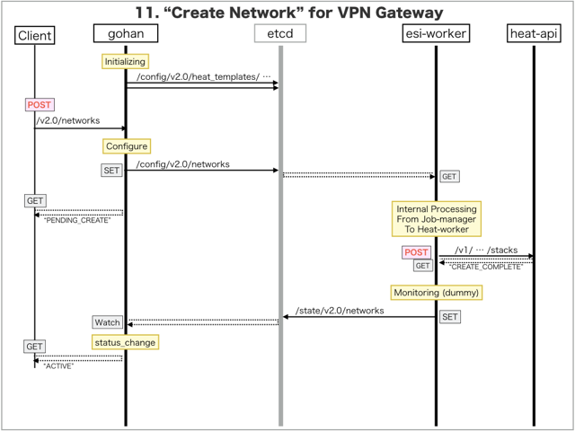

[Return to Previous Page](00_vpn_gateway.md)

# 11. Clarification of interface in Sequence Diagram "Create Network"
You can see the relations of "Network" as following.


## 11.1. Sequence Diagram between gohan and etcd
This is a diagram that has been described as interfaces for "Network" between gohan and etcd.

* Initinalizing gohan ...
* Receiving HTTP Methods for Creating Resource ...



## 11.2. Stored data in etcd after initinalizing gohan
These are stored data for "heat_templates" in etcd.

* [Checking stored data for "network"](../heat_template/network.md)
* [Checking stored data for "network_monitoring"](../heat_template/network_monitoring.md)


## 11.3. HTTP Methods for RESTful between Gohan and Client
This is JSON data for "Create Network" in HTTP Methods from client.

* Checking JSON data at post method
```
POST /v2.0/networks
```
```
{
    "network": {
        "admin_state_up": true,
        "description": "Sample Network",
        "name": "sample-network",
        "plane": "data",
        "tags": {},
        "tenant_id": "0b576f6f4cbf414f829cd12f008bf08f"
    }
}
```


## 11.4. Stored data in etcd after receiving HTTP Methods for RESTful
These are stored data for "Create Network" in etcd.

* [Checking stored data for creating "network"](stored_in_etcd/CreateNetwork_01.md)


## 11.5. Stored heat-stack via heat-api
These are stored heat-stacks for "Create Network" in heat-engine.

* [Checking heat-stack of "network"](heat-stack/CreateNetwork_01.md)


## 11.6. Stored resource for monitoring in Kafka
This is JSON data for "Create Network" between monitoring-worker and kafka

* [Checking the topic "monitor_virtual_network" for monitoring "network"](stored_in_kafka/CreateNetwork_01.md)


## 11.7. Stored resource in gohan
As a result, checking resources regarding of "Network" in gohan.

* Checking the target of resources via gohan client
```
$ gohan client network show --output-format json bb69041d-c654-4e9f-a763-afd4333275bc
{
    "network": {
        "admin_state_up": true,
        "description": "Sample Network",
        "id": "bb69041d-c654-4e9f-a763-afd4333275bc",
        "name": "sample-network",
        "plane": "data",
        "shared": false,
        "status": "ACTIVE",
        "subnets": [],
        "tags": {},
        "tenant_id": "0b576f6f4cbf414f829cd12f008bf08f"
    }
}
```
* Checking resource_mapping via gohan client
```
$ gohan client resource_mapping list --output-format json
{
    "resource_mappings": [

        ... (snip)

        {
            "created": 1.494478907e+09,
            "deleted": null,
            "id": "883c3271-8090-4515-abaa-56ef34692cd3",
            "mapped_id": "bb69041d-c654-4e9f-a763-afd4333275bc",
            "relation": "instance",
            "resource_id": "bb69041d-c654-4e9f-a763-afd4333275bc",
            "resource_type": "network",
            "tenant_id": "0b576f6f4cbf414f829cd12f008bf08f"
        }
    ]
}
```
* Checking billing_resource via gohan client
```
$ gohan client billing_resource list --output-format json
{   
    "billing_resources": [
        {
            "config_version": 1,
            "ended": null,
            "id": "0a8861ae-fab5-4a20-814d-6934bbb3e3d4",
            "info": {},
            "parent_billing_id": null,
            "resource_id": "bb69041d-c654-4e9f-a763-afd4333275bc",
            "resource_type": "network",
            "started": 1.494478907e+09,
            "tenant_id": "0b576f6f4cbf414f829cd12f008bf08f",
            "unique_resource_id": "bb69041d-c654-4e9f-a763-afd4333275bc"
        }
    ]
}
```


[Return to Previous Page](00_vpn_gateway.md)
