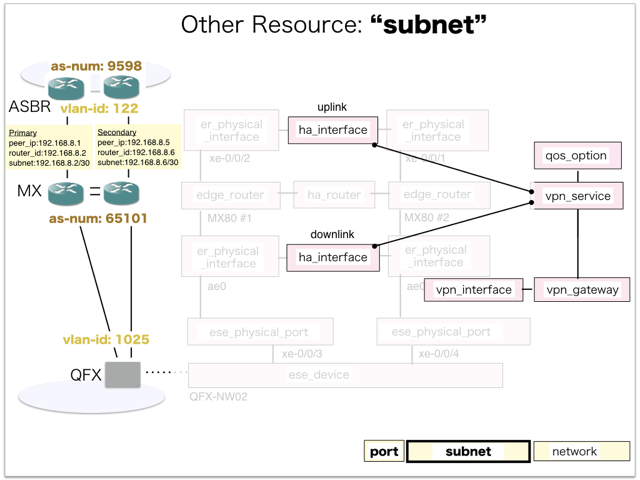
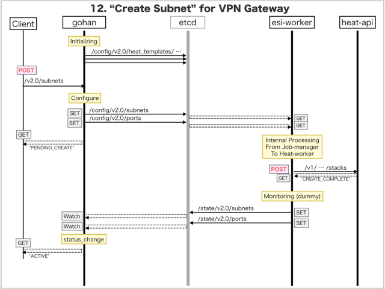

[Return to Previous Page](00_vpn_gateway.md)

# 12. Clarification of interface in Sequence Diagram "Create Subnet"
You can see the relations of "Subnet" as following.



## 12.1. Sequence Diagram between gohan and etcd
This is a diagram that has been described as interfaces for "Subnet" between gohan and etcd.

* Initinalizing gohan ...
* Receiving HTTP Methods for Creating Resource ...



## 12.2. Stored data in etcd after initinalizing gohan
These are stored data for "heat_templates" in etcd.

* [Checking stored data for "subnet"](../heat_template/subnet.md)
* [Checking stored data for "port"](../heat_template/port.md)
* [Checking stored data for "port_monitoring"](../heat_template/port_monitoring.md)


## 12.3. HTTP Methods for RESTful between Gohan and Client
This is JSON data for "Create Subnet" in HTTP Methods from client.

* Checking JSON data at post method
```
POST /v2.0/subnets
```
```
{
    "subnet": {
        "description": "Sample Subnet",
        "name": "sample-subnet",
        "tenant_id": "0b576f6f4cbf414f829cd12f008bf08f",
        "tags": {},
        "ip_version": 4,
        "cidr": "172.16.101.0/24",
        "network_id": "bb69041d-c654-4e9f-a763-afd4333275bc"
    }
}
```


## 12.4. Stored data in etcd after receiving HTTP Methods for RESTful
These are stored data for "Create Subnet" in etcd.

* [Checking stored data for creating "subnet"](stored_in_etcd/CreateSubnet_01.md)
* [Checking stored data for creating "port(dhcp)"](stored_in_etcd/CreateSubnet_02.md)


## 12.5. Stored heat-stack via heat-api
These are stored heat-stacks for "Create Subnet" in heat-engine.

* [Checking heat-stack of "subnet"](heat-stack/CreateSubnet_01.md)


## 12.6. Stored resource in gohan
As a result, checking resources regarding of "Subnet" in gohan.

* Checking the target of resources via gohan client
```
$ gohan client subnet show --output-format json b4f0c956-2fe0-4634-b7c8-22bfd8095aaf
{
    "subnet": {
        "allocation_pools": [
            {
                "end": "172.16.101.254",
                "start": "172.16.101.2"
            }
        ],
        "cidr": "172.16.101.0/24",
        "description": "Sample Subnet",
        "dhcp_server_address": "172.16.101.2",
        "dns_nameservers": [],
        "enable_dhcp": true,
        "gateway_ip": "172.16.101.1",
        "host_routes": [],
        "id": "b4f0c956-2fe0-4634-b7c8-22bfd8095aaf",
        "ip_version": 4,
        "ipv6_address_mode": null,
        "ipv6_ra_mode": null,
        "name": "sample-subnet",
        "network_id": "bb69041d-c654-4e9f-a763-afd4333275bc",
        "ntp_servers": [],
        "status": "ACTIVE",
        "tags": {},
        "tenant_id": "0b576f6f4cbf414f829cd12f008bf08f"
    }
}
```
* Checking another resources via gohan client
```
$ gohan client port show --output-format json 3388400c-5e25-4b97-8210-2a796927f2e7
{
    "port": {
        "admin_state_up": true,
        "allowed_address_pairs": [],
        "attached": false,
        "binding:vif_type": "vrouter",
        "description": "DHCP Server Port",
        "device_id": "b4f0c956-2fe0-4634-b7c8-22bfd8095aaf",
        "device_owner": "network:dhcp",
        "ese_logical_port_id": null,
        "fake_delete": false,
        "fixed_ips": [
            {
                "ip_address": "172.16.101.2",
                "subnet_id": "b4f0c956-2fe0-4634-b7c8-22bfd8095aaf"
            }
        ],
        "id": "3388400c-5e25-4b97-8210-2a796927f2e7",
        "mac_address": "00:00:5e:00:01:00",
        "managed_by_service": false,
        "name": "dhcp-server-port",
        "network_id": "bb69041d-c654-4e9f-a763-afd4333275bc",
        "segmentation_id": null,
        "segmentation_type": null,
        "status": "ACTIVE",
        "tags": {},
        "tenant_id": "0b576f6f4cbf414f829cd12f008bf08f"
    }
}
```

[Return to Previous Page](00_vpn_gateway.md)
